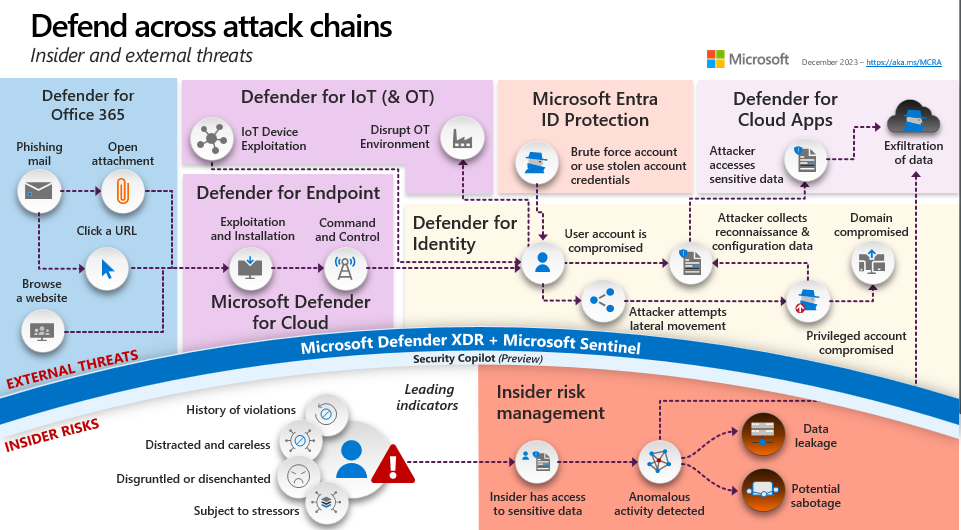
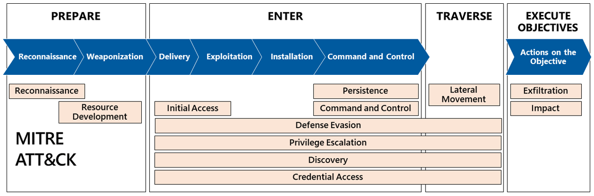

This module covers common cyberthreats, business resiliency, secure backup and restore configurations, and security update management.

Imagine that you work for a medium-sized company that has recently experienced a ransomware attack. The attack has caused significant damage to the company's systems and data, and the company is struggling to recover. As a cybersecurity architect, you have been tasked with designing a comprehensive backup and restore plan that will help the company recover from future attacks. In this module, you will learn how to design secure backup and restore configurations using Azure Backup, as well as how to integrate with Configuration Manager for on-premises resources. You will also learn how to manage security updates using Update Management and how to support business resiliency in the face of cyberthreats.

The module is divided into four sections: Understanding Cyberthreats, Designing Secure Backup and Restore Configurations, Managing Security Updates, and Supporting Business Resiliency.

## Learning objectives

In this module, you learn how to:

*   Understand common cyberthreats like ransomware.
*   Understand how to support business resiliency.
*   Design configurations for secure backup and restore.
*   Design solutions for managing security updates.

The content in the module helps you prepare for the certification exam SC-100: Microsoft Cybersecurity Architect.

## Prerequisites

- Conceptual knowledge of security policies, requirements, zero trust architecture, and management of hybrid environments
- Working experience with zero trust strategies, applying security policies, and developing security requirements based on business goals

## Cyberthreats

### What is the threat landscape?

Whether an organization is big or small, the entirety of the digital landscape with which it interacts represents an entry point for a cyberattack. These can include:

-   Email accounts
-   Social media accounts
-   Mobile devices
-   The organization's technology infrastructure
-   Cloud services
-   People

Collectively, these are referred to as the threat landscape. Notice that the threat landscape can cover more than just computers and mobile phones. It can include any elements that are owned or managed by an organization, or some that aren't. As you'll learn next, criminals will use any means they can to mount and carry out an attack.

## What are attack vectors?

An attack vector is an entry point or route for an attacker to gain access to a system.

Here are some examples of common attack vectors:

- **Email** is perhaps the most common attack vector. Cybercriminals will send seemingly legitimate emails that result in users taking action. This might include downloading a file, or selecting a link that will compromise their device.
-   **Removable media**. An attacker can use media such as USB drives, smart cables, storage cards, and more to compromise a device. For example, attackers might load malicious code into USB devices that are subsequently provided to users as a free gift, or left in public spaces to be found. When they're plugged in, the damage is done.
-   **Browser**. Attackers can use malicious websites or browser extensions to get users to download malicious software on their devices, or change a user's browser settings. The device can then become compromised, providing an entry point to the wider system or network.
-   **Cloud services**. Organizations rely more and more on cloud services for day-to-day business and processes. Attackers can compromise poorly secured resources or services in the cloud. For example, an attacker could compromise an account in a cloud service, and gain control of any resources or services accessible to that account. They could also gain access to another account with even more permissions.
-   **Insiders**. The employees of an organization can serve as an attack vector in a cyberattack, whether intentionally or not. An employee might become the victim of a cybercriminal who impersonates them as a person of authority to gain unauthorized access to a system. This is a form of social engineering attack. In this scenario, the employee serves as an unintentional attack vector. In some cases, however, an employee with authorized access may use it to intentionally steal or cause harm.

## What are security breaches?

Any attack that results in someone gaining unauthorized access to devices, services, or networks is considered a security breach. Imagine a security breach as similar to a break-in where an intruder (attacker) successfully breaks into a building (a device, application, or network).

Security breaches come in different forms, including the following:

- Social engineering attacks - In social engineering, impersonation attacks happen when an unauthorized user (the attacker), aims to gain the trust of an authorized user by posing as a person of authority to access a system from some nefarious activity. For example, a cybercriminal might pretend to be a support engineer to trick a user into revealing their password to access an organization’s systems.
- Browser attacks - Whether on a desktop, laptop, or phone, browsers are an important access tool for the internet. Security vulnerabilities in a browser can have a significant impact because of their pervasiveness. 
- Password attacks - A password attack is when someone attempts to use authentication for a password-protected account to gain unauthorized access to a device or system. Attackers often use software to speed up the process of cracking and guessing passwords. 

### What are data breaches?

A data breach is when an attacker successfully gains access or control of data. Using the intruder example, this would be similar to that person getting access to, or stealing, vital documents and information inside the building:

When an attacker achieves a security breach, they'll often want to target data, because it represents vital information. Poor data security can lead to an attacker gaining access and control of data. This can lead to serious consequences for the victim, whether that is a person, organization, or even a government. This is because the victim's data could be abused in many ways. For example, it can be held as ransom or used to cause financial or reputational harm.

## Attack chain modeling

An attack chain describes the typical chain of events during an attack that leads to organizational damage. This includes technical and non-technical steps taken by adversaries or insiders during the attack. It's important to note that there's no single linear path for either insider risk or external attacks. There are many common elements across attacks, but each one can take a unique path.

The MCRA includes an attack chain diagram that depicts common techniques related to both external attacks and insider risks, as shown below.

The top portion of this diagram represents common steps seen in many
external attacks and the Microsoft capabilities that map to each step.
The bottom portion shows the insider risk leading indicators and how
Microsoft Purview Insider Risk Management helps quickly identify,
triage, and act on risky user activity.

Most external attacks include common steps and follow common patterns that are depicted in the diagram above. Most of the variation in external attacks comes from the use of different entry points. Attacks also differ based on the different objectives of the attackers like stealing data, encrypting data, or disrupting business.

Most external attacks that result in a major incident include some form of privilege escalation using credential theft, which is mitigated by securing privileged access. For more information, see [securing privileged access](https://aka.ms/SPA).

Lockheed Martin created one of the first adaptations of the 'kill chain' military concept to cybersecurity. This concept of a cybersecurity attack chain it helped mature how organizations understand attacks and plan security controls by viewing attacks as a sequential chain of events. Many organizations use the MITRE ATT&CK framework today for detailed control planning like threat detection coverage.

The diagram below describes how these relate to each other and to a simple
Prepare-Enter-Traverse-Execute (PETE) model that Microsoft developed to
improve communications with business leaders and non-security
professionals.

Attackers can choose different techniques to achieve each goal of prepare, enter, traverse, and execute objectives. Attackers may also use a combination of techniques or the same technique over and over again iteratively to achieve their objectives.

All of the security best practices in the MCRA and MCSB are intended to reduce risk of attackers succeeding. Several MCRA best practices focus directly on the security operations aspects of external attacks - detect, respond, recover.