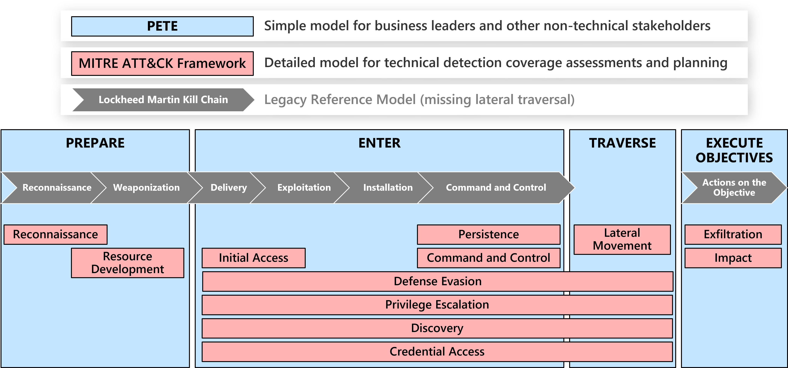

### What is the threat landscape?

Whether an organization is large or small, the entirety of the digital landscape with which it interacts represents an entry point for a cyberattack. These can include:

- Email accounts
- Social media accounts
- Mobile devices
- The organization's technology infrastructure
- Cloud services
- AI and machine learning systems
- People

Collectively, these are referred to as the threat landscape. The threat landscape extends beyond traditional computers and mobile phones to include any digital assets owned, managed, or used by an organization. As AI systems become integral to business operations, they expand the threat landscape with new attack surfaces that security architects must address.

## What are attack vectors?

An attack vector is an entry point or route for an attacker to gain access to a system.

:::image type="content" source="../media/attack-vectors.png" alt-text="Diagram showing eight of the most common attack vectors: Email, Social Media, Removable Devices, Browsers, Cloud Services, Insiders, Devices, and Wireless." lightbox="../media/attack-vectors.png":::

Common attack vectors include:

- **Email** is perhaps the most common attack vector. Cybercriminals send seemingly legitimate emails that trick users into downloading malicious files or selecting compromised links. AI technologies enable attackers to create highly convincing phishing emails with proper grammar, context-aware content, and personalized details that make detection more difficult.
- **Removable media**. An attacker can use media such as USB drives, smart cables, storage cards, and more to compromise a device. For example, attackers might load malicious code into USB devices that are provided to users as a free gift, or left in public spaces. When they're plugged in, the damage is done.
- **Browser**. Attackers can use malicious websites or browser extensions to get users to download malicious software on their devices, or change browser settings. The device can then become compromised, providing an entry point to the wider system or network.
- **Cloud services**. Organizations rely more on cloud services for day-to-day business and processes. Attackers can compromise poorly secured resources or services in the cloud. For example, an attacker could compromise an account in a cloud service and gain control of any resources or services accessible to that account.
- **Insiders**. The employees of an organization can serve as an attack vector in a cyberattack, whether intentionally or not. An employee might become the victim of social engineering, serving as an unintentional attack vector. In some cases, an employee with authorized access may use it to intentionally steal data or cause harm.
- **AI systems**. Attackers target AI and machine learning systems through prompt injection, adversarial inputs, or supply chain compromises of AI models and training data.

## What are security breaches?

Any attack that results in unauthorized access to devices, services, or networks is a security breach. Common forms include:

- **Social engineering attacks**: Impersonation attacks where an unauthorized user poses as a person of authority to gain system access. AI-powered deepfake audio and video make these attacks more sophisticated and harder to detect.
- **Browser attacks**: Security vulnerabilities in browsers have significant impact because of their pervasiveness across desktop, laptop, and mobile platforms.
- **Password attacks**: Attempts to use authentication for password-protected accounts to gain unauthorized access, often using automated tools to crack or guess passwords.
- **Supply chain attacks**: Attackers compromise software supply chains, including open-source libraries, development tools, and third-party integrations to gain access to downstream targets.

### What are data breaches?

A data breach occurs when an attacker successfully gains access to or control of data.

:::image type="content" source="../media/data-breach-v3.png" alt-text="Diagram that shows a thief running from an office building." lightbox="../media/data-breach-v3.png":::

Poor data security can lead to attackers gaining access and control of data, resulting in serious consequences for victims. Data can be held for ransom, used to cause financial or reputational harm, or exfiltrated for competitive advantage. In AI systems, data breaches can also expose proprietary model weights, training data, or inference outputs that reveal sensitive business intelligence.

## Attack chain modeling

An attack chain describes the typical chain of events during an attack that leads to organizational damage. This includes technical and nontechnical steps taken by adversaries or insiders. There's no single linear path for either insider risk or external attacks—many common elements exist across attacks, but each one can take a unique path.

The Microsoft Cybersecurity Reference Architecture (MCRA) includes an attack chain diagram that depicts common techniques related to both external attacks and insider risks.

:::image type="content" source="../media/microsoft-cybersecurity-reference-architecture-attack-chain.png" alt-text="Diagram of an attack chain M C R A depicting both external attacks and insider risks." lightbox="../media/microsoft-cybersecurity-reference-architecture-attack-chain.png":::

The top portion of this diagram represents common steps in external attacks and the Microsoft capabilities that map to each step. The bottom portion shows insider risk leading indicators and how Microsoft Purview Insider Risk Management helps identify, triage, and act on risky user activity.

Most external attacks follow common patterns. Variation comes from different entry points and objectives such as stealing data, encrypting data, or disrupting business. Most attacks that result in a major incident include some form of privilege escalation using credential theft, which is mitigated by securing privileged access. For more information, see [securing privileged access](https://aka.ms/SPA).

### Attack chain frameworks

Security architects should understand how multiple attack chain frameworks relate to each other:

- **MITRE ATT&CK**: The most widely adopted framework for detailed control planning and threat detection coverage. It provides a comprehensive matrix of attacker tactics, techniques, and procedures (TTPs) that security teams use to map detective controls and identify coverage gaps.
- **Lockheed Martin Cyber Kill Chain**: One of the first adaptations of the military kill chain concept to cybersecurity. It defines sequential phases: reconnaissance, weaponization, delivery, exploitation, installation, command and control, and actions on objectives.
- **PETE model**: A simplified framework developed by Microsoft to improve communications with business leaders and nonsecurity professionals. PETE stands for Prepare, Enter, Traverse, Execute.

Attackers can choose different techniques to achieve each objective across prepare, enter, traverse, and execute phases. They may use a combination of techniques or apply the same technique iteratively.

All security best practices in the MCRA and Microsoft Cloud Security Benchmark (MCSB) are intended to reduce risk of attackers succeeding. Several MCRA best practices focus directly on security operations aspects—detect, respond, recover.

## AI-specific cyberthreats

As organizations adopt AI technologies, security architects must address threats that specifically target AI systems. These threats require understanding beyond traditional cybersecurity frameworks.

### AI threat landscape

The MITRE ATLAS (Adversarial Threat Landscape for AI Systems) framework provides a structured knowledge base of adversarial tactics and techniques against AI systems, complementing MITRE ATT&CK for traditional systems. Key AI-specific threats include:

- **Prompt injection**: Attackers craft malicious inputs designed to manipulate AI language models into bypassing safety controls, disclosing system instructions, or performing unauthorized actions. This includes both direct prompt injection (targeting the model directly) and indirect prompt injection (embedding malicious instructions in data the model processes).
- **Model poisoning and data poisoning**: Attackers corrupt training data or manipulate the model training process to introduce backdoors or biases. This can occur through supply chain compromises of training datasets or model repositories.
- **Jailbreaking**: Techniques that circumvent AI system safety restrictions to produce harmful, inaccurate, or unauthorized outputs.
- **Adversarial perturbation**: Carefully crafted inputs that appear normal to humans but cause AI models to make incorrect classifications or predictions.
- **Model theft and inversion**: Attackers extract proprietary model parameters through repeated querying, or use model outputs to reconstruct sensitive training data.
- **Training data exfiltration**: Extraction of sensitive or proprietary data used to train AI models, potentially exposing personal information, trade secrets, or intellectual property.

When designing security strategies, use threat modeling practices specific to AI and machine learning systems. Evaluate AI systems across the full lifecycle—data collection, model training, deployment, and inference—to identify vulnerabilities at each stage.