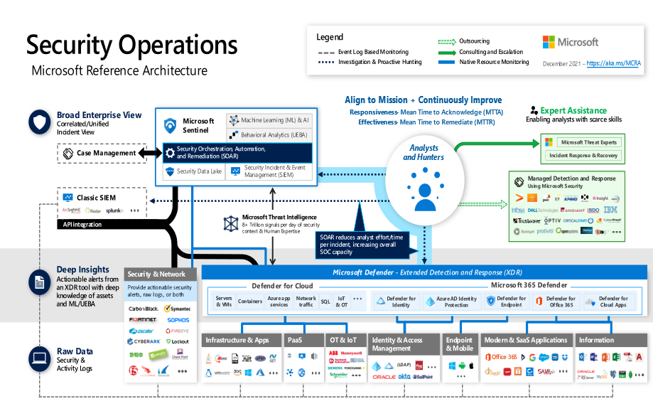

### Case Study: Design a Security Operations Solution

**Meet Tailwind Traders**

 

Tailwind Trader is a fictitious home improvement retailer. It operates
retail hardware stores across the globe and online. The Tailwind Traders
CISO is aware of the opportunities offered by Azure but also understands
the need for strong security and solid cloud architecture. Without
strong security and a great point of reference architecture, the company
may have difficulty managing the Azure environment and costs, which are
hard to track and control. The CISO is interested in understanding how
Azure manages and enforces security standards.

### Requirements

Tailwind Traders is planning to make some significant changes to their
Security Operations. They have asked for your assistance with
recommendations and questions. Here are the specific requirements.

-   **Security and Activity logs** The company has a new security
    optimization project for customer environments. The CISO wants to
    ensure that all available Azure logs are sourced and correlated
    within Microsoft Sentinel.

 

### Tasks

**Security and Activity Logs**

* **Question** What are different ways Tailwind Traders could collect events, performance data, or custom data provided through the API?
* **Task** Evaluate a solution and explain your decision-making process.
* **Question** What are the different ways Tailwind Traders could prevent, detect, and respond to threats with increased visibility into (and control over) the security of your Azure resources?
* **Task** Evaluate a solution and explain your decision-making process.
* **Question** How are you incorporating Azure Security Operations services available to users to protect their data, applications, and other assets in Microsoft Azure?
