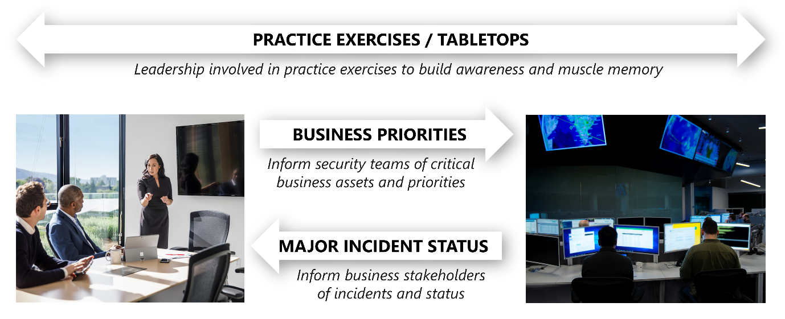
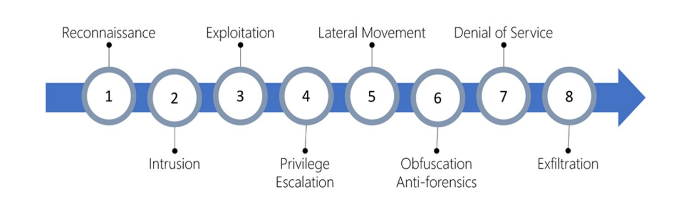

The responsibility of the security operations team (also known as the Security Operations Center (SOC), or SecOps) is to rapidly detect, prioritize, and triage potential attacks. These operations help eliminate false positives and focus on real attacks, reducing the mean time to remediate real incidents. 

Watch the video below for an overview about Security Operations in the Cloud Adoption Framework:

> [!VIDEO https://www.microsoft.com/videoplayer/embed/RWVECU]

The central SecOps team monitors security-related telemetry data and
investigates security breaches. It's important that any communication,
investigation, and hunting activities are aligned with the application
team. Here are some general best practices for conducting security
operations:

-   Follow the NIST Cybersecurity Framework functions as part of
    operations:
    -   **Detect** the presence of adversaries in the system.
    -   **Respond** by quickly investigating whether it's an actual
        attack or a false alarm.
    -   **Recover** and restore the confidentiality, integrity, and
        availability of the workload during and after an attack.
-   Acknowledge an alert quickly. A detected adversary must not be
    ignored while defenders are triaging false positives.
-   Reduce the time to remediate a detected adversary. Reduce their
    opportunity to conduct attacks and reach sensitive systems.
-   Prioritize security investments into systems that have high
    intrinsic value.
-   Proactively hunt for adversaries as your system matures. This effort
    will reduce the time that a highly skilled adversary can operate in
    the environment.

## Security operations functions

:::image type="content" source="../media/security-operations-functions.png" alt-text="Diagram that shows security Operations functions (Tiers)." lightbox="../media/security-operations-functions.png":::

Security operations teams often focus on three key outcomes:

- **Incident management:** Manage active attacks on the environment, including:
  - **Reactively responding** to detected attacks.
  - **Proactively hunting** for attacks that slipped through traditional threat detections.
  - **Coordinating** the legal, communications, and other business implications of security incidents.
- **Incident preparation:** Help the organization prepare for future attacks. Incident preparation is a broader strategic set of activities that are aimed at building muscle memory and context at all levels of the organization. This strategy prepares people to better handle major attacks and gain insights on security process improvements.
- **Threat intelligence:** Gathering, processing, and disseminating threat intelligence to security operations, security teams, security leadership, and business leadership stakeholders through security leadership.

To deliver against these outcomes, security operations teams should be structured to focus on key outcomes. In larger SecOps teams, the outcomes are often broken out between subteams.

- **Triage (tier 1):** The first line of response for security incidents. Triage is focused on the high-volume processing of alerts, and typically generated by automation and tools. The triage processes solve for most of common incident types and resolve them within the team. More complex incidents, or incidents that haven't been seen and resolved before should be escalated to tier 2.
- **Investigation (tier 2):** Focused on incidents that require further investigation, often requiring correlation of data points from multiple sources. This investigation tier looks to provide repeatable solutions to issues escalated to them. It then enables tier 1 to resolve later recurrences of that issue type. Tier 2 will also respond to alerts against business critical systems, to reflect the severity of the risk and the need to act quickly.
- **Hunt (tier 3):** Focused primarily on proactive hunting for highly sophisticated attack processes and developing guidance to the wider teams for maturing security controls as a result. The tier 3 team also acts as an escalation point for major incidents in to support forensic analysis and response.

## Interactions between SecOps and business leadership

 

SecOps has multiple potential interactions with business leadership, including:

-   **Business context to SecOps**: SecOps must understand what is most
    important to the organization so that the team can apply that
    context to fluid real-time security situations. What would have the
    most negative impact on the business? Downtime of critical systems?
    A loss of reputation and customer trust? Disclosure of sensitive
    data? Tampering with critical data or systems? We've learned it's
    critical that key leaders and staff in the SOC understand this
    context. They'll wade through the continuous flood of information
    and triage incidents and prioritize their time, attention, and
    effort.

-   **Joint practice exercises with SecOps**: Business leaders should
    regularly join SecOps in practicing response to major incidents.
    This training builds the muscle memory and relationships that are
    critical to fast and effective decision making in the high pressure
    of real incidents, reducing organizational risk. This practice also
    reduces risk by exposing gaps and assumptions in the process that
    can be fixed before a real incident occurs.

-   **Major incidents updates from SecOps**: SecOps should provide
    updates to business stakeholders for major incidents as they happen.
    This information allows business leaders to understand their risk
    and take both proactive and reactive steps to manage that risk.

-   **Business intelligence from the SOC**: Sometimes SecOps finds that
    adversaries are targeting a system or data set that isn't expected.
    As these discoveries are made, the threat intelligence team should
    share these signals with business leaders as they might trigger
    insight for business leaders. For example, someone outside the
    company is aware of a secret project or unexpected attacker targets
    highlight the value of an otherwise overlooked dataset.

## People and process

Security operations can be highly technical, but more importantly, it's a human discipline. People are the most valuable asset in security operations. Their experience, skill, insight, creativity, and resourcefulness are what make the discipline effective.

Attacks on your organization are also planned and conducted by people like criminals, spies, and hacktivists. While some commodity attacks are fully automated, the most damaging ones are often done by live human attack operators.

**Focus on empowering people**: your goal shouldn't be to replace people with automation. Empower your people with tools that simplify their daily workflows. These tools enable them to keep up with or get ahead of the human adversaries they face.

Rapidly sorting out signal (real detections) from the noise (false positives) requires investing in both humans and automation. Automation and technology can reduce human work, but attackers are human and human judgment is critical in defeating them.

**Diversify your thinking portfolio**: security operations can be highly technical, but it's also just another new version of forensic investigation that shows up in many career fields like criminal justice. Don't be afraid to hire people with a strong competency in investigation or deductive or inductive reasons and train them on technology.

Make sure that your people are set up with a healthy culture and are measuring the right outcomes. These practices can increase productivity and employee enjoyment of their jobs.

## Metrics

Metrics drive behavior, so measuring success is a critical element to
get right. Metrics translate culture into clear measurable goals that
drive outcomes.

We've learned that it's critical to consider what you measure, and the
ways that you focus on and enforce those metrics. Recognize that
security operations must manage significant variables that are out of
their direct control, like attacks and attackers. Any deviations from
targets should be viewed primarily as a learning opportunity for process
or tool improvement, rather than assumed to be a failure by the SOC to
meet a goal.

The main metrics to focus on that have a direct influence on
organizational risk are:

-   **Mean time to acknowledge (MTTA)**: Responsiveness is one of the
    few elements SecOps has more direct control over. Measure the time
    between an alert, like when the light starts to blink, and when an
    analyst sees that alert and begins the investigation. Improving this
    responsiveness requires that analysts don't waste time
    investigating false positives. It can be achieved with ruthless
    prioritization, ensuring that any alert feed that requires an
    analyst response must have a track record of 90 percent true
    positive detections.

-   **Mean time to remediate (MTTR)**: Effectiveness of reducing risk
    measures the next period of time. That period is the time the
    analyst begins the investigation to when the incident is remediated.
    MTTR identifies how long it takes SecOps to remove the attacker's
    access from the environment. This information helps identify where
    to invest in processes and tools to help analysts reduce risk.

-   **Incidents remediated (manually or with automation)**: Measuring
    how many incidents are remediated manually and how many are resolved
    with automation is another key way to inform staffing and tool
    decisions.

-   **Escalations between each tier**: Track how many incidents
    escalated between tiers. It helps ensure accurate tracking of the
    workload to inform staffing and other decisions. For example, so
    that work done on escalated incidents isn't attributed to the wrong
    team.

## SecOps modernization

Just like other security disciplines, security operations face the transformative effect of continuously evolving business models, attackers, and technology platforms.

The transformation of security operations is driven primarily by the following trends:

- **Cloud platform coverage:** Security operations must detect and respond to attacks across the enterprise estate including cloud resources. Cloud resources are a new and rapidly evolving platform that is often unfamiliar to SecOps professionals.
- **Shift to identity-centric security:** Traditional SecOps relies heavily on network-based tools, but must now integrate identity, endpoint, application, and other tools and skills. This integration is because:
  - Attackers have incorporated identity attacks, like phishing, credential theft, password spray, and other attack types into their arsenal that reliably evade network-based detections.
  - Assets of value, like bring your own devices (BYOD), spend some or all of their lifecycle outside the network perimeter, limiting the utility of network detections.
- **Internet of Things (IoT) and operational technology (OT) coverage:** Adversaries actively target IoT and OT devices as part of their attack chains. These targets might be the ultimate purpose of an attack or a means to access or traverse the environment.
- **Cloud processing of telemetry:** Security operations modernization is required because of the massive increase in relevant telemetry that comes from the cloud. This telemetry is difficult or impossible to process with on-premises resources and classic techniques. It then drives SecOps to embrace cloud services that provide massive scale analytics, machine learning, and behavior analytics. These technologies help rapidly extract the value to meet the time sensitive needs of security operations.

## The MITRE ATT&CK™ framework

The MITRE ATT&CK™ framework, represents the typical steps that cyberattack progresses through. 

- **Reconnaissance:** The observation stage where attackers assess networks and services to identify possible targets and techniques to gain entry. 
- **Intrusion:** Attackers use the knowledge gained in the reconnaissance phase to get access to a part of a network. This often involves exploring a flaw or security hole. 
- **Exploitation:** This phase involves exploiting vulnerabilities and inserting malicious code onto the system to get more access. 
- **Privilege Escalation:** Attackers often try to gain administrative access to compromised systems to get access to more critical data and move into other connected systems. 
- **Lateral Movement:** This is the act of moving laterally to connected servers and gaining greater access to potential data. 
- **Obfuscation / Anti-forensics:** Attackers need to cover their entry to successfully pull off a cyberattack. They will often compromise data and clear audit logs to prevent detection by any security team. 
- **Denial of Service:** This phase involves disrupting normal access for users and systems to keep the attack from being monitored, tracked, or blocked. 
- **Exfiltration:** The final extraction stage: getting valuable data out of the compromised systems. 

Different types of attacks are associated with each stage, targeting various subsystems. 