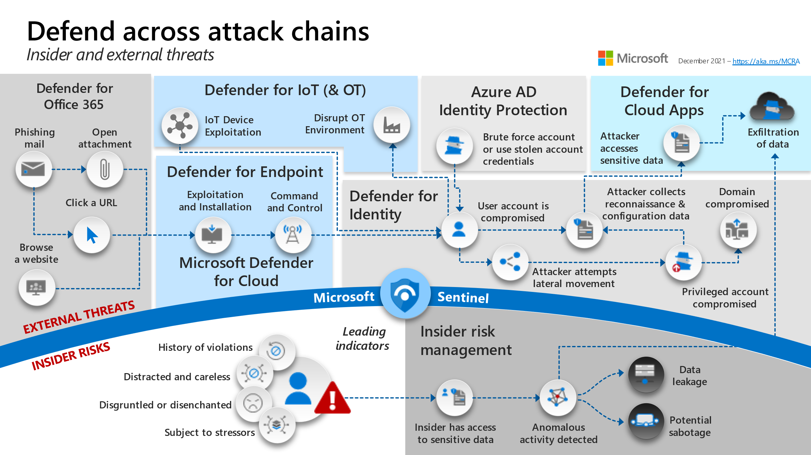
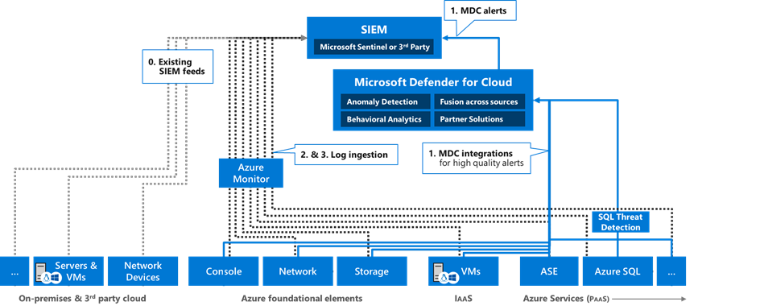

The cloud has dramatically changed the role of the operations team. They
are no longer responsible for managing the hardware and infrastructure
that hosts the application. Operations are still a critical part of
running a successful cloud application. Some of the important functions
of the operations team include:

-   Deployment
-   Monitoring
-   Escalation
-   Incident response
-   Security auditing

Robust logging and tracing are particularly important in cloud
applications. Involve the operations team in design and planning to
ensure the application gives them the data and insight they need to be
successful.

## Recommendations

* **Make all things observable.** Once a solution is deployed and
    running, logs and traces are your primary insight into the
    system. *Tracing* records a path through the system and is useful to
    pinpoint bottlenecks, performance issues, and failure
    points. *Logging* captures individual events such as application
    state changes, errors, and exceptions. Log in production, or else
    you lose insight at the very times when you need it the most.

* **Instrument for monitoring.** Monitoring gives insight into how
    well (or poorly) an application performs in terms of availability,
    performance, and system health. For example, monitoring indefinite
    if SLAs are being met. Monitoring happens during the normal
    operation of the system. It should be as close to real-time as
    possible so that the operations staff can react to issues quickly.
    Ideally, monitoring can help avert problems before a critical
    failure. For more information, see [Monitoring and
    diagnostics](https://docs.microsoft.com/azure/architecture/best-practices/monitoring).

* **Instrument for root cause analysis.** Root cause analysis is the
    process of finding underlying causes of failures. It occurs after a
    failure has already happened.

* **Use distributed tracing.** Use a distributed tracing system
    designed for concurrency, asynchrony, and cloud scale. Traces should
    include a correlation ID that flows across service boundaries. A
    single operation may involve calls to multiple application services.
    If an operation fails, the correlation ID helps pinpoint the
    failure's cause.

* **Standardize logs and metrics.** The operations team will need to
    aggregate logs from across various services in your solution. If
    every service uses its logging format, it becomes difficult or
    impossible to get useful information from them. Define a common
    schema that includes fields such as correlation ID, event name, IP
    address of the sender, and so forth. Individual services can derive
    custom schemas that inherit the base schema and contain additional
    fields.

* **Automate management tasks**. This includes provisioning,
    deployment, and monitoring. Automating a task makes it repeatable
    and less prone to human errors.

* **Treat configuration as code.** Check configuration files into a
    version control system so that you can track and version your
    changes and roll back if needed.

## Review the cyber kill chain 

In the information security lexicon, a kill chain describes the structure of an attack against an objective. The series of steps describe a cyberattacks progression from reconnaissance to data exfiltration. 

Understanding the intention of an attack can help you investigate and report the event more easily. Microsoft Defender for Cloud alerts includes the 'intent' field to help with these efforts. 

## Types of logs in Azure

Cloud applications are complex, with many moving parts. Logging data can provide insights about your applications and help you: 

- Troubleshoot past problems or prevent potential ones 

- Improve application performance or maintainability 

- Automate actions that would otherwise require manual intervention 
 

Azure logs are categorized into the following types:

-   **Control/management logs** provide information about Azure Resource
    Manager CREATE, UPDATE, and DELETE operations. For more information,
    see [Azure activity logs](/azure/azure-monitor/essentials/platform-logs-overview).

-   **Data plane logs** provide information about events raised as part
    of Azure resource usage. Examples of this type of log are the
    Windows event system, security and application logs in a virtual
    machine (VM), and the [diagnostics logs](/azure/azure-monitor/essentials/platform-logs-overview)
    configured through Azure Monitor.

-   **Processed events** provide information about analyzed
    events/alerts. Examples of this type are [Microsoft Defender for
    Cloud alerts](https://docs.microsoft.com/azure/security-center/security-center-managing-and-responding-alerts), where [Microsoft
    Defender for Cloud](https://docs.microsoft.com/azure/security-center/security-center-introduction) has processed and analyzed subscriptions and provides concise security
    alerts.

The following table lists the most important types of logs available in Azure:

| Log category | Log type | Usage | Integration |
|:-----:|:------:|:-----------------------------:|:-------------------------------------------------------:|
| [Activity logs](/azure/azure-monitor/essentials/platform-logs-overview) | Control-plane events on Azure Resource Manager resources | Provides insight into the operations that were performed on resources in your subscription. | REST API, [Azure Monitor](/azure/azure-monitor/essentials/platform-logs-overview) |
| [Azure Resource logs](/azure/azure-monitor/essentials/platform-logs-overview) | Frequent data about the operation of Azure Resource Manager resources in the subscription | Provides insight into operations that your resource itself performed. | [Azure Monitor](/azure/azure-monitor/essentials/platform-logs-overview) |
| [Azure Active Directory reporting](/azure/active-directory/reports-monitoring/overview-reports) | Logs and reports | Reports user sign-in activities and system activity information about users and group management. | [Graph API](/azure/active-directory/develop/microsoft-graph-intro) |
| [Virtual machines and cloud services](/azure/azure-monitor/vm/monitor-virtual-machine) | Windows Event Log service and Linux Syslog | Captures system data and logging data on the virtual machines and transfers that data into a storage account of your choice. | Windows (using Windows Azure Diagnostics [WAD](/azure/azure-monitor/agents/diagnostics-extension-overview) storage) and Linux in Azure Monitor |
| [Azure Storage Analytics](/rest/api/storageservices/fileservices/storage-analytics) | Storage logging, provides metrics data for a storage account | Provides insight into trace requests, analyzes usage trends, and diagnoses issues with your storage account. | REST API or the [client library](/dotnet/api/overview/azure/storage) |
| [Network security group (NSG) flow logs](/azure/network-watcher/network-watcher-nsg-flow-logging-overview) | JSON format, shows outbound and inbound flows on a per-rule basis | Displays information about ingress and egress IP traffic through a Network Security Group. | [Azure Network Watcher](/azure/network-watcher/network-watcher-monitoring-overview) |
| [Application insight](/azure/azure-monitor/app/app-insights-overview) | Logs, exceptions, and custom diagnostics | Provides an application performance monitoring (APM) service for web developers on multiple platforms. | REST API, [Power BI](https://powerbi.microsoft.com/documentation/powerbi-azure-and-power-bi/) |
| [Process data / security alerts](/azure/security-center/security-center-introduction) | Microsoft Defender for Cloud alerts, Azure Monitor logs alerts | Provides security information and alerts. | REST APIs, JSON |

## Using the Security Operations Frame 

Azure provides a wide array of configurable security auditing and logging options to help you identify gaps in your security policies and mechanisms. The tables below discuss generating, collecting, and analyzing security logs from services hosted on Azure using the Security Operations Frame for the following items: 

| Product/Service | Article | 
|:-:|:-:|
| Dynamics CRM | [Identify sensitive entities in your solution and implement change auditing](/azure/security/develop/threat-modeling-tool-auditing-and-logging#sensitive-entities) |
| Web Application | [Ensure that auditing and logging is enforced on the application](/azure/security/develop/threat-modeling-tool-auditing-and-logging#auditing) |
| | [Ensure that log rotation and separation are in place](/azure/security/develop/threat-modeling-tool-auditing-and-logging#log-rotation) |
| | [Ensure that the application does not log sensitive user data](/azure/security/develop/threat-modeling-tool-auditing-and-logging#log-sensitive-data) |
| | [Ensure that Audit and Log Files have Restricted Access](/azure/security/develop/threat-modeling-tool-auditing-and-logging#log-restricted-access) |
| | [Ensure that User Management Events are Logged](/azure/security/develop/threat-modeling-tool-auditing-and-logging#user-management) |
| | [Ensure that the system has inbuilt defenses against misuse](/azure/security/develop/threat-modeling-tool-auditing-and-logging#inbuilt-defenses) |
| | [Enable diagnostics logging for web apps in Azure App Service](/azure/security/develop/threat-modeling-tool-auditing-and-logging#diagnostics-logging) |
| Database | [Ensure that login auditing is enabled on SQL Server](/azure/security/develop/threat-modeling-tool-auditing-and-logging#identify-sensitive-entities) |
| | [Enable Threat detection on Azure SQL](/azure/security/develop/threat-modeling-tool-auditing-and-logging#threat-detection) |
| Azure Storage | [Use Azure Storage Analytics to audit access of Azure Storage](/azure/security/develop/threat-modeling-tool-auditing-and-logging#analytics) |
| WCF | [Implement sufficient Logging](/azure/security/develop/threat-modeling-tool-auditing-and-logging#sufficient-logging) |
| | [Implement sufficient Audit Failure Handling](/azure/security/develop/threat-modeling-tool-auditing-and-logging#audit-failure-handling) |
| Web API | [Ensure that auditing and logging is enforced on Web API](/azure/security/develop/threat-modeling-tool-auditing-and-logging#logging-web-api) |
| IoT Field Gateway | [Ensure that appropriate auditing and logging is enforced on Field Gateway](/azure/security/develop/threat-modeling-tool-auditing-and-logging#logging-field-gateway) |
| IoT Cloud Gateway | [Ensure that appropriate auditing and logging is enforced on Cloud Gateway](/azure/security/develop/threat-modeling-tool-auditing-and-logging#logging-cloud-gateway) |

## Protect against threats 

Security Center's threat protection enables you to detect and prevent threats at the Infrastructure as a Service (IaaS) layer, non-Azure servers, and Platforms as a Service (PaaS) in Azure. 

Security Center's threat protection includes fusion kill-chain analysis, which automatically correlates alerts in your environment based on cyber kill-chain analysis to help you better understand the full story of an attack campaign, where it started, and what kind of impact it had on your resources. Security Center's supported kill chain intents are based on the MITRE ATT&CK™ framework. As illustrated below, the typical steps that trace the stages of a cyberattack. 

- **Reconnaissance:** The observation stage where attackers assess networks and services to identify possible targets and techniques to gain entry. 
- **Intrusion:** Attackers use the knowledge gained in the reconnaissance phase to get access to a part of a network. This often involves exploring a flaw or security hole. 
- **Exploitation:** This phase involves exploiting vulnerabilities and inserting malicious code onto the system to get more access. 
- **Privilege Escalation:** Attackers often try to gain administrative access to compromised systems to get access to more critical data and move into other connected systems. 
- **Lateral Movement:** This is the act of moving laterally to connected servers and gaining greater access to potential data. 
- **Obfuscation / Anti-forensics:** Attackers need to cover their entry to successfully pull off a cyberattack. They will often compromise data and clear audit logs to prevent detection by any security team. 
- **Denial of Service:** This phase involves disrupting normal access for users and systems to keep the attack from being monitored, tracked, or blocked. 
- **Exfiltration:** The final extraction stage: getting valuable data out of the compromised systems. 

Different types of attacks are associated with each stage, targeting various subsystems. 