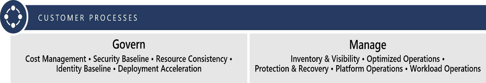
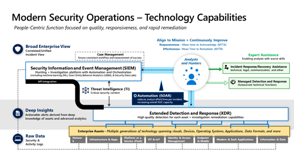
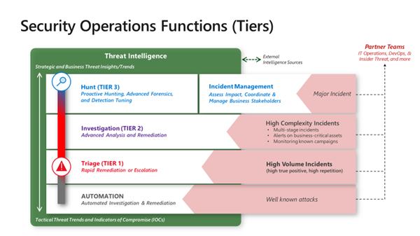

### Develop Security Operations for Hybrid and Multi-cloud Environments

A hybrid cloud combines a private cloud (on-premises infrastructure)
with a public cloud (computing services offered by third-party providers
over the public internet). Hybrid clouds allow data and applications to
consistently move between the two cloud environments. Many organizations
choose a hybrid cloud strategy because of business requirements, such as
meeting regulatory and data sovereignty requirements, maximizing
on-premises technology investments, or addressing latency issues.

The hybrid cloud is evolving to include edge workloads. Cloud-managed
edge computing devices bring the computing power of the public cloud to
the private cloud, closer to where the IoT devices reside, including
data residing in applications, connected devices, and mobile consumer
services. Reducing latency by moving workloads to the edge, devices
spend less time communicating with the cloud and can operate reliably in
extended offline periods. Expanded compute, storage and service
availability provides experience-driven resources closer to your
customers.

Multi-cloud computing uses multiple cloud computing services from more
than one cloud provider (including private and public clouds) in a
heterogeneous environment. A multi-cloud strategy provides greater
flexibility and mitigates risk. Choose services from different cloud
providers best suited for a specific task or take advantage of services
offered by a particular cloud provider in a specific location.

#### Unified Operations

The primary objective of unified operations is to create as much process
consistency as possible across deployments. No cloud service provider
will be able to reach 100% feature parity across all hybrid,
multi-cloud, and edge deployments. However, the provider should be able
to deliver baseline feature sets common across all deployments so that
your [governance](/azure/cloud-adoption-framework/scenarios/hybrid/govern) and 
[operations management](/azure/cloud-adoption-framework/scenarios/hybrid/manage) 
processes remain consistent.

 

Most commonly, customers require the ability to deliver consistency
within their defined governance and operations management processes. To
meet long-term requirements, your unified operations solution will need
to be able to scale to meet these common processes specified below.

#### Common governance processes (tasks)

-   **Cost management:** View, manage, or optimize costs and **identify
    and provide mitigation guidance for cloud-related IT spend risk**.

-   **Security baseline:** Audit, apply, or automate requirements from
    recommended security controls and **identify and provide mitigation
    guidance for security-related business risks**.

-   **Resource consistency:** Onboard, organize, configure resources and
    services, and **identify and provide risk mitigation guidance for
    potential business risks**.

-   **Identity baseline:** Enforce authentication and authorization
    across user identity and access and **identify and provide
    risk-mitigation guidance for potential identity-related business
    risks**.

-   **Deployment acceleration:** Drive consistency using templates,
    automation, and pipelines (for deployments, configuration alignment,
    and reusable assets), **establishing policies to ensure compliant,
    consistent, and repeatable resource deployment and configuration**.

#### Common operations management processes (tasks)

-   **Inventory and visibility:** Account for, and ensure reporting for
    all assets, and **collect and monitor your inventory's run state in
    enterprise-grade environments**.

-   **Optimized operations:** Track, patch, and optimize supported
    resources and **minimize business interruption risks from
    configuration drift or vulnerabilities from inconsistent patch
    management**.

-   **Protection and recovery:** Backup, business continuity, and
    disaster recovery best practices and **reduce the duration and
    impact of unpreventable outages**.

-   **[Platform operations](/azure/cloud-adoption-framework/manage/azure-management-guide/platform-specialization):**
    Specialized operations for common technology platforms such as SQL
    databases, virtual desktops, and SAP (for medium to high criticality
    workloads).

-   **[Workload operations](/azure/cloud-adoption-framework/manage/azure-management-guide/workload-specialization):**
    Specialized operations (for high priority/mission-critical
    workloads) with greater operations requirements.

Your primary cloud platform should be able to provide the required
technical capabilities and tools to automate processes and reach the
goals above for governance and operations management. Your unified
operations solution should enable you to extend these processes across
all hybrid, multi-cloud, and edge deployments.

 

 

#### Azure Security Operation services

[Azure security operations](/azure/security/fundamentals/operational-security) refer
to the services, controls, and features available to users to protect
their data, applications, and other assets in Microsoft Azure. It is a
framework that incorporates the knowledge gained through various
capabilities that are unique to Microsoft. These capabilities include
the Microsoft Security Development Lifecycle (SDL), the Microsoft
Security Response Center program, and deep awareness of the
cybersecurity threat landscape.

#### Azure management services

An IT operations team is responsible for managing hybrid and multi-cloud
environments, such as data center infrastructure, applications, and
data, including the stability and security of these systems. However,
gaining security insights across increasingly complex IT environments
often requires organizations to cobble together data from multiple
security and management systems.

[Microsoft Azure Monitor logs](/azure/azure-monitor/overview) is
a cloud-based IT management solution that helps you manage and protect
your on-premises and cloud infrastructure. Its core functionality is
provided by the following services that run in Azure. Azure includes
multiple services that help you manage and protect on-premises and cloud
infrastructures. Each service provides a specific management function.
Services can be combined to achieve different management scenarios.

#### Azure Monitor

[Azure Monitor](/azure/azure-monitor/overview) collects
data from managed sources into central data stores. This data can
include events, performance data, or custom data provided through the
API. After the data is collected, it is available for alerting,
analysis, and export.

Data can be consolidated from various sources and combined from Azure
services with existing on-premises environments. Azure Monitor logs also
clearly separate the data collection from the action taken on that data
so that all actions are available to all kinds of data.

#### Automation

[Azure Automation](/azure/automation/automation-intro) provides
a way to automate the manual, long-running, error-prone, and frequently
repeated tasks commonly performed in a cloud and enterprise environment.
It saves time and increases the reliability of administrative tasks. It
even schedules these tasks to be automatically performed at regular
intervals. Processes can be automated using runbooks or configuration
management using Desired State Configuration.

#### Backup

[Azure Backup](/azure/backup/backup-overview) is
the Azure-based service that you can use to back up (or protect) and
restore your data in the Microsoft Cloud. Azure Backup replaces existing
on-premises or off-site backup solutions with a cloud-based solution
that's reliable, secure, and cost-competitive.

Azure Backup offers components to download and deploy on the appropriate
computer or server or in the cloud. The component or agent deployed
depends on what needs to be protected. All Azure Backup components
(whether protecting data on-premises or in the cloud) can be used to
back up data to an Azure Recovery Services vault in Azure.

For more information, see the [Azure Backup components table](/azure/backup/backup-overview#what-can-i-back-up).

#### Site Recovery

[Azure Site Recovery](https://azure.microsoft.com/documentation/services/site-recovery) provides
business continuity by orchestrating the replication of on-premises
virtual and physical machines to Azure or a secondary site. If primary
sites are unavailable, failover to the secondary location so that users
can keep working. Fail back when systems return to working order. Use
Microsoft Defender for Cloud to perform more intelligent and effective
threat detection.

#### Azure Active Directory

[Azure Active Directory (Azure AD)](/azure/active-directory/manage-apps/what-is-application-management) is
a comprehensive identity service that:

-   Enables identity and access management (IAM) as a cloud service.

-   Provides central access management, single sign-on (SSO), and
    reporting.

-   Supports integrated access management for [thousands of applications](https://azuremarketplace.microsoft.com/marketplace/apps/Microsoft.AzureActiveDirectory) in
    the Azure Marketplace, including Salesforce, Google Apps, Box, and Concur.

Azure AD also includes a full suite of 
[identity management capabilities](/azure/security/fundamentals/identity-management-overview#security-monitoring-alerts-and-machine-learning-based-reports),
including these:

-   [Multi-factor authentication](/azure/active-directory/authentication/concept-mfa-howitworks)

-   [Self-service password management](https://azure.microsoft.com/resources/videos/self-service-password-reset-azure-ad/)

-   [Self-service group management](https://support.microsoft.com/account-billing/reset-your-work-or-school-password-using-security-info-23dde81f-08bb-4776-ba72-e6b72b9dda9e)

-   [Privileged account management](/azure/active-directory/privileged-identity-management/pim-configure)

-   [Azure role-based access control (Azure RBAC)](/azure/role-based-access-control/overview)

-   [Application usage monitoring](/azure/active-directory/hybrid/whatis-hybrid-identity)

-   [Rich auditing](/azure/active-directory/reports-monitoring/concept-audit-logs)

-   [Security monitoring and alerting](/azure/security-center/security-center-managing-and-responding-alerts)

With Azure Active Directory, all applications published for partners and
customers (business or consumer) have the same identity and access
management capabilities. This enables significant reduction in
operational costs.

#### Microsoft Defender for Cloud

[Microsoft Defender for Cloud](/azure/security-center/security-center-introduction) helps
prevent, detect, and respond to threats with increased visibility into
(and control over) the security of your Azure resources. It provides
integrated security monitoring and policy management across
subscriptions. It helps detect threats that might otherwise go
unnoticed, and it works with a broad ecosystem of security solutions.

[Safeguard virtual machine (VM) data](/azure/security-center/security-center-introduction) in
Azure by providing visibility into virtual machines' security settings
and monitoring for threats. Defender for Cloud can monitor your virtual
machines for:

-   Operating system security settings with the recommended
    configuration rules.

-   System security and critical updates that are missing.

-   Endpoint protection recommendations.

-   Disk encryption validation.

-   Network-based attacks.

Defender for Cloud uses [Azure role-based access control (Azure RBAC)](/azure/role-based-access-control/role-assignments-portal).
Azure RBAC provides [built-in roles](/azure/role-based-access-control/built-in-roles) that
can be assigned to Azure users, groups, and services.

Defender for Cloud assesses the configuration resources to identify
security issues and vulnerabilities. In Defender for Cloud, information
related to a resource is seen only when by assigned the role of owner,
contributor, or reader for the subscription or resource group that a
resource belongs to.

