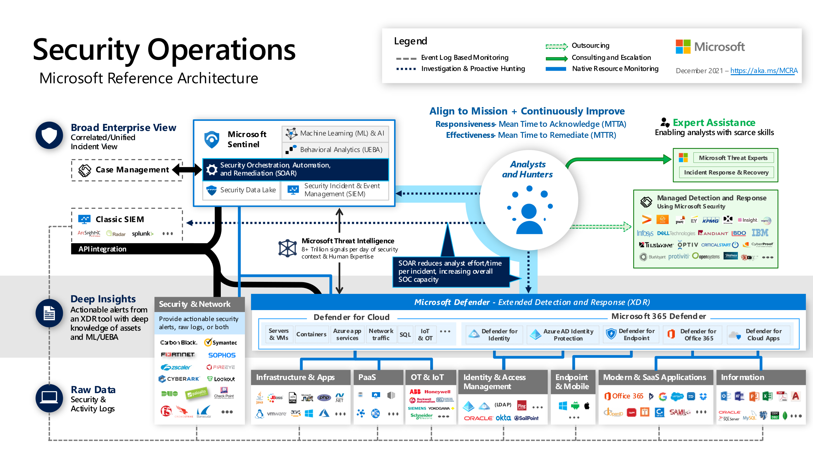

Organizations today must contend with an increasingly complex threat landscape. A key tenant of Zero Trust is assuming breach.  An effective approach to "assume breach" means having a threat detection approach that provides visibility across the entire estate, with the depth of information that security teams need to investigate individual threats. 

Visibility, automation, and orchestration integrations build robust solutions for monitoring security signals. They are key to ensuring the ongoing security of an environment by detecting suspicious behavior and enabling proactive hunting for threats. They allow customers to scan for unexpected behavior and access and proactively search for bad actors already in the network. 

This guidance is for software providers and technology partners who want to enhance their visibility, automation, and orchestration security solutions by integrating with Microsoft products. 

### Visibility, automation, and orchestration Zero Trust integration guide 

This integration guide includes instructions for integrating with [Microsoft Sentinel](/azure/sentinel). Microsoft Sentinel is Microsoft's cloud-native Security Information and Event Management (SIEM) service. Independent software vendors (ISVs) can integrate with Microsoft Sentinel to enable new use-cases for customers with data connectors, analytics rules, interactive workbooks, and automation playbooks to deliver end-to-end product or domain or industry vertical value for customers. 

Azure operational security refers to the services, controls, and features available to users for protecting their data, applications, and other assets in Azure. Azure operational security is built on a framework that incorporates the knowledge gained through capabilities that are unique to Microsoft, including the Security Development Lifecycle (SDL), the Microsoft Security Response Center program, and deep awareness of the cybersecurity threat landscape. 

#### Security Operations Tools 

The following table contains Azure tools that a SOC team can use to investigate and remediate incidents. 

| Tools | Purpose  |
|:-:|:-:|
| [Azure Monitor](/azure/azure-monitor/overview) | Event logs from application and Azure services. |
| [Log Analytics](/azure/azure-monitor/logs/log-analytics-workspace-overview) | A unique environment for log data from Azure Monitor and other Azure services such as Microsoft Sentinel and Microsoft Defender for Cloud. |
| [Azure Network Security Group (NSG)](/azure/virtual-network/network-security-groups-overview) | Visibility into network activities. |
| [Azure Information Protection](/azure/information-protection/what-is-information-protection) | You share secure email, documents, and sensitive data outside your company. |
| [Microsoft Sentinel](/azure/sentinel/overview) | Centralized Security Information and Event Management (SIEM) to get enterprise-wide visibility into logs. |
| [Microsoft Defender for Cloud](/azure/security-center/security-center-intro) | Alert generation. Use a security playbook in response to an alert. |

#### Security operations best practices for SIEM and SOAR 

Below are operational best practices for protecting your data, applications, and other assets in Azure. The best practices are based on a consensus, and they work with current Azure platform capabilities and feature sets.

##### Receive incident notifications from Microsoft 

Be sure security operations teams receive Azure incident notifications from Microsoft. An incident notification lets a security team know when there are compromised Azure resources so they can quickly respond to and remediate potential security risks. 

The Azure enrollment portal admin contact information includes details that notify security operations. Contact information is an email address and phone number. 

##### Monitor storage services for unexpected changes in behavior 

Diagnosing and troubleshooting issues in a distributed application hosted in a cloud environment can be more complex than in traditional environments. Applications can be deployed in a PaaS or IaaS infrastructure, on-premises, on a mobile device, or some combination of these environments. An application's network traffic might traverse public and private networks using multiple storage technologies. 

Continuously monitor the storage services of application uses for any unexpected changes in behavior (such as slower response times). Use logging to collect more detailed data and analyze a problem in depth. The diagnostics information obtained from monitoring and logging helps determine the root cause of the issue that an application encountered. From there, troubleshoot the issue and determine the appropriate steps to remediate it. 

[Azure Storage Analytics](/azure/storage/common/storage-analytics) performs logging and provides metrics data for an Azure storage account. We recommend using this data to trace requests, analyze usage trends, and diagnose issues with storage accounts. 

##### Prevent, detect, and respond to threats 

Here are best practices for preventing, detecting, and responding to threats: 

**Best practice:** Increase the speed and scalability of your SIEM solution by using a cloud-based SIEM. 

**Detail:** Investigate the features and capabilities of [Microsoft Sentinel](/azure/sentinel/overview) and compare them with the capabilities of what you're currently using on-premises. Consider adopting Microsoft Sentinel if it meets your organization's SIEM requirements. 

**Best practice:** Find the most serious security vulnerabilities to prioritize investigating. 

**Detail:** Review [Azure secure score](/azure/security-center/secure-score-security-controls) to see the recommendations from the Azure policies and initiatives built into Microsoft Defender for Cloud. These recommendations help address top risks like security updates, endpoint protection, encryption, security configurations, missing WAF, internet-connected VMs, and many more. 

The secure score, based on Center for Internet Security (CIS) controls, lets one benchmark an organization's Azure security against external sources. External validation helps validate and enrich a security strategy. 

**Best practice:** Monitor the security posture of machines, networks, storage and data services, and applications to discover and prioritize potential security issues. 

**Detail:** Follow the [security recommendations](/azure/security-center/security-center-recommendations) in Defender for Cloud starting with the highest priority items. 

**Best practice:** Integrate Defender for Cloud alerts into a security information and event management (SIEM) solution. 

**Detail:** Most organizations with a SIEM use it as a central clearinghouse for security alerts that require an analyst response. Processed events produced by Defender for Cloud are published to the Azure Activity Log, one of the logs available through Azure Monitor. Azure Monitor offers a consolidated pipeline for routing any of your monitoring data into a SIEM tool. See [Stream alerts to a SIEM, SOAR, or IT Service Management solution](/azure/security-center/export-to-siem) for instructions. If using Microsoft Sentinel, see [Connect Microsoft Defender for Cloud](/azure/sentinel/connect-azure-security-center). 

**Best practice:** Integrate Azure logs with your SIEM. 

**Detail:** [Use Azure Monitor to gather and export data](/azure/azure-monitor/overview#integrate-and-export-data). This practice is critical for enabling security incident investigation, and online log retention is limited. If using Microsoft Sentinel, see [Connect data sources](/azure/sentinel/connect-data-sources). 

**Best practice:** Speed up investigation and hunting processes and reduce false positives by integrating Endpoint Detection and Response (EDR) capabilities into an attack investigation. 

**Detail:** [Enable the Microsoft Defender for Endpoint integration](/azure/security-center/security-center-wdatp#enable-the-microsoft-defender-for-endpoint-integration) via a Defender for Cloud security policy. Consider using Microsoft Sentinel for threat hunting and incident response. 

##### Monitor end-to-end scenario-based network monitoring 

Customers build an end-to-end network in Azure by combining network resources like a virtual network, ExpressRoute, Application Gateway, and load balancers. Monitoring is available on each of the network resources. 

[Azure Network Watcher](/azure/network-watcher/network-watcher-monitoring-overview) is a regional service. Use its diagnostic and visualization tools to monitor and diagnose conditions at a network scenario level in, to, and from Azure. 

The following are best practices for network monitoring and available tools. 

**Best practice:** Automate remote network monitoring with packet capture. 

**Detail:** Monitor and diagnose networking issues without logging in to your VMs using Network Watcher. Trigger [packet capture](/azure/network-watcher/network-watcher-alert-triggered-packet-capture) by setting alerts and gaining access to real-time performance information at the packet level. Better diagnoses can be investigated in detail when issues are seen. 

**Best practice:** Gain insight into network traffic by using flow logs. 

**Detail:** Build a deeper understanding of network traffic patterns [using network security group flow logs](/azure/network-watcher/network-watcher-nsg-flow-logging-overview). Information in flow logs helps gather data for compliance, auditing, and monitoring a network security profile. 

**Best practice:** Diagnose VPN connectivity issues. 

**Detail:** Use Network Watcher to [diagnose your most common VPN Gateway and connection issues](/azure/network-watcher/network-watcher-diagnose-on-premises-connectivity). You can not only identify the issue but also use detailed logs to further investigate. 

##### Monitor Azure AD risk reports 

Most security breaches occur when attackers gain access to an environment by stealing a user's identity. Discovering compromised identities is no easy task. Azure AD uses adaptive machine learning algorithms and heuristics to detect suspicious actions related to user accounts. Each detected suspicious action is stored in a record called risk detection. Risk detections are recorded in Azure AD security reports. For more information, read about the users at risk security report and the risky sign-ins security report. 

**Best practice:** Monitor for suspicious actions related to your user accounts. 

**Detail:** Monitor for [users at risk](/azure/active-directory/identity-protection/overview-identity-protection) and [risky sign-ins](/azure/active-directory/identity-protection/overview-identity-protection) by using Azure AD security reports. 

##### Architecture for Security Operations 

The Security Operations Microsoft Reference Architecture describes how Microsoft's security capabilities integrate with Microsoft services and applications for Microsoft's Security Operations functions. 

