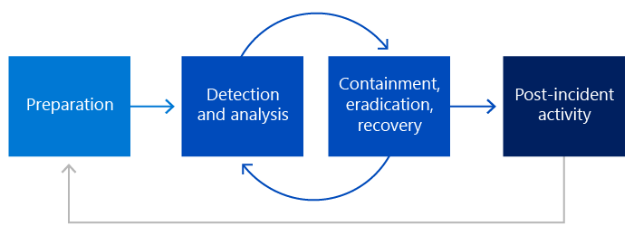

A security incident is a confirmed breach of security leading to the accidental or unlawful destruction, loss, alteration, unauthorized disclosure of, or access to customer data or personal data. For example, unauthorized access to infrastructure and exfiltration of customer data would constitute a security incident, while compliance events that don't affect the confidentiality, integrity, or availability of services or customer data aren't considered security incidents. 

## Responding to security incidents 

Whenever there's a security incident, an organization should respond quickly and effectively to protect its services and customer data. An incident response strategy should be designed to investigate, contain, and remove security threats quickly and efficiently. 

In addition to automated security monitoring and alerting, all employees should receive annual training to recognize and report signs of potential security incidents. Any suspicious activity detected by employees, customers, or security monitoring tools should be escalated to Service-specific Security Response teams for investigation. Organizations should strive to have service operations teams, including Service-specific Security Response teams, maintain a deep on-call rotation to ensure resources are available for incident response 24x7x365. Many companies are now also outsourcing the  function  of providing Managed Service-specific Response capabilities. 

When suspicious activity is detected and escalated, Security Response teams should be able to initiate a process of analysis, containment, eradication, and recovery. These teams should be able to coordinate analysis of the potential incident to determine its scope, including any impact on customers or customer data. Based on this analysis, Security Response teams should be able to work with impacted service teams to develop a plan to contain the threat and minimize the impact of the incident, eradicate the threat from the environment, and have the ability to fully recover systems to a known secure state.  

After an incident is resolved, service teams should strive to implement any lessons learned from the incident to better prevent, detect, and respond to similar incidents in the future. Security incidents, especially those incidents that are customer-impacting or result in a data breach, should undergo a full incident post-mortem. The post-mortem process should be designed to identify technical lapses, procedural failures, manual errors, and other process flaws that might have contributed to the incident or been identified during the incident response process. Improvements identified during the post-mortem should be implemented with coordination from Security Response teams to help prevent future incidents and improve detection and response capabilities. 

## Incident management process 

Security Response teams and the various service teams should work jointly and take the same approach to security incidents: 

- **Preparation:** Refers to the organizational preparation needed to be able to respond, including tools, processes, competencies, and readiness. 

- **Detection & analysis:** Refers to the activity to detect a security incident in a production environment and to analyze all events to confirm the authenticity of the security incident. 

- **Containment, eradication, recovery:** Refers to the required and appropriate actions taken to contain the security incident based on the analysis done in the previous phase. More analysis may also be necessary for this phase to fully recover from the security incident. 

- **Post-incident activity:** Refers to the post-mortem analysis performed after the recovery of a security incident. The operational actions performed during the process are reviewed to determine if any changes need to be made in the preparation or detection and analysis phases. 

 

### Preparation 

Preparation enables rapid response when an incident occurs and may even prevent incidents in the first place. Azure dedicates significant resources to preparing for security incidents. 

Organizations using Azure services should provide employees with training regarding security incidents and response procedures appropriate to their role. Every employee should be receiving training upon joining and annual refresher training every year thereafter. The training should be designed to provide the employee with a basic understanding of the Organization's approach to security so that upon completion of training, all employees understand: 

- The definition of a security incident 
- The responsibility of all employees to report security incidents 
- How to escalate a potential security incident 
- How security incident response teams respond to security incidents 
- Special concerns regarding privacy, particularly customer privacy 
- Where to find more information about security and privacy and escalation contacts 
- Any other relevant security areas (as needed) 

The appropriate employees should receive refresher training on security annually. The annual refresher training focuses on: 

- Any changes made to the standard operating procedures in the preceding year 
- The responsibility of everyone to report security incidents, and how to do so 
- Where to find more information about security and privacy, and escalation contacts 
- Any other security focus areas that may be relevant each year 

### Detection and analysis 

Organizations should use a centralized audit logging and analysis to detect anomalous or suspicious activity. Log files from Azure services should be collected and stored in a central, consolidated database. Centralized log analysis will allow the Security Response teams to comprehensively monitor the environment and correlate log entries from different services. 

There should be centrally managed detection tools in place, including anti-virus and anti-malware suites, network-based and host-based intrusion detection systems, manual detection methods, and such as observations from engineers and end users.  

When a potential incident is detected, a process should be escalated with a preliminary severity rating to a Security Response team, which serves as a key orchestrator of the security incident response process. The Security Response team should be responsible for analyzing the detection indicators to determine whether a security incident has occurred and to adjust its severity level if needed. If at any point the Security Response team discovers if data has been disclosed, modified, or destroyed, the team should initiate a security notification process. 

At the beginning of the investigation, the Security Response team should record all information relevant to the incident. Continuous Improvement. Relevant information may include: 

- A summary of the incident 
- The incident's severity and priority based on its potential impact 
- A list of all indicators that led to the detection of the incident 
- A list of any related incidents 
- A list of all actions taken by the Security Response team and any associated service teams 
- Any evidence gathered during the incident response process 
- Recommended next steps and actions 

### Containment, eradication, and recovery 

Based on the analysis coordinated by the Security Response team, an appropriate containment and recovery plan should be developed to minimize the impact of the security incident and remove the threat from the environment. Relevant service teams should implement the plan with support from the Security Response team to ensure the threat is successfully eliminated and the impacted services undergo a complete recovery. 

#### Containment 

The primary goal of containment is to limit harm to systems, applications, customers, and customer data. During this phase, the Security Response team should work with affected service teams to limit the impact of the security incident and prevent further damage. All automated response solutions within Azure should help the team contain the incident. 

The data collection and analysis should continue through the containment phase to ensure that the incident's root cause has been correctly identified and that all impacted services and tenants are included in the eradication and recovery plan. Successfully tracing all impacted services makes full eradication and recovery possible. 

#### Eradication 

Eradication is the process of eliminating the root cause of the security incident with a high degree of confidence. The goal of eradication is twofold: to evict the adversary completely from the environment and mitigate any vulnerabilities that contributed to the incident or could enable the adversary to reenter the environment. 

Eradication steps to evict the adversary and mitigate vulnerabilities are based on the analysis performed in the previous incident response phases. The Security Response team should coordinate with affected service teams to ensure the threat is successfully removed from the environment. Recovery isn't possible until the threat has been removed and its underlying causes have been resolved. 

#### Recovery 

When the Security Response team is confident the adversary has been evicted from the environment, and known vulnerabilities have been remediated, the team should work with affected service teams to initiate recovery. Recovery brings affected services to a known secure configuration. The recovery process includes identifying the last known good state of the service, restoring from backups to this state, and confirming the restored state mitigates the vulnerabilities that contributed to the incident. 

A key aspect of the recovery process is enhanced detection controls to validate that the recovery plan has been successfully executed and that no signs of breach remain within the environment. Examples of additional detection controls include increased network-level monitoring, targeted alerting for attack vectors identified during the incident response process, and additional security team vigilance for critical resources. Enhanced monitoring helps to ensure that eradication was successful and that the adversary is unable to reenter the environment. 

### Post-Incident Activity 

After the incident has been resolved, select security incidents, especially customer-impacting or resulting in a data breach, undergo a full incident post-mortem. The post-mortem process should be designed to identify technical lapses, procedural failures, manual errors, and other process flaws that might have contributed to the incident or been identified during the incident response process. The process should include the following: 

A deep analysis of the root cause and investigation to identify any opportunities to improve system security or the security incident response process. 

Discussion with Product Group Subject Matter Experts along with Security and Privacy Experts to identify opportunities for improvements in process, training, or technology. 

Implementation of new automated monitoring and detection mechanisms to discover similar issues in the future. 

Recording any findings as ticketed work items or bugs to be addressed by product teams as part of our normal Security Development Lifecycle and assigning these items to appropriate owning teams for follow-up. 

Discussing the results of the completed post-mortem in monthly security incident review meetings conducted by senior management. 

### Continuous Improvement

:::image type="content" source="../media/security-operations-continuous-improvement.png" alt-text="Diagram showing continuous improvement for incident management." lightbox="../media/security-operations-continuous-improvement.png":::

Lessons learned from the security incident should be implemented with coordination from the Security Response team to help prevent future incidents and improve detection and response capabilities. Continuous improvement is paramount for effective and efficient incident response. Post-incident activities ensure that lessons learned from the security incident are successfully implemented across the enterprise to defend organizations and their customers against evolving threats.