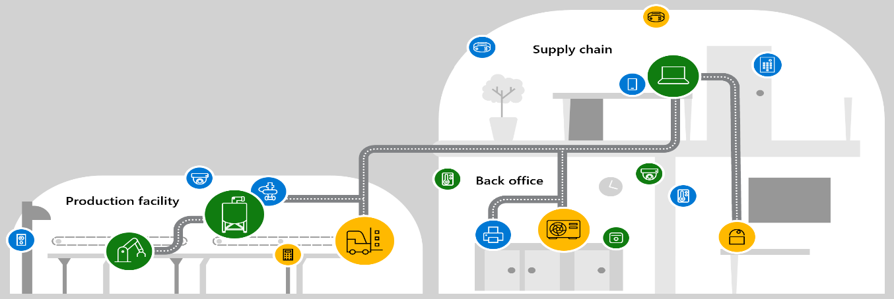

Organizations use Cyber Threat Intelligence to collect information gained from access to various signals across the Microsoft network. Cyber Threat Intelligence can be sourced from many places. These include, open-source data feeds, threat intelligence-sharing communities, commercial intelligence feeds, and local intelligence gathered during security investigations within an organization. Every second, hundreds of GB's worth of data is added to the Microsoft Intelligent Security Graph. This anonymized data comes from:

-   Over a hundred Microsoft data centers across the globe.
-   Threats faced by over 1 billion PCs updated by Windows Update each month.
-   External data points are collected through extensive research and partnership with industry and law enforcement. This research is accomplished through Microsoft's Digital Crime Unit and Cybersecurity Defense Operations Center.

Threat intelligence in Azure:

-   Consumes billions of signals ("signals" is a term meaning information traffic) across the Microsoft network.
-   Uses artificial intelligence and machine learning capabilities.
-   Integrates this data across different security products to address different attack scenarios.

The signals obtained from the Intelligent Security Graph, plus other
third-party feeds, are fed into Microsoft's three major platforms:
Windows, Azure, and Microsoft 365. Microsoft then integrates these
signals so that security services on one platform can communicate with
security services on one of the other platforms. As a result, any threat
seen in Windows is automatically and quickly added to the set of threats
that Azure views. This design provides deep insight into the evolving
cyber threat landscape.

## Threat Intelligence in Microsoft Sentinel

Within a Security Information and Event Management (SIEM) solution like
Microsoft Sentinel, the most commonly used form of CTI is threat
indicators, also known as Indicators of Compromise or IoCs. Threat
indicators are data that associate observed artifacts such as URLs, file
hashes, or IP addresses with known threat activity such as phishing,
botnets, or malware. Using Microsoft Sentinel, you can evaluate threat
indicators to help detect malicious activity observed in your
environment and provide context to security investigators to help inform
response decisions.

Integrate threat intelligence (TI) into Microsoft Sentinel through the following activities:

-   Import threat intelligence into Microsoft Sentinel by enabling data connectors to various TI platforms and feeds.
-   View and manage the imported threat intelligence in Logs and the Microsoft Sentinel Threat Intelligence page.
-   Detect threats and generate security alerts and incidents using the built-in Analytics rule templates based on your imported threat intelligence.
-   Visualize key information about your imported threat intelligence in Microsoft Sentinel with the Threat Intelligence workbook.

## Threat Intelligence in Defender for Endpoint

With Microsoft 365 Defender, you can create custom threat alerts that
help you keep track of possible attack activities in your organization.
You can flag suspicious events to gather clues and possibly stop an
attack chain. These custom threat alerts will only appear in your
organization and will flag events that you set it to track.

Before creating custom threat alerts, it's important to know the
concepts behind alert definitions and indicators of compromise (IOCs)
and their relationship.

### Alert definitions

Alert definitions are contextual attributes that can be used
collectively to identify early clues on a possible cybersecurity attack.
These indicators are typically a combination of activities,
characteristics, and actions taken by an attacker to successfully
achieve the objective of an attack. Monitoring these combinations of
attributes is critical in gaining a vantage point against attacks. These
possibly interfere with the chain of events before an attacker's
objective is reached.

### Indicators of compromise (IOC)

IOCs are individually known malicious events that indicate that a
network or device has already been breached. Unlike alert definitions,
these indicators are considered evidence of a breach. They're often
seen after an attack has already been carried out, and the objective has
been reached, such as exfiltration. Keeping track of IOCs is also
important during forensic investigations. Although it might not be able
to intervene with an attack chain, gathering these indicators can be
useful in creating better defenses for possible future attacks.

### Relationship between alert definitions and IOCs

In Microsoft 365 Defender and Microsoft Defender for Endpoint, alert
definitions are containers for IOCs and define the alert, including the
metadata raised for a specific IOC match. Various metadata is provided
as part of the alert definitions. Metadata such as alert definition,
attack name, severity, and description is provided along with other
options.

Each IOC defines the concrete detection logic based on its type, value,
and action, determining how it's matched. It's bound to a specific
alert definition that defines how detection is displayed as an alert on
the Microsoft 365 Defender console.

## Threat Intelligence in Defender for IoT

Microsoft Defender for IoT is a unified security solution for identifying IoT and OT devices, vulnerabilities, and threats and
managing them through a central interface.

Defender for IoT has [native threat intelligence capabilities](/azure/sentinel/iot-solution?tabs=use-out-of-the-box-analytics-rules-recommended) using threat intelligence packages. You can deploy Microsoft Defender for IoT in Azure-connected and hybrid environments or completely on-premises. If you choose to integrate Defender for IoT with Microsoft Sentinel, you'll get threat intelligence from Defender for IoT and the enriched threat intelligence from Sentinel.

 

Defender for IoT has both agent-based and agentless monitoring solutions:

-   **For end-user organizations**, Microsoft Defender for IoT provides agentless, network-layer monitoring that integrates smoothly with industrial equipment and SOC tools. You can deploy Microsoft Defender for IoT in Azure-connected and hybrid environments or completely on-premises.
-   **For IoT device builders**, Microsoft Defender for IoT also offers a lightweight micro-agent that supports standard IoT operating systems, such as Linux and RTOS. The Microsoft Defender device builder agent helps you ensure that security is built into your IoT/OT projects from the cloud. For more information, see [Microsoft Defender for IoT for device builders    documentation](/azure/defender-for-iot/device-builders/overview).

## Threat Intelligence in Defender for Cloud

Defender for Cloud's threat protection works by monitoring security information from your Azure resources, the network, and connected partner solutions. It analyzes this information, often correlating information from multiple sources, to identify threats. For more information, see [How Microsoft Defender for Cloud detects and responds to threats](/azure/defender-for-cloud/alerts-overview#detect-threats).

When Defender for Cloud identifies a threat, it triggers a [security alert](/azure/defender-for-cloud/managing-and-responding-alerts), containing detailed information regarding the event, including suggestions for remediation. To help incident response teams investigate and remediate threats, Defender for Cloud provides threat intelligence
reports containing information about detected threats. The report includes information such as:

-   Attacker's identity or associations (if this information is available)
-   Attackers' objectives
-   Current and historical attack campaigns (if this information is available)
-   Attackers' tactics, tools, and procedures
-   Associated indicators of compromise (IoC) such as URLs and file hashes
-   Victimology, which is the industry and geographic prevalence to assist you in determining if your Azure resources are at risk
-   Mitigation and remediation information

## Threat Intelligence in Microsoft 365 Defender

Threat investigation and response capabilities provide insights into
threats and related response actions available in the Microsoft 365
Defender. These insights can help your organization's security team
protect users from email- or file-based attacks. The capabilities help
monitor signals and gather data from multiple sources, such as user
activity, authentication, email, compromised PCs, and security
incidents. Business decision makers and your security operations team
can use this information to understand and respond to threats against
your organization and protect your intellectual property.

Threat investigation and response capabilities in the Microsoft 365 Defender portal at [https://security.microsoft.com](https://security.microsoft.com/) are a set of tools and response workflows that include:

-   [Explorer](/microsoft-365/security/office-365-security/office-365-ti?view=o365-worldwide&preserve-view=true#explorer)
-   [Incidents](/microsoft-365/security/office-365-security/office-365-ti?view=o365-worldwide&preserve-view=true#incidents)
-   [Attack simulation training](/microsoft-365/security/office-365-security/attack-simulation-training?view=o365-worldwide&preserve-view=true)
-   [Automated investigation and response](/microsoft-365/security/office-365-security/automated-investigation-response-office?view=o365-worldwide&preserve-view=true)
