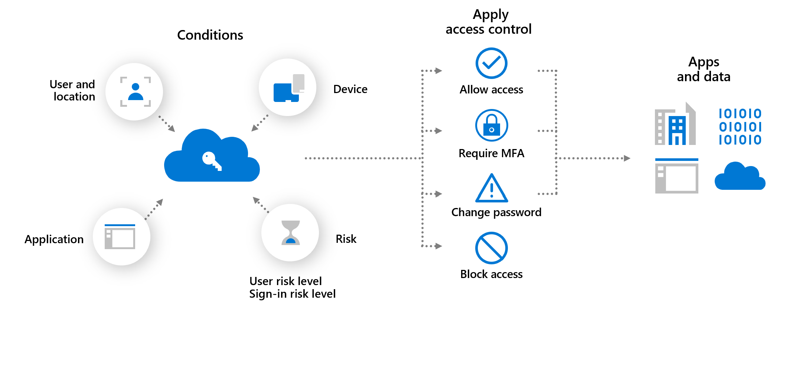

This unit addresses a few specific strategies for modern authentication:

- Conditional access
- Continuous access authentication
- Threat intelligence integration
- Risk scoring

## Conditional Access

Users can access your organization's resources by using various devices and apps from anywhere. As an IT admin, you want to make sure that these devices meet your standards for security and compliance. Just focusing on who can access a resource isn't sufficient anymore.

To balance security and productivity, you need to think about how a resource is accessed before you can make a decision about access control. With Azure AD Conditional Access, you can address this requirement. With Conditional Access, you can make automated access control decisions based on conditions for accessing your cloud apps.

**Best practice**: Manage and control access to corporate resources.  

**Detail**: Configure common Azure AD Conditional Access policies based on a group, location, and application sensitivity for SaaS apps and Azure AD–connected apps.

**Best practice**: Block legacy authentication protocols.

**Detail**: Attackers exploit weaknesses in older protocols every day, particularly for password spray attacks. Configure Conditional Access to block legacy protocols.

## Continuous access evaluation
<!--
BEGIN(https://learn.microsoft.com/azure/active-directory/conditional-access/concept-continuous-access-evaluation)
-->
Token expiration and refresh are a standard mechanism in the industry. When a client application like Outlook connects to a service like Exchange Online, the API requests are authorized using OAuth 2.0 access tokens. By default, access tokens are valid for one hour, when they expire the client is redirected to Azure AD to refresh them. That refresh period provides an opportunity to reevaluate policies for user access. For example: we might choose not to refresh the token because of a Conditional Access policy, or because the user has been disabled in the directory. 

Customers have expressed concerns about the lag between when conditions change for a user, and when policy changes are enforced. Azure AD has experimented with the "blunt object" approach of reduced token lifetimes but found they can degrade user experiences and reliability without eliminating risks.

Timely response to policy violations or security issues really requires a "conversation" between the token issuer (Azure AD), and the relying party (enlightened app). This two-way conversation gives us two important capabilities. The relying party can see when properties change, like network location, and tell the token issuer. It also gives the token issuer a way to tell the relying party to stop respecting tokens for a given user because of account compromise, disablement, or other concerns. The mechanism for this conversation is continuous access evaluation (CAE). The goal for critical event evaluation is for response to be near real time, but latency of up to 15 minutes may be observed because of event propagation time; however, IP locations policy enforcement is instant.

The initial implementation of continuous access evaluation focuses on Exchange, Teams, and SharePoint Online.

Continuous access evaluation is available in Azure Government tenants (GCC High and DOD) for Exchange Online.

### Key benefits

- User termination or password change/reset: User session revocation is enforced in near real time.
- Network location change: Conditional Access location policies are enforced in near real time.
- Token export to a machine outside of a trusted network can be prevented with Conditional Access location policies.

## Scenarios 

There are two scenarios that make up continuous access evaluation, critical event evaluation and Conditional Access policy evaluation.

### Critical event evaluation

Continuous access evaluation is implemented by enabling services, like Exchange Online, SharePoint Online, and Teams, to subscribe to critical Azure AD events. Those events can then be evaluated and enforced near real time. Critical event evaluation doesn't rely on Conditional Access policies so it's available in any tenant. The following events are currently evaluated:

- User Account is deleted or disabled
- Password for a user is changed or reset
- Multifactor Authentication is enabled for the user
- Administrator explicitly revokes all refresh tokens for a user
- High user risk detected by Azure AD Identity Protection

This process enables the scenario where users lose access to organizational SharePoint Online files, email, calendar, or tasks, and Teams from Microsoft 365 client apps within minutes after a critical event. 

### Conditional Access policy evaluation

Exchange Online, SharePoint Online, Teams, and MS Graph can synchronize key Conditional Access policies for evaluation within the service itself.

This process enables the scenario where users lose access to organizational files, email, calendar, or tasks from Microsoft 365 client apps or SharePoint Online immediately after network location changes.

| | Outlook Web | Outlook Win32 | Outlook iOS | Outlook Android | Outlook Mac |
| :--- | :---: | :---: | :---: | :---: | :---: |
| **SharePoint Online** | Supported | Supported | Supported | Supported | Supported |
| **Exchange Online** | Supported | Supported | Supported | Supported | Supported |

| | Office web apps | Office Win32 apps | Office for iOS | Office for Android | Office for Mac |
| :--- | :---: | :---: | :---: | :---: | :---: |
| **SharePoint Online** | Not Supported \* | Supported | Supported | Supported | Supported |
| **Exchange Online** | Not Supported | Supported | Supported | Supported | Supported |

| | OneDrive web | OneDrive Win32 | OneDrive iOS | OneDrive Android | OneDrive Mac |
| :--- | :---: | :---: | :---: | :---: | :---: |
| **SharePoint Online** | Supported | Not Supported | Supported | Supported | Not Supported |

| | Teams web | Teams Win32 | Teams iOS | Teams Android | Teams Mac |
| :--- | :---: | :---: | :---: | :---: | :---: |
| **Teams Service** | Partially supported | Partially supported | Partially supported | Partially supported | Partially supported |
| **SharePoint Online** | Partially supported | Partially supported | Partially supported | Partially supported | Partially supported |
| **Exchange Online** | Partially supported | Partially supported | Partially supported | Partially supported | Partially supported |

> \* Token lifetimes for Office web apps are reduced to 1 hour when a Conditional Access policy is set.
<!--
END()
-->
## Threat intelligence integration - Azure AD Identity Protection

<!--
BEGIN([What is Azure Active Directory Identity Protection? - Microsoft Entra | Microsoft Learn](https://learn.microsoft.com/azure/active-directory/identity-protection/overview-identity-protection))
-->
Identity Protection allows organizations to accomplish three key tasks:

-   [Automate the detection and remediation of identity-based risks](https://learn.microsoft.com/azure/active-directory/identity-protection/howto-identity-protection-configure-risk-policies).
-   [Investigate risks](https://learn.microsoft.com/azure/active-directory/identity-protection/howto-identity-protection-investigate-risk) using data in the portal.
-   [Export risk detection data to other tools](https://learn.microsoft.com/azure/active-directory/identity-protection/howto-export-risk-data).

Identity Protection uses the learnings Microsoft has acquired from their position in organizations with Azure Active Directory, the consumer space with Microsoft Accounts, and in gaming with Xbox to protect your users. Microsoft analyses trillions of signals per day to identify and protect customers from threats.

The signals generated by and fed to Identity Protection, can be further fed into tools like Conditional Access to make access decisions, or fed back to a security information and event management (SIEM) tool for further investigation.

### Detect risk

Identity Protection detects [risks](https://learn.microsoft.com/azure/active-directory/identity-protection/concept-identity-protection-risks) of many types, including:

-   Anonymous IP address use
-   Atypical travel
-   Malware linked IP address
-   Unfamiliar sign-in properties
-   Leaked credentials
-   Password spray
-   and more...

The risk signals can trigger remediation efforts such as requiring: perform multifactor authentication, reset their password using self-service password reset, or block access until an administrator takes action.

More detail on these and other risks including how or when they're calculated can be found in the article, [What is risk](https://learn.microsoft.com/azure/active-directory/identity-protection/concept-identity-protection-risks).

### Investigate risk

Administrators can review detections and take manual action on them if needed. There are three key reports that administrators use for investigations in Identity Protection:

-   Risky users
-   Risky sign-ins
-   Risk detections

More information can be found in the article, [How To: Investigate risk](https://learn.microsoft.com/azure/active-directory/identity-protection/howto-identity-protection-investigate-risk).

#### Risk levels

Identity Protection categorizes risk into tiers: low, medium, and high.

Microsoft doesn't provide specific details about how risk is calculated. Each level of risk brings higher confidence that the user or sign-in is compromised. For example, something like one instance of unfamiliar sign-in properties for a user might not be as threatening as leaked credentials for another user.
<!--
END([What is Azure Active Directory Identity Protection? - Microsoft Entra | Microsoft Learn](https://learn.microsoft.com/azure/active-directory/identity-protection/overview-identity-protection))
-->

> [!NOTE]
> Risk based policies can be created in Identity protection as well, but it is recommended to do so with Conditional Access policies.

## Risk-based access policies

Access control policies can be applied to protect organizations when a sign-in or user is detected to be at risk. Such policies are called **risk-based policies**. 

Azure AD Conditional Access offers two risk conditions: **Sign-in risk** and **User risk**. Organizations can create risk-based Conditional Access policies by configuring these two risk conditions and choosing an access control method. During each sign-in, Identity Protection sends the detected risk levels to Conditional Access, and the risk-based policies apply if the policy conditions are satisfied.

The following diagram shows an example of enforcing a policy that requires multifactor authentication when the sign-in risk level is medium or high.
  

The example above also demonstrates a main benefit of a risk-based policy: **automatic risk remediation**. When a user successfully completes the required access control, like a secure password change, their risk is remediated. That sign-in session and user account isn't at risk, and no action is needed from the administrator. 

Allowing users to self-remediate using this process reduces the risk investigation and remediation burden on the administrators while protecting your organizations from security compromises. More information about risk remediation can be found in the article, Remediate risks and unblock users.

### Sign-in risk-based Conditional Access policy

During each sign-in, Identity Protection analyzes hundreds of signals in real-time and calculates a sign-in risk level that represents the probability that the given authentication request isn't authorized. This risk level then gets sent to Conditional Access, where the organization's configured policies are evaluated. Administrators can configure sign-in risk-based Conditional Access policies to enforce access controls based on sign-in risk, including requirements such as:

- Block access
- Allow access
- Require multifactor authentication

If risks are detected on a sign-in, users can perform the required access control such as multifactor authentication to self-remediate and close the risky sign-in event to prevent unnecessary noise for administrators.

### User risk-based Conditional Access policy

Identity Protection analyzes signals about user accounts and calculates a risk score based on the probability that the user has been compromised. If a user has risky sign-in behavior, or their credentials have been leaked, Identity Protection uses these signals to calculate the user risk level. Administrators can configure user risk-based Conditional Access policies to enforce access controls based on user risk, including requirements such as: 

- Block access
- Allow access but require a secure password change.

A secure password change remediates the user risk and close the risky user event to prevent unnecessary noise for administrators.
