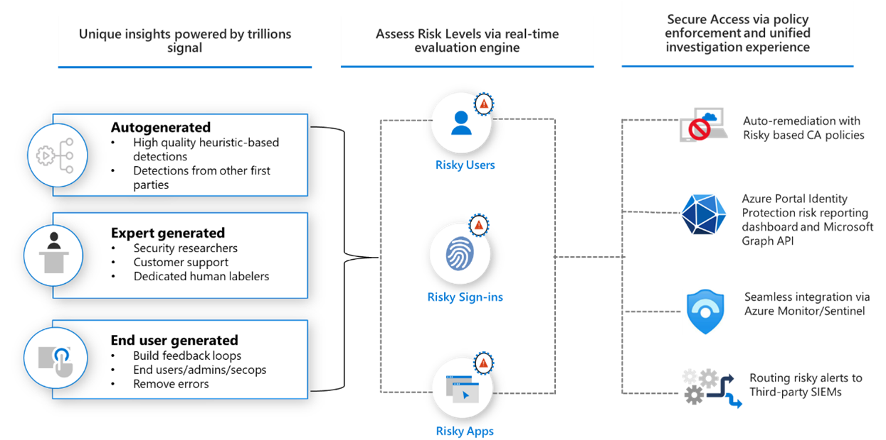

Before designing a modern authentication and authorization strategy, it's important to distinguish between the two concepts:

- **Authentication** is the process of proving that you are who you say you are, achieved through verification of the identity of a person or device.
- **Authorization** is the act of granting an authenticated party permission to do something—it specifies what data you're allowed to access and what you can do with that data.

**Modern authentication** combines authentication and authorization methods with security measures like multifactor authentication (MFA), certificate-based authentication, OAuth 2.0 authorization, and Conditional Access policies. It replaces older methods like basic authentication with industry-standard protocols (OpenID Connect, OAuth 2.0, SAML).

As a security architect, you design authentication and authorization strategies that balance security requirements with user productivity while supporting Zero Trust principles. The core components of a modern authentication and authorization strategy in Microsoft Entra ID include:

- Authentication methods and authentication strengths
- Conditional Access
- Continuous access evaluation
- Risk scoring through Identity Protection
- Protected actions

## Authentication methods and authentication strengths

Microsoft Entra ID supports a range of authentication methods. Microsoft recommends adopting phishing-resistant passwordless methods, which satisfy MFA with a single gesture and resist credential phishing:

- **Windows Hello for Business** – Biometric (face, fingerprint) or PIN authentication bound to the user's device. Satisfies MFA and is phishing-resistant.
- **FIDO2 security keys** – External hardware keys (WebAuthn/CTAP). Phishing-resistant and ideal for shared devices.
- **Passkeys in Microsoft Authenticator** – Device-bound passkeys in the Authenticator app for passwordless mobile sign-in.
- **Certificate-based authentication (CBA)** – X.509 certificates verified by Microsoft Entra ID. Phishing-resistant when configured for multifactor.
- **Microsoft Authenticator (push notification)** – Passwordless sign-in with number matching. Satisfies MFA but isn't phishing-resistant.
- **OATH tokens** – Time-based one-time password (TOTP) tokens used as a second factor.
- **SMS and voice** – One-time codes via text or phone call. Least secure MFA method—not recommended for sensitive scenarios.

Conditional Access uses **authentication strengths** to control which methods are acceptable. Three built-in strengths are available: **Multifactor authentication strength** (any MFA-satisfying combination), **Passwordless MFA strength** (MFA without a password), and **Phishing-resistant MFA strength** (Windows Hello for Business, FIDO2 keys, or multifactor CBA only). Administrators can also create custom strengths.

## Conditional Access

Microsoft Entra Conditional Access is the Zero Trust policy engine that brings signals together to enforce organizational access policies. Conditional Access policies are if-then statements: **if** a user wants to access a resource, **then** they must complete an action (for example, perform MFA).

:::image type="content" source="../media/risk-based-conditional-access-diagram.png" alt-text="Diagram that shows a conceptual risk-based Conditional Access policy.":::

### Signal evaluation

Conditional Access policies evaluate signals from various sources to make access decisions:

- **User, group, or agent** – Target specific users, groups, and agent identities for fine-grained access control.
- **Network** – Evaluate named locations (trusted IP ranges, countries/regions) and compliant network status through Global Secure Access.
- **Device** – Target devices by platform, compliance state, or use filters for specific devices like privileged access workstations.
- **Application** – Apply different policies based on the application being accessed.
- **Real-time and calculated risk detection** – Signals from Microsoft Entra ID Protection identifying risky users and sign-in behavior.
- **Microsoft Defender for Cloud Apps** – Real-time monitoring and control of user application access and sessions.

### Access controls

Based on signal evaluation, Conditional Access policies can block access entirely or grant access with required conditions. Policies also apply session controls that limit the experience after sign-in.

**Grant controls** determine whether access is blocked or granted with conditions, such as:

- **Block access** – Denies access entirely under the specified conditions.
- **Require multifactor authentication** – The user must complete MFA.
- **Require authentication strength** – The user must authenticate with methods from a specified strength.
- **Require compliant or hybrid joined device** – The device must meet Intune compliance policies or be Microsoft Entra hybrid joined.
- **Require approved client app or app protection policy** – Access is limited to apps that meet organizational protection requirements.
- **Require password change** – The user must change their password before access is granted.

**Session controls** limit the experience within cloud applications after access is granted:

- **Sign-in frequency** – Specifies how often users must reauthenticate.
- **Persistent browser session** – Controls whether users stay signed in after closing the browser.
- **Conditional Access App Control** – Routes sessions through Microsoft Defender for Cloud Apps for real-time monitoring and control.
- **Application enforced restrictions** – Passes device state to apps like SharePoint Online and Exchange Online for limited or full access.
- **Customize continuous access evaluation** – Allows disabling CAE or configuring strict enforcement for specific policies.

## Continuous access evaluation (CAE)

Access tokens are valid for one hour by default. If conditions change between refreshes—such as a user being disabled—the token remains valid until expiry. Continuous access evaluation (CAE) addresses this gap by establishing a near real-time conversation between Microsoft Entra ID (the token issuer) and resource providers (the relying parties) through two mechanisms:

- **Critical event evaluation** – Resource providers (Exchange Online, SharePoint Online, Teams) subscribe to critical Microsoft Entra events: account deleted or disabled, password changed or reset, MFA enabled, tokens explicitly revoked by an administrator, and high user risk detected by ID Protection. When any of these events fires, the resource provider rejects the user's existing token and issues a claim challenge, forcing reauthentication within minutes rather than waiting up to an hour for token expiry.
- **Conditional Access policy evaluation** – These providers, along with Microsoft Graph, synchronize Conditional Access policies so they can enforce policy changes in near real time. For example, if an administrator adds an IP-based location restriction, a user who moves outside the trusted range loses access immediately—even though their token hasn't expired.

Because revocation is driven by events and policy changes rather than a fixed expiry window, CAE-aware sessions can safely receive long-lived tokens (up to 28 hours), reducing unnecessary reauthentication while providing stronger security.

## Risk scoring with Identity Protection

Microsoft Entra ID Protection detects, investigates, and remediates identity-based risks. During each sign-in, it generates a risk score indicating the likelihood the sign-in is compromised.

### Risk types

| Risk type | Description | Examples |
|-----------|-------------|----------|
| **Sign-in risk** | The probability that a given authentication request isn't authorized by the identity owner | Atypical travel, anonymous IP address, password spray, token replay attacks |
| **User risk** | The probability that a user account has been compromised | Leaked credentials, threat intelligence indicators |

### Risk levels

ID Protection categorizes risk as **High** (high confidence of compromise), **Medium** (moderate-severity anomalies), or **Low** (lower-confidence anomalies). Detections fire in real time (enabling self-remediation during sign-in) or offline (surfacing within 48 hours).

### Risk-based Conditional Access policies

Organizations create Conditional Access policies that respond to risk levels by configuring sign-in risk and user risk conditions. When risk is detected, policies enforce controls such as requiring a password change or blocking access. A key benefit is **automatic risk remediation**: when a user completes the required control, their risk is automatically remediated, reducing the burden on administrators.

## Protected actions

Protected actions in Microsoft Entra ID are permissions assigned Conditional Access policies that are enforced when a user attempts the action, rather than at sign-in. Users are prompted for additional verification only when needed. Protected actions apply additional verification—they don't replace role-based authorization or identity-based access blocking.

### Common use cases

- Modifying Conditional Access policies (require phishing-resistant MFA)
- Changing tenant-wide settings
- Modifying role assignments
- Performing sensitive administrative operations

## Assembling a unified strategy

The components described in this unit aren't independent features—they form a layered enforcement architecture with Conditional Access as the central policy engine. Each layer addresses a different phase of the access lifecycle:

- **At sign-in** – Authentication strengths and ID Protection risk scores feed into Conditional Access, which evaluates all signals and enforces the appropriate grant or block decision.
- **During the session** – CAE synchronizes Conditional Access policies and critical events with resource providers, enforcing changes mid-session rather than waiting for token expiry.
- **At the point of action** – Protected actions trigger a Conditional Access policy through authentication context when a user attempts a sensitive operation, adding step-up verification beyond sign-in requirements.

### Designing a tiered strategy

A practical strategy layers these components into protection tiers:

- **Baseline tier (all users).** Require MFA for all users using Multifactor authentication strength. Block legacy authentication. Enable CAE tenant-wide so all sessions benefit from near real-time revocation. Configure ID Protection to detect risk at all levels.
- **Risk-adaptive tier (elevated-risk scenarios).** Add Conditional Access policies that respond to risk: require MFA for medium sign-in risk, require password change for medium user risk, and block access for high user risk. Enable automatic remediation so users can self-resolve without administrator intervention. Use sign-in frequency controls to force reauthentication for risky sessions.
- **High-security tier (sensitive resources and administrative actions).** Require Phishing-resistant MFA strength for access to administrative portals and sensitive applications. Require compliant or hybrid-joined devices. Protect critical administrative permissions—such as modifying Conditional Access policies and role assignments—with authentication context and protected actions. Enable strict CAE enforcement for these policies to minimize the window between a condition change and access revocation.

### Resilience and iteration

- Create at least two emergency access (break-glass) accounts excluded from all Conditional Access policies to prevent lockout during misconfiguration or outages.
- Deploy new policies in report-only mode and review the Conditional Access insights workbook before switching to enforcement.
- Review sign-in logs, risky users reports, and Conditional Access gap analysis regularly to identify policy gaps, refine risk thresholds, and expand coverage as the organization matures.
