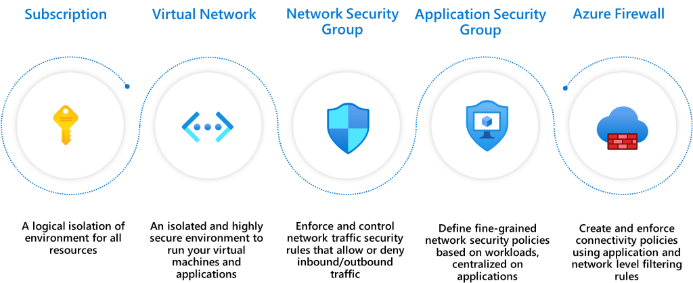

## Azure features for segmentation

When you operate on Azure, you have many segmentation options.

1. [Subscription](https://learn.microsoft.com/azure/cost-management-billing/manage/create-subscription): A high-level construct, which provides platform powered separation between entities. It's intended to carve out boundaries between large organizations within a company and communication between resources in different subscriptions needs to be explicitly provisioned.
1. [Virtual Network (VNets)](https://learn.microsoft.com/azure/virtual-network/virtual-networks-overview): Created within a subscription in private address spaces. They provide network level containment of resources with no traffic allowed by default between any two virtual networks. Like subscriptions, any communication between virtual networks needs to be explicitly provisioned.
1. [Network Security Groups (NSG)](https://learn.microsoft.com/azure/virtual-network/security-overview): An access control mechanisms for controlling traffic between resources within a virtual network and also with external networks, such as the internet, other virtual networks. NSGs can take your segmentation strategy to a granular level by creating perimeters for a subnet, a VM, or a group of VMs. For information about possible operations with subnets in Azure, see [Subnets (Azure Virtual Networks)](https://learn.microsoft.com/rest/api/virtualnetwork/subnets).
1. [Application Security Groups (ASGs)](https://learn.microsoft.com/azure/virtual-network/application-security-groups): Similar to NSGs but are referenced with an application context. It allows you to group a set of VMs under an application tag and define traffic rules that are then applied to each of the underlying VMs.
1. [Azure Firewall](https://learn.microsoft.com/azure/firewall/): A cloud native stateful Firewall as a service, which can be deployed in your VNet or in [Azure Virtual WAN](https://learn.microsoft.com/azure/virtual-wan/virtual-wan-about) hub deployments for filtering traffic flowing between cloud resources, the internet, and on-premise. You create rules or policies (using Azure Firewall or [Azure Firewall Manager](https://learn.microsoft.com/azure/firewall-manager/overview)) specifying allow/deny traffic using layer 3 to layer 7 controls. You can also filter traffic going to the internet using both Azure Firewall and third parties by directing some or all traffic through third-party security providers for advanced filtering & user protection.

## Segmentation patterns

Here are some common patterns for segmenting a workload in Azure from a networking perspective. Each pattern provides a different type of isolation and connectivity. Choose a pattern based on your organization's needs.

## Pattern 1: Single VNet

All the components of the workload reside in a single VNet. This pattern is appropriate you are operating in a single region because a VNet cannot span multiple regions.

Common ways for securing segments, such as subnets or application groups, are by using NSGs and ASGs. You can also use a Network Virtualized Appliance (NVAs) from Azure Marketplace or Azure Firewall to enforce and secure this segmentation.

In this image, Subnet1 has the database workload. Subnet2 has the web workloads. You can configure NSGs that allow Subnet1 to only communicate with Subnet2 and Subnet2 can only communicate with the internet.

Consider a use case where you have multiple workloads that are placed in separate subnets. You can place controls that will allow one workload to communicate to the backend of another workload.

## Pattern 2: Multiple VNets that communicate through with peering

The resources are spread or replicated in multiple VNets. The VNets can communicate through peering. This pattern is appropriate when you need to group applications into separate VNets. Or, you need multiple Azure regions. One benefit is the built-in segmentation because you have to explicitly peer one VNet to another. Virtual network peering is not transitive. You can further segment within a VNet by using NSGs and ASGs as shown in pattern 1.

## Pattern 3: Multiple VNets in a hub and spoke model

A VNet is designated as a _hub_ in a given region for all the other VNets as _spokes_ in that region. The hub and its spokes are connected through peering. All traffic passes through the hub that can act as a gateway to other hubs in different regions. In this pattern, the security controls are set up at the hubs so that they get to segment and govern the traffic in between other VNets in a scalable way. One benefit of this pattern is, as your network topology grows, the security posture overhead does not grow (except when you expand to new regions).

The recommended native option is Azure Firewall. This option works across both VNets and subscriptions to govern traffic flows using layer 3 to layer 7 controls. You can define your communication rules and apply them consistently. Here are some examples:

-   VNet 1 cannot communicate with VNet 2, but it can communicate VNet 3.
-   VNet 1 cannot access public internet except for *.github.com.

With Azure Firewall Manager preview, you can centrally manage policies across multiple Azure Firewalls and enable DevOps teams to further customize local policies.

## Pattern comparison

|Considerations | Pattern 1 | Pattern 2 | Pattern 3
|--|--|--|--|
|**Connectivity/routing: how each segment communicates to each other** | System routing provides default connectivity to any workload in any subnet. | Same as a pattern 1. | No default connectivity between spoke networks. A layer 3 router, such as the Azure Firewall, in the hub is required to enable connectivity. |
|**Network level traffic filtering**| Traffic is allowed by default. Use NSG, ASG to filter traffic. | Same as a pattern 1. | Traffic between spoke virtual networks is denied by default. Open selected paths to allow traffic through Azure Firewall configuration. |
|**Centralized logging**| NSG, ASG logs for the virtual network. | Aggregate NSG, ASG logs across all virtual networks. | Azure Firewall logs all accepted/denied traffic sent through the hub. View the logs in Azure Monitor. |
|**Unintended open public endpoints**| DevOps can accidentally open a public endpoint through incorrect NSG, ASG rules. | Same as a pattern 1. |Accidentally opened public endpoint in a spoke will not enable access because the return packet will get dropped through stateful firewall (asymmetric routing). |
**Application level protection** | NSG or ASG provides network layer support only.  | Same as a pattern 1. | Azure Firewall supports FQDN filtering for HTTP/S and MSSQL for outbound traffic and across virtual networks. |