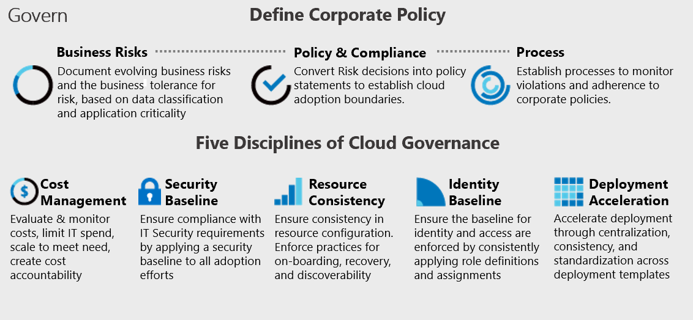

In this module, you learn how to:

-  Translate compliance requirements into a security solution
- Address compliance requirements with Microsoft Purview
- Design a solution to address privacy requirements with Microsoft Priva
- Design Azure Policy solutions to address security and compliance requirements
- Evaluate infrastructure compliance by using Microsoft Defender for Cloud

The content in the module helps you prepare for the certification exam SC-100: Microsoft Cybersecurity Architect.

## Prerequisites

- Conceptual knowledge of security policies, requirements, zero trust architecture, and management of hybrid environments
- Working experience with zero trust strategies, applying security policies, and developing security requirements based on business goals

## Overview of regulatory compliance

This article provides an introduction to regulatory compliance, and therefore is not intended for implementing a compliance strategy. More detailed information about [Azure compliance offerings](https://learn.microsoft.com/compliance/regulatory/offering-home) is available at the [Microsoft Trust Center](https://www.microsoft.com/trust-center). Moreover, all downloadable documentation is available to certain Azure customers from the [Microsoft Service Trust Portal](https://servicetrust.microsoft.com/).

Regulatory compliance refers to the discipline and process of ensuring that a company follows the laws enforced by governing bodies in their geography or rules required by voluntarily adopted industry standards. For IT regulatory compliance, people and processes monitor corporate systems to detect and prevent violations of policies and procedures established by these governing laws, regulations, and standards. This in turn applies to a wide array of monitoring and enforcement processes. Depending on the industry and geography, these processes can become lengthy and complex.

Compliance is challenging for multinational organizations, especially in heavily regulated industries like healthcare and financial services. Standards and regulations abound, and in certain cases may change frequently, making it difficult for businesses to keep up with changing international electronic data handling laws.

As with security controls, organizations should understand the division of responsibilities regarding regulatory compliance in the cloud. Cloud providers strive to ensure that their platforms and services are compliant. Organizations also need to confirm that their applications, the infrastructure those applications depend on, and services supplied by third parties are also certified as compliant.

## Regulatory compliance as part of Governance
<!--
https://learn.microsoft.com/azure/cloud-adoption-framework/govern/methodology
-->

The Cloud Adoption Framework governance model identifies key areas of importance during the journey. Each area relates to different types of risks the company must address as it adopts cloud services. Within this framework, the governance guide identifies required actions for the cloud governance team. Along the way, each principle of the Cloud Adoption Framework governance model is described further.

### Corporate policies

Corporate policies drive cloud governance. The governance guide focuses on specific aspects of corporate policy:

-   **Business risks:** Identifying and understanding corporate risks.
-   **Policy and compliance:** Converting risks into policy statements that support any compliance requirements.
-   **Processes:** Ensuring adherence to the stated policies.

**Five Disciplines of Cloud Governance:** These disciplines support the corporate policies. Each discipline protects the company from potential pitfalls:

-   Cost Management discipline
-   Security Baseline discipline
-   Resource Consistency discipline
-   Identity Baseline discipline
-   Deployment Acceleration discipline

Essentially, corporate policies serve as an early warning system to detect potential problems. The disciplines help the company manage risks and create guardrails.

## Important regulatory compliance standards

The following are descriptions of compliance regulations in various industries and geographies:

<!---->

## HIPAA

A healthcare application that processes protected health information (PHI) is subject to both the privacy rule and the security rule encompassed within the Health Insurance Portability and Accountability Act (HIPAA). At a minimum, HIPAA could likely require that a healthcare business must receive written assurances from the cloud provider that it will safeguard any PHI received or created.

<!---->

## PCI

The Payment Card Industry Data Security Standard (PCI DSS) is a proprietary information security standard for organizations that handle branded credit cards from the major card payment systems, including Visa, Mastercard, American Express, Discover, and JCB. The PCI standard is mandated by the card brands and administered by the Payment Card Industry Security Standards Council. The standard was created to increase controls around cardholder data to reduce credit-card fraud. Validation of compliance is performed annually, either by an external qualified security assessor (QSA) or by a firm-specific internal security assessor (ISA) who creates a report on compliance (ROC) for organizations handling large volumes of transactions, or by a self-assessment questionnaire (SAQ) for companies.

<!---->

## Personal data

Personal data is information that could be used to identify a consumer, employee, partner, or any other living or legal entity. Many emerging laws, particularly those dealing with privacy and personal data, require that businesses comply and report on compliance and any breaches that occur.

<!---->

## GDPR

One of the most important developments in this area is the General Data Protection Regulation (GDPR), designed to strengthen data protection for individuals within the European Union. GDPR requires that data about individuals (such as "a name, a home address, a photo, an email address, bank details, posts on social networking websites, medical information, or a computer's IP address") be maintained on servers within the EU and not transferred out of it. It also requires that companies notify individuals of any data breaches, and mandates that companies have a data protection officer (DPO). Other geopolitical regions have, or are developing, similar types of regulations.

<!---->

## Compliant foundation in Azure

To help customers meet their own compliance obligations across regulated industries and markets worldwide, Azure maintains the largest compliance portfolio in the industry, in both breadth (total number of offerings) and depth (number of customer-facing services in assessment scope). Azure compliance offerings are grouped into four segments:

- Global
- US government
- Industry
- Regional

Azure compliance offerings are based on various types of assurances, including formal certifications, attestations, validations, authorizations, and assessments produced by independent third-party auditing firms, as well as contractual amendments, self-assessments, and customer guidance documents produced by Microsoft. Each offering description in this document provides an up-to-date scope statement indicating which Azure customer-facing services are in scope for the assessment, along with links to downloadable resources to assist customers with their own compliance obligations.

The Microsoft Trust Center provides more detailed information about [Azure compliance offerings](https://www.microsoft.com/trust-center/compliance/compliance-overview). Additionally, all downloadable documentation is available to certain Azure customers from the [Microsoft Service Trust Portal](https://servicetrust.microsoft.com/) in the following sections:

- **Audit reports:** Includes sections for FedRAMP, GRC assessment, ISO, PCI DSS, and SOC reports.
- **Data protection resources:** Includes compliance guides, FAQ and white papers, and pen test and security assessment sections.