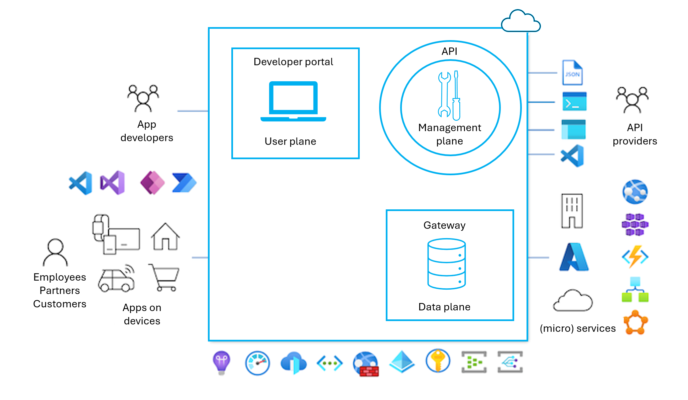

This unit will focus on using Azure API Management to secure APIs. Azure API Management is a hybrid, multicloud management platform for APIs across all environments. As a platform-as-a-service, API Management supports the complete API lifecycle.

## API Management components

Azure API Management is made up of an API _gateway_, a _management plane_, and a _developer portal_. These components are Azure-hosted and fully managed by default. API Management is available in various [tiers](https://learn.microsoft.com/azure/api-management/api-management-features) differing in capacity and features.

<!--

-->

## API gateway

All requests from client applications first reach the API gateway, which then forwards them to respective backend services. The API gateway acts as a facade to the backend services, allowing API providers to abstract API implementations and evolve backend architecture without impacting API consumers. The gateway enables consistent configuration of routing, security, throttling, caching, and observability.

Specifically, the gateway:

-   Acts as a facade to backend services by accepting API calls and routing them to appropriate backends
-   Verifies [API keys](https://learn.microsoft.com/azure/api-management/api-management-subscriptions) and other credentials such as [JWT tokens and certificates](https://learn.microsoft.com/azure/api-management/api-management-access-restriction-policies) presented with requests
-   Enforces [usage quotas and rate limits](https://learn.microsoft.com/azure/api-management/api-management-access-restriction-policies)
-   Optionally transforms requests and responses as specified in [policy statements](https://learn.microsoft.com/azure/api-management/api-management-howto-policies)
-   If configured, [caches responses](https://learn.microsoft.com/azure/api-management/api-management-howto-cache) to improve response latency and minimize the load on backend services
-   Emits logs, metrics, and traces for [monitoring, reporting, and troubleshooting](https://learn.microsoft.com/azure/api-management/observability)
<!--

-->

### Self-hosted gateway

With the [self-hosted gateway](https://learn.microsoft.com/azure/api-management/self-hosted-gateway-overview), customers can deploy the API gateway to the same environments where they host their APIs, to optimize API traffic and ensure compliance with local regulations and guidelines. The self-hosted gateway enables customers with hybrid IT infrastructure to manage APIs hosted on-premises and across clouds from a single API Management service in Azure.

The self-hosted gateway is packaged as a Linux-based Docker container and is commonly deployed to Kubernetes, including to Azure Kubernetes Service and [Azure Arc-enabled Kubernetes](https://learn.microsoft.com/azure/api-management/how-to-deploy-self-hosted-gateway-azure-arc).

More information:

- [API gateway in Azure API Management](https://learn.microsoft.com/azure/api-management/api-management-gateways-overview)
<!--

-->

## Management plane

API providers interact with the service through the management plane, which provides full access to the API Management service capabilities.

Customers interact with the management plane through Azure tools including the Azure portal, Azure PowerShell, Azure CLI, a [Visual Studio Code extension](https://marketplace.visualstudio.com/items?itemName=ms-azuretools.vscode-apimanagement&ssr=false#overview), or client SDKs in several popular programming languages.

Use the management plane to:

-   Provision and configure API Management service settings
-   Define or import API schemas from a wide range of sources, including OpenAPI specifications, Azure compute services, or WebSocket or GraphQL backends
-   Package APIs into products
-   Set up [policies](https://learn.microsoft.com/azure/api-management/api-management-key-concepts#policies) like quotas or transformations on the APIs
-   Get insights from analytics
-   Manage users

Microsoft cloud security benchmark's API security baseline outlines a number of controls for secure API management, in seven main areas. For each area, we have identified:
* the specific controls 
* important features which support that control
* configuration guidance for those features

## Azure API Management Security baseline

Microsoft cloud security benchmark's API security baseline outlines a number of controls for secure API management, in seven main areas. For each area, we have identified:
* the specific controls 
* important features which support that control
* configuration guidance for those features

We have omitted controls from the baseline where the feature was not supported to secure the service at this time and there was no configuration guidance. For the full specification, see [Azure security baseline for API Management](https://learn.microsoft.com/security/benchmark/azure/baselines/api-management-security-baseline).

### Network security

* NS-1: Establish network segmentation boundaries
	* Virtual Network Integration - Deploy Azure API Management inside an Azure Virtual Network (VNET), so it can access backend services within the network. The developer portal and API Management gateway can be configured to be accessible either from the Internet (External) or only within the Vnet (Internal).
	* Network Security Group Support - Deploy network security groups (NSG) to your API Management subnets to restrict or monitor traffic by port, protocol, source IP address, or destination IP address. Create NSG rules to restrict your service's open ports (such as preventing management ports from being accessed from untrusted networks). Be aware that by default, NSGs deny all inbound traffic but allow traffic from virtual network and Azure Load Balancers.
* NS-2: Secure cloud services with network controls
	* Azure Private Link - In instances where you are unable to deploy API Management instances into a virtual network, you should instead deploy a private endpoint to establish a private access point for those resources.
	* Disable Public Network Access - Disable public network access either using the IP ACL filtering rule on the NSGs assigned to the service's subnets or a toggling switch for public network access.
	* Microsoft Defender for Cloud monitoring
* NS-6: Deploy web application firewall

### Identity Management

* IM-1: Use centralized identity and authentication system
	* Azure AD Authentication Required for Data Plane Access - Use Azure Active Directory (Azure AD) as the default authentication method for API Management where possible.
	* Local Authentication Methods for Data Plane Access - Restrict the use of local authentication methods for data plane access, maintain inventory of API Management user accounts and reconcile access as needed. In API Management, developers are the consumers of the APIs that exposed with API Management. By default, newly created developer accounts are Active, and associated with the Developers group. Developer accounts that are in an active state can be used to access all of the APIs for which they have subscriptions.
* IM-3: Manage application identities securely and automatically
	* Managed Identities - Use a Managed Service Identity generated by Azure Active Directory (Azure AD) to allow your API Management instance to easily and securely access other Azure AD-protected resources, such as Azure Key Vault instead of using service principals. Managed identity credentials are fully managed, rotated, and protected by the platform, avoiding hard-coded credentials in source code or configuration files.
* IM-5: Use single sign-on (SSO) for application access
* IM-8: Restrict the exposure of credential and secrets
	* Service Credential and Secrets Support Integration and Storage in Azure Key Vault - Set up integration of API Management with Azure Key Vault. Ensure that secrets for API Management (Named values) are stored an Azure Key Vault so they can be securely accessed and updated.

### Privilege Access

* PA-1: Separate and limit highly privileged/administrative users 
	* Local Admin Accounts - If not required for routine administrative operations, disable or restrict any local admin accounts for only emergency use.
* PA-7: Follow just enough administration (least privilege) principle
	* Azure RBAC for Data Plane - Use Azure role-based access control (Azure RBAC) for controlling access to Azure API Management. Azure API Management relies on Azure role-based access control to enable fine-grained access management for API Management services and entities (for example, APIs and policies).
* PA-8: Determine access process for cloud provider support
	* Customer Lockbox - In support scenarios where Microsoft needs to access your data, use Customer Lockbox to review, then approve or reject each of Microsoft's data access requests.

### Data protection

* **DP-3: Encrypt sensitive data in transit**
	* Data in Transit Encryption - No additional configurations are required as this is enabled on a default deployment.
* **DP-6: Use a secure key management process**
	* Key Management in Azure Key Vault - Set up integration of API Management with Azure Key Vault. Ensure that keys used by API Management are stored an Azure Key Vault so they can be securely accessed and updated.
* **DP-7: Use a secure certificate management process**
	* Certificate Management in Azure Key Vault - Set up integration of API Management with Azure Key Vault. Ensure that secrets for API Management (Named values) are stored an Azure Key Vault so they can be securely accessed and updated.

### Asset management

* AM-2: Use only approved services
	*  Azure Policy Support - Use built-in Azure Policy to monitor and enforce secure configuration across API Management resources. Use Azure Policy aliases in the "Microsoft.ApiManagement" namespace to create custom Azure Policy definitions where required.

### Logging and threat detection

* LT-4: Enable logging for security investigation
	* Azure Resource Logs - Enable resource logs for API Management, resource logs provide rich information about operations and errors that are important for auditing and troubleshooting purposes. 

### Backup and recovery

* BR-1: Ensure regular automated backups
	* Service Native Backup Capability - Azure API Management supports its own native backup capability.

