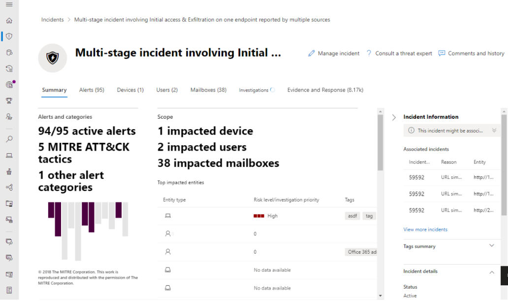

Microsoft 365 Defender is a unified pre- and post-breach enterprise defense suite that natively coordinates detection, prevention, investigation, and response across endpoints, identities, email, and applications to provide integrated protection against sophisticated attacks.

Here's a list of the different Microsoft 365 Defender products and solutions that Microsoft 365 Defender coordinates with:

-   [**Microsoft Defender for Endpoint**](https://learn.microsoft.com/microsoft-365/security/defender-endpoint/microsoft-defender-endpoint?view=o365-worldwide)
-   [**Microsoft Defender for Office 365**](https://learn.microsoft.com/microsoft-365/security/office-365-security/microsoft-defender-for-office-365-product-overview?view=o365-worldwide)
-   [**Microsoft Defender for Identity**](https://learn.microsoft.com/defender-for-identity/what-is)
-   [**Microsoft Defender for Cloud Apps**](https://learn.microsoft.com/defender-cloud-apps/what-is-defender-for-cloud-apps)
-   [**Microsoft Defender Vulnerability Management**](https://learn.microsoft.com/microsoft-365/security/defender-vulnerability-management/defender-vulnerability-management?view=o365-worldwide)
-   [**Azure Active Directory Identity Protection**](https://learn.microsoft.com/azure/active-directory/identity-protection/overview-identity-protection)
-   [**Microsoft Data Loss Prevention**](https://learn.microsoft.com/microsoft-365/compliance/dlp-learn-about-dlp)
-   [**App Governance**](https://learn.microsoft.com/defender-cloud-apps/app-governance-manage-app-governance)

## Microsoft 365 Defender interactive guide

In this interactive guide, you'll learn how to protect your organization with Microsoft 365 Defender. You'll see how Microsoft 365 Defender can help you detect security risks, investigate attacks to your organization, and prevent harmful activities automatically.

[Check out the interactive guide](https://aka.ms/M365Defender-InteractiveGuide)

## Microsoft 365 Defender protection

Microsoft 365 Defender services protect:

-   **Endpoints with Defender for Endpoint** - Defender for Endpoint is a unified endpoint platform for preventative protection, post-breach detection, automated investigation, and response.
-   **Assets with Defender Vulnerability Management** - Microsoft Defender Vulnerability Management delivers continuous asset visibility, intelligent risk-based assessments, and built-in remediation tools to help your security and IT teams prioritize and address critical vulnerabilities and misconfigurations across your organization.
-   **Email and collaboration with Defender for Office 365** - Defender for Office 365 safeguards your organization against malicious threats posed by email messages, links (URLs) and collaboration tools.
-   **Identities with Defender for Identity and Azure Active Directory (Azure AD) Identity Protection** - Microsoft Defender for Identity is a cloud-based security solution that leverages your on-premises Active Directory signals to identify, detect, and investigate advanced threats, compromised identities, and malicious insider actions directed at your organization. Azure AD Identity Protection uses the learnings Microsoft has acquired from their position in organizations with Azure AD, the consumer space with Microsoft Accounts, and in gaming with Xbox to protect your users.
-   **Applications with Microsoft Defender for Cloud Apps** - Microsoft Defender for Cloud Apps is a comprehensive cross-SaaS solution bringing deep visibility, strong data controls, and enhanced threat protection to your cloud apps.

Here's an example of how the Microsoft 365 Defender portal correlates all related alerts across products into a single incident.

Here's an example of the list of related alerts for an incident.

Here's an example of query-based hunting on top of email and endpoint raw data.

