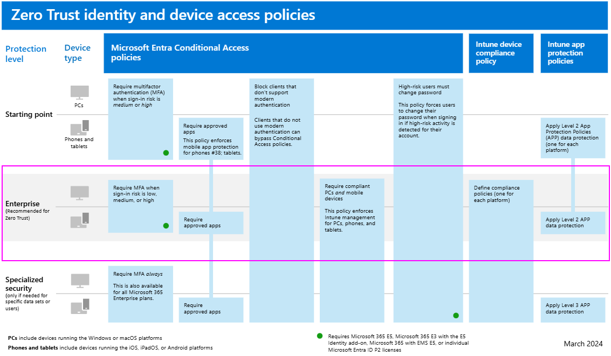

## Deploying Zero Trust for Microsoft 365

Microsoft 365 is built intentionally with many security and information protection capabilities to help you build Zero Trust into your environment. Many of the capabilities can be extended to protect access to other SaaS apps your organization uses and the data within these apps.

This illustration represents the work of deploying Zero Trust capabilities. This work is broken into units of work that can be configured together, starting from the bottom and working to the top to ensure that prerequisite work is complete.

In this illustration:

-   Zero Trust begins with a foundation of identity and device protection.
-   Threat protection capabilities are built on top of this foundation to provide real-time monitoring and remediation of security threats.
-   Information protection and governance provide sophisticated controls targeted at specific types of data to protect your most valuable information and to help you comply with compliance standards, including protecting personal information.

This article assumes you have already configured cloud identity. If you need guidance for this objective, see [**Deploy your identity infrastructure for Microsoft 365**](https://learn.microsoft.com/microsoft-365/enterprise/deploy-identity-solution-overview).

## Step 1. Configure Zero Trust identity and device access protection — starting-point policies

The first step is to build your Zero Trust foundation by configuring identity and device access protection.

Go to [**_Zero Trust identity and device access protection_**](https://learn.microsoft.com/microsoft-365/security/office-365-security/microsoft-365-policies-configurations?view=o365-worldwide) for prescriptive guidance to accomplish this. This series of articles describes a set of identity and device access prerequisite configurations and a set of Azure Active Directory (Azure AD) Conditional Access, Microsoft Intune, and other policies to secure access to Microsoft 365 for enterprise cloud apps and services, other SaaS services, and on-premises applications published with Azure AD Application Proxy.

|Includes|Prerequisites|Doesn't include|
|---------|---------|---------|
|Recommended identity and device access policies for three levels of protection: <ul><li>Starting point</li><li>Enterprise (recommended)</li><li>Specialized</li></ul>   Additional recommendations for: <ul><li>External users (guests)</li><li>Microsoft Teams</li><li>SharePoint Online</li><li>Microsoft Defender for Cloud Apps</lu></ul>|Microsoft E3 or E5    Azure Active Directory in either of these modes: <ul><li>Cloud-only</li><li>Hybrid with password hash sync (PHS) authentication</li><li>Hybrid with pass-through authentication (PTA)</li><li>Federated</li></ul>|Device enrollment for policies that require managed devices. See [Step 2. Manage endpoints with Intune](#step-2-manage-endpoints-with-intune) to enroll devices|

Device enrollment for policies that require managed devices. See [Step 2. Manage endpoints with Intune](https://learn.microsoft.com/microsoft-365/security/microsoft-365-zero-trust?view=o365-worldwide#step-2-manage-endpoints-with-intune) to enroll devices.

Start by implementing the starting-point tier. These policies do not require enrolling devices into management.

## Step 2. Manage endpoints with Intune

Next, enroll your devices into management and begin protecting these with more sophisticated controls.

Go to [**_Manage devices with Intune_**](https://learn.microsoft.com/microsoft-365/solutions/manage-devices-with-intune-overview?view=o365-worldwide) for prescriptive guidance to accomplish this.

|Includes|Prerequisites|Doesn't include|
|---------|---------|---------|
|Enroll devices with Intune: <ul><li>Corporate-owned devices</li><li>Autopilot/automated</li><li>enrollment</li></ul>   Configure policies: <ul><li>App Protection policies</li><li>Compliance policies</li><li>Device profile policies</li></ul>|Register endpoints with Azure AD|Configuring information protection capabilities, including: <ul><li>Sensitive information types</li><li>Labels</li><li>DLP policies</li></ul>|

## Step 3. Add Zero Trust identity and device access protection — Enterprise policies

With devices enrolled into management, you can now implement the full set of recommended Zero Trust identity and device access policies, requiring compliant devices.

Return to [**_Common identity and device access policies_**](https://learn.microsoft.com/microsoft-365/security/office-365-security/identity-access-policies?view=o365-worldwide) and add the policies in the Enterprise tier.

## Step 4. Evaluate, pilot, and deploy Microsoft 365 Defender

Microsoft 365 Defender is an extended detection and response (XDR) solution that automatically collects, correlates, and analyzes signal, threat, and alert data from across your Microsoft 365 environment, including endpoint, email, applications, and identities.

Go to [**_Evaluate and pilot Microsoft 365 Defender_**](https://learn.microsoft.com/microsoft-365/security/defender/eval-overview?view=o365-worldwide) for a methodical guide to piloting and deploying Microsoft 365 Defender components.

|Includes|Prerequisites|Doesn't include|
|---------|---------|---------|
|Set up the evaluation and pilot environment for all components: <ul><li>Defender for Identity</li><li>Defender for Office 365</li><li>Defender for Endpoint</li><li>Microsoft Defender for Cloud Apps</li></ul>   Protect against threats    Investigate and respond to threats|See the guidance to read about the architecture requirements for each component of Microsoft 365 Defender.| Azure AD Identity Protection is not included in this solution guide.|

See the guidance to read about the architecture requirements for each component of Microsoft 365 Defender.

## Step 5. Protect and govern sensitive data

Implement Microsoft Purview Information Protection to help you discover, classify, and protect sensitive information wherever it lives or travels.

Microsoft Purview Information Protection capabilities are included with Microsoft Purview and give you the tools to know your data, protect your data, and prevent data loss.

While this work is represented at the top of the deployment stack illustrated earlier in this article, you can begin this work anytime.

Microsoft Purview Information Protection provides a framework, process, and capabilities you can use to accomplish your specific business objectives.

For more information on how to plan and deploy information protection, see [**_Deploy a Microsoft Purview Information Protection solution_**](https://learn.microsoft.com/microsoft-365/compliance/information-protection-solution?view=o365-worldwide).

If you're deploying information protection for data privacy regulations, this solution guide provides a recommended framework for the entire process: [**_Deploy information protection for data privacy regulations with Microsoft 365_**](https://learn.microsoft.com/microsoft-365/solutions/information-protection-deploy?view=o365-worldwide).