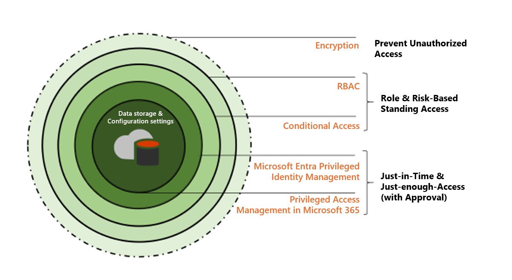

This unit discusses the following identity governance solutions:

- Privileged Identity Management (PIM)
- Privileged Access Management (PAM)
- Entitlement management
- Access reviews

## Privileged Identity Management (PIM)

Privileged Identity Management (PIM) is a service in Azure Active Directory (Azure AD) that enables you to manage, control, and monitor access to important resources in your organization. These resources include resources in Azure AD, Azure, and other Microsoft Online Services such as Microsoft 365 or Microsoft Intune.

### What does it do?

Privileged Identity Management provides time-based and approval-based role activation to mitigate the risks of excessive, unnecessary, or misused access permissions on resources that you care about. Here are some of the key features of Privileged Identity Management:

-   Provide **just-in-time** privileged access to Azure AD and Azure resources
-   Assign **time-bound** access to resources using start and end dates
-   Require **approval** to activate privileged roles
-   Enforce **multi-factor authentication** to activate any role
-   Use **justification** to understand why users activate
-   Get **notifications** when privileged roles are activated
-   Conduct **access reviews** to ensure users still need roles
-   Download **audit history** for internal or external audit
-   Prevents removal of the **last active Global Administrator** and **Privileged Role Administrator** role assignments

## Role assignment overview

The PIM role assignments give you a secure way to grant access to resources in your organization. This section describes the assignment process. It includes assign roles to members, activate assignments, approve or deny requests, extend and renew assignments.

### Assign

The assignment process starts by assigning roles to members. To grant access to a resource, the administrator assigns roles to users, groups, service principals, or managed identities. The assignment includes the following data:

-   The members or owners to assign the role.
-   The scope of the assignment. The scope limits the assigned role to a particular set of resources.
-   The type of the assignment
    -   **Eligible** assignments require the member of the role to perform an action to use the role. Actions might include activation, or requesting approval from designated approvers.
    -   **Active** assignments don't require the member to perform any action to use the role. Members assigned as active have the privileges assigned to the role.
-   The duration of the assignment, using start and end dates or permanent. For eligible assignments, the members can activate or requesting approval during the start and end dates. For active assignments, the members can use the assign role during this period of time.

### Activate

If users have been made eligible for a role, then they must activate the role assignment before using the role. To activate the role, users select specific activation duration within the maximum (configured by administrators), and the reason for the activation request.

### Approve or deny

Delegated approvers receive email notifications when a role request is pending their approval. Approvers can view, approve or deny these pending requests in PIM. After the request has been approved, the member can start using the role. For example, if a user or a group was assigned with Contribution role to a resource group, they are able to manage that particular resource group.

### Extend and renew assignments

After administrators set up time-bound owner or member assignments, the first question you might ask is what happens if an assignment expires? In this new version, we provide two options for this scenario:

-   **Extend** – When a role assignment nears expiration, the user can use Privileged Identity Management to request an extension for the role assignment
-   **Renew** – When a role assignment has already expired, the user can use Privileged Identity Management to request a renewal for the role assignment

Both user-initiated actions require an approval from a Global Administrator or Privileged Role Administrator. Admins don't need to be in the business of managing assignment expirations. You can just wait for the extension or renewal requests to arrive for simple approval or denial.

## Privileged Access Management (PAM)

### PAM in AD DS
<!--
BEGIN(https://learn.microsoft.com/microsoft-identity-manager/pam/privileged-identity-management-for-active-directory-domain-services)
-->
MIM Privileged Access Management (PAM) is a solution that helps organizations restrict privileged access within an existing and isolated Active Directory environment.

Privileged Access Management accomplishes two goals:

-   Re-establish control over a compromised Active Directory environment by maintaining a separate bastion environment that is known to be unaffected by malicious attacks.
-   Isolate the use of privileged accounts to reduce the risk of those credentials being stolen.
<!--
END()
-->

### PAM in Office 365

<!--
BEGIN(https://learn.microsoft.com/microsoft-365/compliance/privileged-access-management?view=o365-worldwide)
-->
Microsoft Purview Privileged Access Management allows granular access control over privileged admin tasks in Office 365. It can help protect your organization from breaches that use existing privileged admin accounts with standing access to sensitive data or access to critical configuration settings. Privileged access management requires users to request just-in-time access to complete elevated and privileged tasks through a highly scoped and time-bounded approval workflow. This configuration gives users just-enough-access to perform the task at hand, without risking exposure of sensitive data or critical configuration settings. Enabling privileged access management allows your organization to operate with zero standing privileges and provide a layer of defense against standing administrative access vulnerabilities.

### PAM vs PIM

Privileged access management complements other data and access feature protections within the Microsoft 365 security architecture. Including privileged access management as part of an integrated and layered approach to security provides a security model that maximizes protection of sensitive information and Microsoft 365 configuration settings. As shown in the diagram, privileged access management builds on the protection provided with native encryption of Microsoft 365 data and the role-based access control security model of Microsoft 365 services. When used with [Azure AD Privileged Identity Management](https://learn.microsoft.com/azure/active-directory/active-directory-privileged-identity-management-configure), these two features provide access control with just-in-time access at different scopes.

Privileged access management is defined and scoped at the **task** level, while Azure AD Privileged Identity Management applies protection at the **role** level with the ability to execute multiple tasks. Azure AD Privileged Identity Management primarily allows managing accesses for AD roles and role groups, while Microsoft Purview Privileged Access Management applies only at the task level.

-   **Enabling privileged access management while already using Azure AD Privileged Identity Management:** Adding privileged access management provides another granular layer of protection and audit capabilities for privileged access to Microsoft 365 data.
    
-   **Enabling Azure AD Privileged Identity Management while already using Microsoft Purview Privileged Access Management:** Adding Azure AD Privileged Identity Management to Microsoft Purview Privileged Access Management can extend privileged access to data outside of Microsoft 365 that's primarily defined by user roles or identity.

<!--
END()
-->

## Entitlement management

<!--
BEGIN(https://learn.microsoft.com/azure/active-directory/governance/entitlement-management-overview)
-->
Entitlement management is an [identity governance](https://learn.microsoft.com/azure/active-directory/governance/identity-governance-overview) feature that enables organizations to manage identity and access lifecycle at scale, by automating access request workflows, access assignments, reviews, and expiration.

Employees in organizations need access to various groups, applications, and SharePoint Online sites to perform their job. Managing this access is challenging, as requirements change. New applications are added or users need more access rights. This scenario gets more complicated when you collaborate with outside organizations. You may not know who in the other organization needs access to your organization's resources, and they won't know what applications, groups, or sites your organization is using.

Entitlement management can help you more efficiently manage access to groups, applications, and SharePoint Online sites for internal users, and also for users outside your organization who need access to those resources.

<!---->

### Why use entitlement management?

Enterprise organizations often face challenges when managing employee access to resources such as:

-   Users may not know what access they should have, and even if they do, they may have difficulty locating the right individuals to approve their access
-   Once users find and receive access to a resource, they may hold on to access longer than is required for business purposes

These problems are compounded for users who need access from another organization, such as external users that are from supply chain organizations or other business partners. For example:

-   No one person may know all of the specific individuals in other organization's directories to be able to invite them
-   Even if they were able to invite these users, no one in that organization may remember to manage all of the users' access consistently

<!--
END()
-->

## Access Reviews

Access reviews in Azure Active Directory (Azure AD), part of Microsoft Entra, enable organizations to efficiently manage group memberships, access to enterprise applications, and role assignments. User's access can be reviewed regularly to make sure only the right people have continued access.

### Why are access reviews important?

Azure AD enables you to collaborate with users from inside your organization and with external users. Users can join groups, invite guests, connect to cloud apps, and work remotely from their work or personal devices. The convenience of using self-service has led to a need for better access management capabilities.

-   As new employees join, how do you ensure they have the access they need to be productive?
-   As people move teams or leave the company, how do you make sure that their old access is removed?
-   Excessive access rights can lead to compromises.
-   Excessive access right may also lead audit findings as they indicate a lack of control over access.
-   You have to proactively engage with resource owners to ensure they regularly review who has access to their resources.

<!---->

### When should you use access reviews?

A few of the scenarios when access reviews may be useful are the following:

-   **Too many users in privileged roles:** It's a good idea to check how many users have administrative access, how many of them are Global Administrators, and if there are any invited guests or partners that haven't been removed after being assigned to do an administrative task. You can recertify the role assignment users in Azure AD roles such as Global Administrators, or Azure resources roles such as User Access Administrator in the Microsoft Entra Privileged Identity Management (PIM) experience.
-   **When automation is not possible:** You can create rules for dynamic membership on security groups or Microsoft 365 Groups, but what if the HR data isn't in Azure AD or if users still need access after leaving the group to train their replacement? You can then create a review on that group to ensure those who still need access should have continued access.
-   **When a group is used for a new purpose:** If you have a group that is going to be synced to Azure AD, or if you plan to enable the application Salesforce for everyone in the Sales team group, it would be useful to ask the group owner to review the group membership prior to the group being used in a different risk content.

## Best practices for privileged access management

### Lower exposure of privileged accounts

Securing privileged access is a critical first step to protecting business assets. Minimizing the number of people who have access to secure information or resources reduces the chance of a malicious user getting access, or an authorized user inadvertently affecting a sensitive resource.

Privileged accounts are accounts that administer and manage IT systems. Cyber attackers target these accounts to gain access to an organization’s data and systems. To secure privileged access, you should isolate the accounts and systems from the risk of being exposed to a malicious user.

The following are a few of the best practices found in [Securing privileged access for hybrid and cloud deployments in Azure AD](/azure/active-directory/roles/security-planning):

**Best practice**: Manage, control, and monitor access to privileged accounts.   

**Detail**: Turn on Azure AD Privileged Identity Management. After you turn on Privileged Identity Management, you’ll receive notification email messages for privileged access role changes. These notifications provide early warning when other users are added to highly privileged roles in your directory.

**Best practice**: Ensure all critical admin accounts are managed Azure AD accounts.

**Detail**: Remove any consumer accounts from critical admin roles (for example, Microsoft accounts like hotmail.com, live.com, and outlook.com).

**Best practice**: Ensure all critical admin roles have a separate account for administrative tasks in order to avoid phishing and other attacks to compromise administrative privileges.

**Detail**: Create a separate admin account that’s assigned the privileges needed to perform the administrative tasks. Block the use of these administrative accounts for daily productivity tools like Microsoft 365 email or arbitrary web browsing.

**Best practice**: Identify and categorize accounts that are in highly privileged roles.   

**Detail**: After turning on Azure AD Privileged Identity Management, view the users who are in the global administrator, privileged role administrator, and other highly privileged roles. Remove any accounts that are no longer needed in those roles, and categorize the remaining accounts that are assigned to admin roles:

* Individually assigned to administrative users, and can be used for nonadministrative purposes (for example, personal email)
* Individually assigned to administrative users and designated for administrative purposes only
* Shared across multiple users
* For emergency access scenarios
* For automated scripts
* For external users

**Best practice**: Implement “just in time” (JIT) access to further lower the exposure time of privileges and increase your visibility into the use of privileged accounts.   
**Detail**: Azure AD Privileged Identity Management provides this capability.
