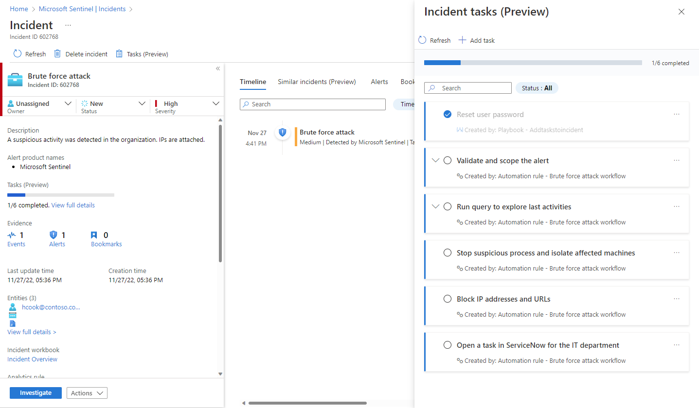

This unit will discuss solutions for the following types of security workflows:

1. Incident response
1. Incident management
1. Threat intelligence
1. Threat hunting

## Microsoft cloud security benchmark controls for incident response

The following table summarizes the control recommendations for incident response from the Microsoft cloud security benchmark. For a complete discussion of these controls, as well as guidance for specific cloud platforms, see [Microsoft cloud security benchmark - Incident Response](https://learn.microsoft.com/security/benchmark/azure/mcsb-incident-response)

Please refer to [Introduction to Microsoft Cybersecurity Reference Architecture and cloud security benchmark](/training/modules/design-solutions-microsoft-cybersecurity-cloud-security-benchmark/1-introduction-reference-architecture-benchmark) for more background on Microsoft Cloud Security Benchmark. 

In the table below, we have included controls from the full baseline where:

* Security controls were *supported* but *not* enabled by default
* There was explicit guidance which contained action to be taken on the part of the customer

| Control Number | Title | Summary |
|---|---|---|
| IR-1 | Preparation - update incident response plan and handling process  | Ensure your organization follows industry best practice to develop processes and plans to respond to security incidents on the cloud platforms. Be mindful about the shared responsibility model and the variances across IaaS, PaaS, and SaaS services. This will have a direct impact on how you collaborate with your cloud provider in incident response and handling activities, such as incident notification and triage, evidence collection, investigation, eradication, and recovery. Regularly test the incident response plan and handling process to ensure they're up to date.  |
| IR-2   | Preparation - setup incident notification  | Ensure the security alerts and incident notifications from the cloud service provider's platform and your environments can be received by correct contact in your incident response organization.  | 
| IR-3  | Detection and analysis - create incidents based on high-quality alerts  | Ensure you have a process to create high-quality alerts and measure the quality of alerts. This allows you to learn lessons from past incidents and prioritize alerts for analysts, so they don't waste time on false positives. High-quality alerts can be built based on experience from past incidents, validated community sources, and tools designed to generate and clean up alerts by fusing and correlating diverse signal sources.  | 
| IR-4  | Detection and analysis - investigate an incident  | Ensure the security operation team can query and use diverse data sources as they investigate potential incidents, to build a full view of what happened. Diverse logs should be collected to track the activities of a potential attacker across the kill chain to avoid blind spots. You should also ensure insights and learnings are captured for other analysts and for future historical reference. Use the cloud native SIEM and incident management solution if your organization does not have an existing solution to aggregate security logs and alerts information. Correlate incident data based on the data sourced from different sources to facility the incident investigations.  |
| IR-5  | Detection and analysis - prioritize incidents  | Provide context to security operations teams to help them determine which incidents ought to first be focused on, based on alert severity and asset sensitivity defined in your organization’s incident response plan. Additionally, mark resources using tags and create a naming system to identify and categorize your cloud resources, especially those processing sensitive data. It is your responsibility to prioritize the remediation of alerts based on the criticality of the resources and environment where the incident occurred.  |
| IR-6  | Containment, eradication and recovery - automate the incident handling  | Automate the manual, repetitive tasks to speed up response time and reduce the burden on analysts. Manual tasks take longer to execute, slowing each incident and reducing how many incidents an analyst can handle. Manual tasks also increase analyst fatigue, which increases the risk of human error that causes delays and degrades the ability of analysts to focus effectively on complex tasks.  |
| IR-7  | Post-incident activity - conduct lessons learned and retain evidence  | Conduct lessons learned in your organization periodically and/or after major incidents, to improve your future capability in incident response and handling. Based on the nature of the incident, retain the evidence related to the incident for the period defined in the incident handling standard for further analysis or legal actions.  |

## Incident management in Microsoft Sentinel

### Analyst
<!--

-->

#### Follow tasks when handling an incident

When you select an incident and **View full details**, on the incident details page you'll see on the right-hand panel all the tasks that have been added to that incident, whether manually or by automation rules.

Expand a task to see its full description, including the user, automation rule, or playbook that created it.

Mark a task complete by selecting its "checkbox" circle.

<!--

-->

#### Add tasks to an incident on the spot

You can add tasks to an open incident that you're working on, either to give yourself reminders of actions you've discovered a need to take, or to record actions that you've taken of your own initiative that don't appear in the task list. Tasks added in this way will apply only to the open incident.
<!--

-->

### Workflow creator
<!--

-->

#### Add tasks to incidents with automation rules

Use the **Add task** action in automation rules to automatically furnish all incidents with a checklist of tasks for your analysts. Set the **Analytics rule name** condition in your automation rule to determine the scope:

-   Apply the automation rule to _all analytics rules_ in order to define a standard set of tasks to be applied to all incidents.
    
-   By applying your automation rule to _a limited set of analytics rules_, you can assign specific tasks to particular incidents, according to the threats detected by the analytics rule or rules that generated those incidents.
    

Consider that the order in which tasks appear in your incident is determined by the tasks' creation time. You can set the order of automation rules so that rules that add tasks required for all incidents will run first, and only afterwards any rules that add tasks required for incidents generated by specific analytics rules. Within a single rule, the order in which the actions are defined governs the order in which they appear in an incident.

See which incidents are covered by existing automation rules and tasks, before you create a new automation rule.  
Use the **Action** filter on the **Automation rules** list to see only those rules that add tasks to incidents, and see which analytics rules those automation rules apply to, to understand which incidents those tasks will be added to.
<!--

-->

#### Add tasks to incidents with playbooks

Use the **Add task** action in a playbook (in the Microsoft Sentinel connector) to automatically add a task to the incident that triggered the playbook.

Then, use other playbook actions - in their respective Logic Apps connectors - to complete the contents of the task.

Finally, use the **Mark task as completed** action (again in the Microsoft Sentinel connector) to automatically mark the task complete.

Consider the following scenarios as examples:

-   **Let playbooks add and complete tasks:** When an incident is created, it will trigger a playbook that does the following:
    
    1.  Adds a task to the incident to reset a user's password.
    2.  Performs the task by issuing an API call to the user provisioning system to reset the user's password.
    3.  Awaits a response from the system as to the success or failure of the reset.
        -   If the password reset succeeded, the playbook then marks the task it just created in the incident as completed.
        -   If the password reset failed, the playbook will not mark the task as completed, leaving it to an analyst to perform.
-   **Let playbook evaluate if conditional tasks should be added:** When an incident is created, it will trigger a playbook that requests an IP address report from an external threat intelligence source.
    
    -   If the IP address is malicious, the playbook adds a certain task (say, "Block this IP address").
    -   Otherwise, the playbook takes no further action.
<!--

-->

#### Use automation rules or playbooks to add tasks?

What considerations should dictate which of these methods should be used to create incident tasks?

-   **Automation rules** - Use whenever possible. Use for plain, static tasks that don't require interactivity.
-   **Playbooks** - Use for advanced use cases: the creation of tasks based on conditions, tasks with integrated automated actions.

## Threat intelligence in Microsoft Sentinel

Cyber threat intelligence (CTI) is information describing existing or potential threats to systems and users. This intelligence takes many forms, from written reports detailing a particular threat actor's motivations, infrastructure, and techniques, to specific observations of IP addresses, domains, file hashes, and other artifacts associated with known cyber threats. CTI is used by organizations to provide essential context to unusual activity, so security personnel can quickly take action to protect their people, information, and assets. CTI can be sourced from many places, such as open-source data feeds, threat intelligence-sharing communities, commercial intelligence feeds, and local intelligence gathered in the course of security investigations within an organization.

For SIEM solutions like Microsoft Sentinel, the most common forms of CTI are threat indicators, also known as Indicators of Compromise (IoC) or Indicators of Attack (IoA). Threat indicators are data that associate observed artifacts such as URLs, file hashes, or IP addresses with known threat activity such as phishing, botnets, or malware. This form of threat intelligence is often called _tactical threat intelligence_ because it can be applied to security products and automation in large scale to detect potential threats to an organization and protect against them. In Microsoft Sentinel, you can use threat indicators to help detect malicious activity observed in your environment and provide context to security investigators to help inform response decisions.

Integrate threat intelligence (TI) into Microsoft Sentinel through the following activities:

-   **Import threat intelligence** into Microsoft Sentinel by enabling **data connectors** to various TI [platforms](https://learn.microsoft.com/azure/sentinel/connect-threat-intelligence-tip) and [feeds](https://learn.microsoft.com/azure/sentinel/connect-threat-intelligence-taxii).
    
-   **View and manage** the imported threat intelligence in **Logs** and in the **Threat Intelligence** blade of Microsoft Sentinel.
    
-   **Detect threats** and generate security alerts and incidents using the built-in **Analytics** rule templates based on your imported threat intelligence.
    
-   **Visualize key information** about your imported threat intelligence in Microsoft Sentinel with the **Threat Intelligence workbook**.
    

Microsoft enriches all imported threat intelligence indicators with [GeoLocation and WhoIs data](https://learn.microsoft.com/azure/sentinel/understand-threat-intelligence?source=recommendations#view-your-geolocation-and-whois-data-enrichments-public-preview), which is displayed together with other indicator details.

Threat Intelligence also provides useful context within other Microsoft Sentinel experiences such as **Hunting** and **Notebooks**. For more information, see [Jupyter Notebooks in Microsoft Sentinel](https://techcommunity.microsoft.com/t5/azure-sentinel/using-threat-intelligence-in-your-jupyter-notebooks/ba-p/860239) and [Tutorial: Get started with Jupyter notebooks and MSTICPy in Microsoft Sentinel](https://learn.microsoft.com/azure/sentinel/notebook-get-started).

## Threat hunting in Sentinel

The hunting dashboard provides ready-made query examples designed to get you started and get you familiar with the tables and the query language. Queries run on data stored in log tables, such as for process creation, DNS events, or other event types.

Built-in hunting queries are developed by Microsoft security researchers on a continuous basis, both adding new queries and fine-tuning existing queries to provide you with an entry point to look for new detections and figure out where to start hunting for the beginnings of new attacks.

Use queries before, during, and after a compromise to take the following actions:

- **Before an incident occurs**: Waiting on detections is not enough. Take proactive action by running any threat-hunting queries related to the data you're ingesting into your workspace at least once a week.

    Results from your proactive hunting provide early insight into events that may confirm that a compromise is in process, or will at least show weaker areas in your environment that are at risk and need attention.

- **During a compromise**:  Use livestream to run a specific query constantly, presenting results as they come in. Use livestream when you need to actively monitor user events, such as if you need to verify whether a specific compromise is still taking place, to help determine a threat actor's next action, and towards the end of an investigation to confirm that the compromise is indeed over.

- **After a compromise**:  After a compromise or an incident has occurred, make sure to improve your coverage and insight to prevent similar incidents in the future.

  - Modify your existing queries or create new ones to assist with early detection, based on insights you've gained from your compromise or incident.

  - If you've discovered or created a hunting query that provides high value insights into possible attacks, create custom detection rules based on that query and surface those insights as alerts to your security incident responders.

    View the query's results, and select **New alert rule** > **Create Microsoft Sentinel alert**. Use the **Analytics rule wizard** to create a new rule based on your query. For more information, see Create custom analytics rules to detect threats.

You can also create hunting and livestream queries over data stored in Azure Data Explorer. For more information, see details of constructing cross-resource queries in the Azure Monitor documentation.

Use community resources, such as the [Microsoft Sentinel GitHub repository](https://github.com/Azure/Azure-Sentinel/tree/master/Hunting%20Queries) to find additional queries and data sources.

## Use the hunting dashboard

The hunting dashboard enables you to run all your queries, or a selected subset, in a single selection. In the Microsoft Sentinel portal, select **Hunting**.

The table shown lists all the queries written by Microsoft's team of security analysts and any extra query you created or modified. Each query provides a description of what it hunts for, and what kind of data it runs on. These queries are grouped by their MITRE ATT&CK **tactics**. The icons on the right categorize the type of threat, such as initial access, persistence, and exfiltration. MITRE ATT&CK **techniques** are shown in the **Techniques** column and describe the specific behavior identified by the hunting query.

:::image type="content" source="../media/hunting-start.png" alt-text="Screenshot showing Microsoft Sentinel hunting." lightbox="../media/hunting-start.png":::

Use the hunting dashboard to identify where to start hunting, by looking at result count, spikes, or the change in result count over a 24-hour period. Sort and filter by favorites, data source, MITRE ATT&CK tactic or technique, results, results delta, or results delta percentage. View queries that still need data sources connected, and get recommendations on how to enable these queries.

The following table describes detailed actions available from the hunting dashboard:

| Action | Description  |
| --------- | --------- |
| **See how queries apply to your environment**      | Select the **Run all queries** button, or select a subset of queries using the check boxes to the left of each row and select the **Run selected queries** button.   Running your queries can take anywhere from a few seconds to many minutes, depending on how many queries are selected, the time range, and the amount of data that is being queried.      |
| **View the queries that returned results**         | After your queries are done running, view the queries that returned results using the **Results** filter:  - Sort to see which queries had the most or fewest results.  - View the queries that are not at all active in your environment by selecting *N/A* in the **Results** filter.  - Hover over the info icon (**i**) next to the *N/A* to see which data sources are required to make this query active.  |
| **Identify spikes in your data**                   | Identify spikes in the data by sorting or filtering on **Results delta** or **Results delta percentage**.   This compares the results of the last 24 hours against the results of the previous 24-48 hours, highlighting any large differences or relative difference in volume.   |
| **View queries mapped to the MITRE ATT&CK tactic** | The **MITRE ATT&CK tactic bar**, at the top of the table, lists how many queries are mapped to each MITRE ATT&CK tactic. The tactic bar gets dynamically updated based on the current set of filters applied.   This enables you to see which MITRE ATT&CK tactics show up when you filter by a given result count, a high result delta, *N/A* results, or any other set of filters.        |
| **View queries mapped to MITRE ATT&CK techniques** | Queries can also be mapped to MITRE ATT&CK techniques. You can filter or sort by MITRE ATT&CK techniques using the **Technique** filter. By opening a query, you will be able to select the technique to see the MITRE ATT&CK description of the technique.        |
| **Save a query to your favorites**                 |   Queries saved to your favorites automatically run each time the **Hunting** page is accessed. You can create your own hunting query or clone and customize an existing hunting query template.      |
| **Run queries**                                    |   Select **Run Query** in the hunting query details page to run the query directly from the hunting page. The number of matches is displayed within the table, in the **Results** column. Review the list of hunting queries and their matches.     |
| **Review an underlying query**                     | Perform a quick review of the underlying query in the query details pane. You can see the results by clicking the **View query results** link (below the query window) or the **View Results** button (at the bottom of the pane). The query will open in the **Logs** (Log Analytics) blade, and below the query, you can review the matches for the query.       |