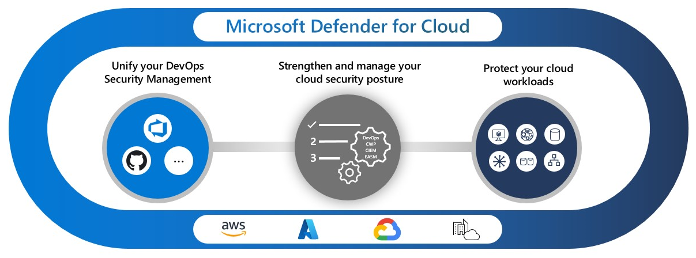

Designing an integrated security posture management solution for hybrid and multicloud environments requires architectural decisions that balance coverage, capability, and operational complexity. An effective design combines multiple components: security frameworks like MCSB for baseline standards, tooling for continuous assessment and protection, and operational processes for governance and remediation. Microsoft Defender for Cloud serves as a central component in this integrated design, providing a cloud-native application protection platform (CNAPP) that extends across Azure, AWS, GCP, and on-premises resources.

## Why Defender for Cloud for multicloud CSPM

Defender for Cloud is a CNAPP that includes CSPM, cloud workload protection, and DevSecOps capabilities. This unit focuses on the CSPM capability—workload protection is covered in a later unit.

The primary benefit for multicloud environments is a single posture management plane. Instead of using separate security tools for each cloud, Defender for Cloud gives you one dashboard with unified recommendations, one secure score, and consistent MCSB assessment across Azure, AWS, and GCP. Two CSPM tiers are available—Foundational and Defender CSPM—compared in the next section.

## Defining your multicloud scope

A key design decision involves defining which environments Defender for Cloud must cover within your integrated solution. Most organizations operate across multiple environments, and your architecture must account for each:

- **Azure**: Native integration with no extra configuration. All Azure subscriptions can enable Foundational CSPM at no cost for immediate visibility.
- **AWS and GCP**: Require cloud connectors deployed through the Defender for Cloud portal. Connector design decisions—such as organization-level versus account/project-level—are covered later in this unit.
- **On-premises and edge**: Require Azure Arc to project servers, Kubernetes clusters, and SQL Server instances into Azure. A later unit covers Azure Arc integration in detail.

Document each environment in scope, the resource types it contains, and any constraints (such as network restrictions or regulatory boundaries). This scoping exercise drives all subsequent design decisions—connector architecture, CSPM tier selection, agent strategy, and governance structure.

## Choosing the right CSPM tier

The decision between Foundational and Defender CSPM depends on your security requirements and the value of advanced capabilities.

| Consideration | Foundational CSPM | Defender CSPM |
|--------------|-------------------|---------------|
| **Best for** | Organizations starting their cloud security journey, or those with mature processes who need basic assessment | Organizations requiring proactive risk identification and compliance beyond MCSB |
| **Attack path analysis** | Not available | Identifies exploitable paths to critical assets across your environment |
| **Cloud security explorer** | Not available | Graph-based queries to proactively identify security risks across your multicloud environment |
| **Governance workflows** | Manual tracking of remediation | Assign recommendations to owners with due dates and track progress |
| **Regulatory compliance** | MCSB only | Additional standards including PCI-DSS, ISO 27001, SOC 2, and custom frameworks |
| **Agentless scanning** | Not available | Discovers vulnerabilities, secrets, and malware without deploying agents to machines |
| **Sensitive data discovery** | Not available | Discovers managed cloud data resources containing sensitive data, integrated with Microsoft Purview |
| **Permissions management (CIEM)** | Not available | Identifies over-permissioned identities and excess entitlements across cloud environments |

For most enterprise environments, start with Foundational CSPM to establish baseline visibility, then enable Defender CSPM on subscriptions containing critical workloads or sensitive data. This tiered approach optimizes cost while ensuring advanced protection where it matters most.

## Designing the agent strategy

Your architecture must address how you collect security data from compute resources across clouds. Defender for Cloud supports both agent-based and agentless approaches.

**Agentless scanning** uses cloud APIs and disk snapshots to assess machine configurations and vulnerabilities without installing software. This approach reduces operational overhead and works across Azure, AWS, and GCP for environments where agent deployment is restricted.

**Agent-based collection** through the Azure Monitor Agent or Defender for Endpoint provides richer telemetry including runtime behavior and network connections. Agents enable capabilities like just-in-time VM access and adaptive application controls.

Design your approach by workload risk: agentless scanning for broad coverage across development and test environments, and agents for production workloads processing sensitive data where deeper visibility justifies the management overhead.

## Designing unified assessment across clouds

A core challenge in multicloud posture management is achieving consistent security assessment when each cloud provider has its own native security tools, terminology, and configuration model. Defender for Cloud addresses this by normalizing assessments into a single recommendation framework.

**How cross-cloud assessment works**: For Azure, Defender for Cloud uses Azure Policy definitions to evaluate resource configurations. For AWS and GCP, Defender for Cloud deploys cloud-native connectors that call provider APIs (such as AWS Security Hub and GCP Security Command Center) to gather configuration data. Regardless of the source, findings surface as unified recommendations in a single dashboard, mapped to MCSB controls.

**Connector architecture decisions**: Design your connectors to match your cloud governance model:

- **AWS**: Connect at the AWS organization level for automatic coverage of all current and future accounts. Use account-level connectors only when you need to limit scope or apply different Defender plans per account. Organization-level connectors can autoprovision Azure Arc agents on EC2 instances.
- **GCP**: Connect at the GCP organization level for broad coverage, or at the project level for granular control. Similar to AWS, organization-level connectors simplify onboarding and reduce management overhead.
- **On-premises**: Defender for Cloud requires Azure Arc to extend posture management to on-premises servers, Kubernetes clusters, and SQL Server instances. Plan Azure Arc deployment as a prerequisite—a later unit covers this integration in detail.

**Achieving consistent standards**: MCSB provides platform-specific implementation guidance for each control across Azure, AWS, and GCP. When you enable MCSB in Defender for Cloud, each cloud environment is assessed against controls tailored to that platform's services. For example, the Network Security control evaluates Azure NSGs, AWS Security Groups, and GCP firewall rules using platform-appropriate criteria but reports findings under the same MCSB control.

For compliance beyond MCSB, Defender CSPM supports adding regulatory standards. Some standards—like AWS Foundational Security Best Practices—are AWS-specific. Others—like PCI-DSS and ISO 27001—apply across clouds. Design your compliance dashboard to include cross-cloud standards for unified reporting and cloud-specific standards where regulations or organizational policy require them.

**Multicloud attack path analysis**: With Defender CSPM enabled, the cloud security graph correlates assets, identities, and permissions across Azure, AWS, and GCP. Attack path analysis can identify cross-cloud exploit chains—for example, an over-permissioned AWS IAM role that could be used to access Azure resources through a federated identity. This cross-cloud visibility is only available with Defender CSPM and requires connectors to be configured for each cloud environment.

**Design consideration**: For Azure resources, you can go further than detective assessment. Azure Policy supports deny effects that block noncompliant deployments at creation time, providing preventive enforcement that isn't available for AWS or GCP resources through Defender for Cloud. Factor this asymmetry into your design—Azure environments can enforce guardrails proactively, while AWS and GCP rely on Defender for Cloud's detective recommendations and their own native enforcement tools.

## Establishing governance and accountability

Beyond technical configuration, your design must address how your organization operationalizes posture management across clouds:

- **Account organization**: Structure Azure subscriptions, AWS accounts, and GCP projects to align with ownership boundaries. This simplifies assigning security recommendations to responsible teams.

- **Role-based access**: Define who can view recommendations, remediate issues, and change Defender for Cloud settings. Security Reader, Security Admin, and Contributor roles provide graduated access.

- **Workflow integration**: Determine how recommendations flow into remediation processes. Defender for Cloud integrates with Azure DevOps, ServiceNow, and other ticketing systems for automatic work item creation.

Your integrated posture management solution may also include complementary tools such as Defender External Attack Surface Management for internet-facing asset discovery, Security Exposure Management for cross-domain attack path analysis, and specialized solutions for specific workload types, which subsequent units cover. The following unit examines selecting the right cloud workload protection plans to protect running workloads across this integrated architecture.
