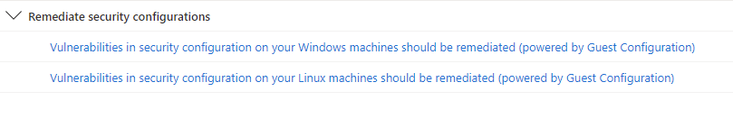

An integral part of securing your Windows Server environment is making sure the servers and client computers are configured in as secure a manner as possible, also known as "hardening" the operating system. To define the security requirements for servers you first need to understand the server's role, since the server role will dictate the hardening settings that should be applied.

While most Servers will have a core foundational security requirement, some servers in a unique role may need more configuration. For example, if your Server is a Domain Controller (DC), you'll have extra steps to harden the Directory Services that are peculiar to this scenario. In general you should start by understanding the current state of the server, and for that you can use the Microsoft Security Compliance Toolkit (SCT).

## Analyze security configuration

The Microsoft Security Compliance Toolkit (SCT) is a set of tools provided by Microsoft that you can use to download and implement security configuration baselines, typically referred to as simply security baselines, for Windows Server and other Microsoft products, including Windows 10, Microsoft 365 Apps for enterprise, and Microsoft Edge. You implement the security configuration baselines by using the toolkit to manage your Group Policy Objects (GPOs).

You can also use the SCT to compare your current GPOs to the recommended GPO security baselines. You can then edit the recommended GPOs and apply them to devices in your organization.

In addition to security baselines for Windows Server, the SCT also includes the Policy Analyzer and Local Group Policy Object (LGPO) tools, which also help you manage your GPO settings.

## Secure Servers (Domain Members)

Each computer that is member of a domain keeps a local Administrator account. This is the account that you configure when you first deploy the computer manually, or which is configured automatically when you use software deployment tools such as Microsoft Endpoint Configuration Manager. The local Administrator account allows IT staff to sign in to the computer if they can't establish connectivity to the domain.

Managing passwords for the local Administrator account for every computer in the organization can be extremely complicated. An organization with 5,000 computers has 5,000 separate local Administrator accounts to manage. What often happens is that organizations assign a single, common local Administrator account password to all local Administrator accounts. The drawback to this approach is that people beyond the IT operations team often figure out this password, and then use it to gain unauthorized local Administrator access to computers in their organization.

The "Local Administrator Password Solution" (LAPS) provides management of local account passwords of domain joined computers. LAPS is available for all currently supported Windows Server and client operating system versions. To get LAPS to function, you must update the AD DS schema. You perform this update by running the *Update-AdmPwdADSchema* cmdlet, which is included in a Windows PowerShell module that's made available when you install LAPS on a computer.

Another important part of server's protection is to ensure that you disable legacy protocols and enforce a more secure communication method. Server Message Block (SMB) protocol is a network protocol primarily used for file sharing. Along with its common file-sharing use, it's also frequently used by printers, scanners, and email servers. The original version of SMB, SMB 1.0 does not support encryption. SMB encryption was introduced with version 3.0.

Encryption is important whenever sensitive data is moved by using the SMB protocol. SMB encryption also lets file services provide secure storage for server applications such as Microsoft SQL Server and is generally simpler to use than dedicated hardware-based encryption.

SMB 3.0 introduced end-to-end encryption to the SMB (Server Message Block) protocol. SMB encryption provides for data packet confidentiality and helps prevent a malicious hacker from tampering with or eavesdropping on any data packet.

SMB 3.1.1, introduced in Windows Server 2016, provides several enhancements to SMB 3.0 security, including pre-authentication integrity checks and encryption improvements. The version of SMB included with Windows Server 2019 is SMB 3.1.1.c.

Windows Server systems support multiple versions of SMB (Server Message Block). This enables them to communicate with servers and clients running other operating systems and other Windows versions. To use SMB 3.1.1, both your host server and the system it communicates with must support SMB 3.1.1.

Pre-authentication with SMB 3.1.1 isn't compatible with devices that modify SMB packets, such as some wide area network (WAN) accelerators. Therefore, you might need to replace some network equipment to use SMB 3.1.1.

## Azure Security Benchmark

Another approach to specify server requirements is to ensure all servers are compliant with **Azure Security Benchmark (ASB)** OS baseline. The ASB OS baseline is available through Microsoft Defender for Cloud in the format of security recommendations for [Windows](/azure/governance/policy/samples/guest-configuration-baseline-windows) or [Linux](/azure/governance/policy/samples/guest-configuration-baseline-linux), as shown below:

 

Once you access one of those recommendations, you'll see a set of rules that are using the Azure Guest Configuration capability to run security checks to verify if the operating system is using the most secure configurations.

Once you click on each rule, you'll have more details about the security check and the affected resources, as shown in the image below:

