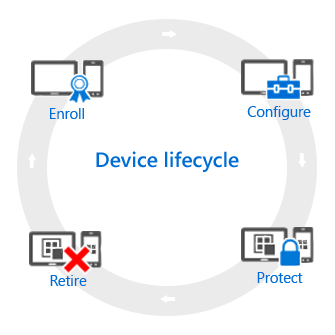
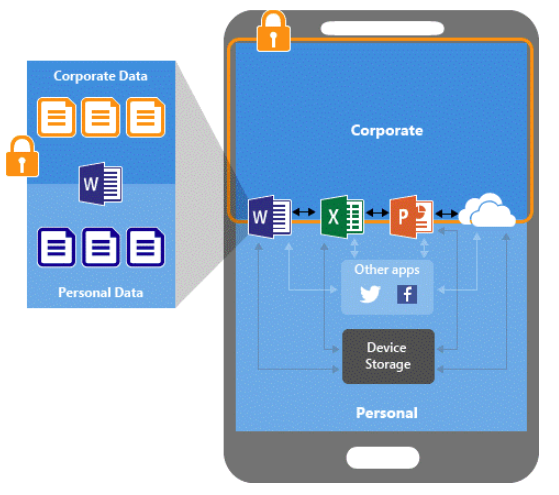
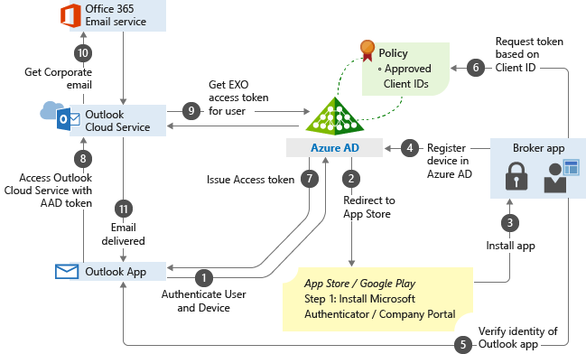

All devices that you manage have a lifecycle. Intune can help you manage this lifecycle: from enrollment, through configuration and protection, to retiring the device when it's no longer required. The mobile device management (MDM) lifecycle is shown below:

 

When you specify security requirements for mobile devices, most of your focus will be on the *Configure* and *Protect* stages, but you should also have general considerations on each one of the other phases:

-   **Enroll**: evaluate the types of devices you have in your organization and verify the [enrollment options](/mem/intune/enrollment/device-enrollment) available.
-   **Configure**: to ensure that your devices are secure and compliant with company standards, you can choose from a wide range of policies during the initial [configuration](/mem/intune/configuration/device-profiles) of the device.
-   **Protect**: protecting devices from unauthorized access is one of the most important tasks that you perform. In addition to the items that were established in the initial configuration, you have addition settings to protect your devices from unauthorized access or malicious attack.
-   **Retire**: When a device gets lost or stolen, when it needs to be replaced, or when users move to another position, it's usually time to retire or wipe the device. There are many ways you can do this---including resetting the device, removing it from management, and wiping the corporate data on it.

#### App isolation and control

When dealing with mobile devices that will also have corporate data, you need to ensure that corporate data and apps are isolated and can be managed separately from the user's owned apps.

Intune app protection policies help protect your work files on devices that are enrolled into Intune. You can also use app protection policies on employee-owned devices that are not enrolled for management in Intune. In this case, even though your company doesn't manage the device, you still need to make sure that work files and resources are protected.

In the example below, the admin has applied app protection policies to the Outlook app. This is  followed by a conditional access rule that adds the Outlook app to an approved list of apps. This list can be used when accessing corporate e-mail.

In a scenario like this, you could use the app protection to enforce the security requirements for your mobile devices, which could include:

-   Encrypt work files.
-   Require a PIN to access work files.
-   Require the PIN to be reset after five failed attempts.
-   Block work files from being backed up in iTunes, iCloud, or Android backup services.
-   Require work files to only be saved to OneDrive or SharePoint.
-   Prevent protected apps from loading work files on jailbroken or rooted devices.
-   Block access to work files if the device is offline for 720 minutes.
-   Remove work files if device is offline for 90 days.

#### Device settings

Besides the app isolation and protection on the device, you also need to ensure that the device's settings are securely configured. With the Mobility and Security feature, you can manage and secure mobile devices when they're connected to your Microsoft 365 organization. Mobile devices like smartphones and tablets that are used to access work email, calendar, contacts, and documents play a big part in making sure that employees get their work done anytime, from anywhere. So, it's critical that you help protect your organization's information when people use devices. You can use Basic Mobility and Security to set device security policies and access rules. You can also use it to wipe mobile devices if they're lost or stolen.

Basic Mobility and Security can help you secure and manage mobile devices like iPhones, iPads, Androids, and Windows Phones used by licensed Microsoft 365 users in your organization. You can create mobile device management policies with settings that can help control access to your organization's Microsoft 365 email and documents for supported mobile devices and apps. If a device is lost or stolen, you can remotely wipe the device to remove sensitive organizational information.

Hardening options for mobile devices must include the following requirements:

-   Require a password
-   Prevent simple password
-   Require an alphanumeric password
-   Minimum password length
-   Number of sign-in failures before device is wiped
-   Minutes of inactivity before device is locked
-   Password expiration (days)
-   Remember password history and prevent reuse
-   Require data encryption on devices
-   Device can't be jail broken or rooted
-   Block screen capture
-   Require password when accessing application store

When establishing your security requirement for mobile devices, make sure that the security setting that you want to manage is available for the type of device that your organization utilizes. For more information about how to manage mobile devices that connect to your Microsoft 365 organization according to each type of device, visit [this article](/microsoft-365/admin/basic-mobility-security/capabilities).

#### Client requirements

One important consideration to take is if your client workstation is domain joined. Many environments use on-premises Active Directory (AD). When AD domain-joined devices are also joined to Azure AD, they're called hybrid Azure AD joined devices. Using Windows Autopilot, you can enroll hybrid Azure AD joined devices in Intune. To enroll, you also need a Domain Join configuration profile.

Once you determine if the client is domain joined or not, you can start planning the security requirements for the operating system configuration. The requirements can also be part of the security baseline that was initially selected. You can deploy security baselines to groups of users or devices in Intune, and the settings apply to devices that run Windows 10/11. For example, the *MDM Security Baseline* automatically enables BitLocker for removable drives, automatically requires a password to unlock a device, automatically disables basic authentication, and more. When a default value doesn't work for your environment, customize the baseline to apply the settings you need.

Client security requirements should include security policies that can manage the following settings:

-   [Antivirus](/mem/intune/protect/endpoint-security-antivirus-policy)
-   [Disk encryption](/mem/intune/protect/endpoint-security-disk-encryption-policy)
-   [Windows firewall](/mem/intune/protect/endpoint-security-firewall-policy)
-   [Endpoint Detection and Response (EDR)](/mem/intune/protect/endpoint-security-edr-policy)
-   [Attack surface reduction](/mem/intune/protect/endpoint-security-asr-policy)
-   [Account protection](/mem/intune/protect/endpoint-security-account-protection-policy)

