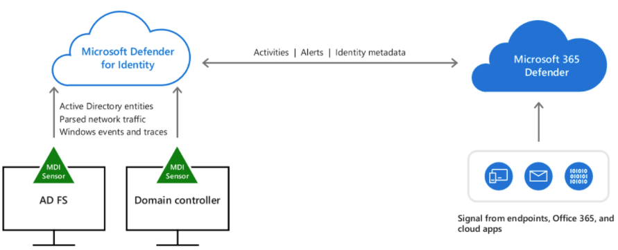

Organizations can use Active Directory Domain Services (AD DS) in Windows Server to simplify user and resource management while creating scalable, secure, and manageable infrastructures. You can use AD DS to manage your network infrastructure, including branch office, Microsoft Exchange Server, and multiple forest environments.

Performing a high-level assessment of your current environment and correctly identifying your Active Directory Domain Services (AD DS) deployment tasks is essential for the success of your AD DS deployment strategy. Your AD DS deployment strategy depends on your existing network configuration.

When it comes to specifying the requirements to secure your Active Directory Domain Services, you must start by understanding that threat actors tend to perform credential theft and that they target some specific accounts. Credential theft attacks are those in which an attacker initially gains highest-privilege (root, Administrator, or SYSTEM, depending on the operating system in use) access to a computer on a network and then uses freely available tooling to extract credentials from the sessions of other logged-on accounts. Depending on the system configuration, these credentials can be extracted in the form of hashes, tickets, or even plaintext passwords.

Because the target of credential theft is usually highly privileged domain accounts and VIP accounts, it's important for administrators to be conscious of activities that increase the likelihood of success of a credential-theft attack. Although attackers also target VIP accounts, if VIPs are not given high levels of privilege on systems or in the domain, theft of their credentials requires other types of attacks, such as socially engineering the VIP to provide secret information.

The core vulnerability that allows credential theft attacks to succeed is the act of logging on to computers that are not secure with accounts that are broadly and deeply privileged throughout the environment. Which means that among the requirements to secure AD DS you need to ensure that you're reducing the attack surface, which includes the following tasks:

-   **Implementing Least-Privilege Administrative Models**: focuses on identifying the risk that the use of highly privileged accounts for day-to-day administration presents, in addition to providing recommendations to implement to reduce the risk that privileged accounts present.
-   **Implementing Secure Administrative Hosts**: describes principles for deployment of dedicated, secure administrative systems, in addition to some sample approaches to a secure administrative host deployment.
-   **Securing Domain Controllers Against Attack**: discusses policies and settings that, although similar to the recommendations for the implementation of secure administrative hosts, contain some domain controller-specific recommendations to help ensure that the domain controllers and the systems used to manage them are well-secured.

In addition, you should never administer a trusted system (that is, a secure server such as a domain controller) from a less-trusted host (that is, a workstation that isn't secured to the same degree as the systems it manages). Also, do not rely on a single authentication factor when performing privileged activities; that is, username and password combinations should not be considered acceptable authentication because only a single factor (something you know) is represented. You should consider where credentials are generated and cached or stored in administrative scenarios.

#### Securing Domain Controllers Against Attack

In datacenters, physical domain controllers should be installed in dedicated secure racks or cages that are separate from the general server population. When possible, domain controllers should be configured with Trusted Platform Module (TPM) chips and all volumes in the domain controller servers should be protected via BitLocker Drive Encryption. BitLocker generally adds performance overhead in single digit percentages but protects the directory against compromise even if disks are removed from the server. BitLocker can also help protect systems against attacks such as rootkits because the modification of boot files will cause the server to boot into recovery mode so that the original binaries can be loaded. If a domain controller is configured to use software RAID, serial-attached SCSI, SAN/NAS storage, or dynamic volumes, BitLocker can't be implemented, so locally attached storage (with or without hardware RAID) should be used in domain controllers whenever possible.

Group Policy Objects that link to all domain controllers OUs in a forest should be configured to allow RDP connections only from authorized users and systems (for example, jump servers). This can be achieved through a combination of user rights settings and WFAS configuration and should be implemented in GPOs so that the policy is consistently applied. If it's bypassed, the next Group Policy refresh returns the system to its proper configuration.

You should run all domain controllers on the newest version of Windows Server that is supported within your organization and prioritize decommissioning of legacy operating systems in the domain controller population. By keeping your domain controllers current and eliminating legacy domain controllers, you can often take advantage of new functionality and security that may not be available in domains or forests with domain controllers running legacy operating system.

Although it may seem counterintuitive, you should consider patching domain controllers and other critical infrastructure components separately from your general Windows infrastructure. If you use enterprise configuration management software for all computers in your infrastructure, compromise of the systems management software can be used to compromise or destroy all infrastructure components managed by that software. By separating patch and systems management for domain controllers from the general population, you can reduce the amount of software installed on domain controllers, in addition to tightly controlling their management.

In addition, make sure to:

-   Continuously monitor Active Directory for [signs of compromise](/windows-server/identity/ad-ds/plan/security-best-practices/monitoring-active-directory-for-signs-of-compromise) using tools such as [Microsoft Defender for Identity](/defender-for-identity/sensor-monitoring)
-   Enable and review [audit policy](/windows-server/identity/ad-ds/plan/security-best-practices/audit-policy-recommendations)

#### Microsoft Defender for Identity

Microsoft Defender for Identity (MDI) monitors your domain controllers by capturing and parsing network traffic and using Windows events directly from your domain controllers, then analyzes the data for attacks and threats. Utilizing profiling, deterministic detection, machine learning, and behavioral algorithms Defender for Identity learns about your network, enables detection of anomalies, and warns you of suspicious activities. The image below shows the core architecture of Defender for Identity:

 

Once you install the Defender for Identity sensor directly on your domain controller or AD FS server, it accesses the event logs it requires directly from each server. After the logs and network traffic are parsed by the sensor, Defender for Identity sends only the parsed information to the Defender for Identity cloud service (only a percentage of the logs are sent).
