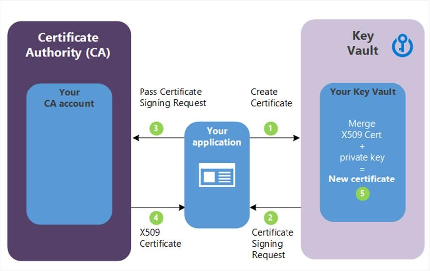

Azure Key Vault is a centralized cloud service for storing application secrets such as encryption keys, certificates, and server-side tokens. Key Vault helps you control your applications' secrets by keeping them in a single central location and providing secure access, permissions control, and access logging. There are three primary concepts used in an Azure Key Vault: vaults, keys, and secrets.

You use Azure Key Vault to create multiple secure containers, called *vaults*. Vaults help reduce the chances of accidental loss of security information by centralizing application secrets storage. Organizations will have several key vaults. Each key vault is a collection of cryptographic keys and cryptographically protected data (call them "secrets") managed by one or more responsible individuals within your organization. These key vaults represent the logical groups of keys and secrets for your organization; those that you want to manage together. They are like folders in the file system. Key vaults also control and log the access to anything stored in them.

*Keys* are the central actor in the Azure Key Vault service. A given key in a key vault is a cryptographic asset destined for a particular use such as the asymmetric master key of Microsoft Azure RMS, or the asymmetric keys used for SQL Server TDE (Transparent Data Encryption), CLE (Column Level Encryption) and Encrypted backup.

*Secrets* are small (less than 10K) data blobs protected by a HSM-generated key created with the Key Vault. Secrets exist to simplify the process of persisting sensitive settings that almost every application has: storage account keys, .PFX files, SQL connection strings, data encryption keys, etc.

Azure Key Vault enables Microsoft Azure applications and users to store and use certificates, which are built on top of keys and secrets and add an automated renewal feature.

When designing your strategy to maintain Key Vault, make sure to include the following security best practices:

| Best practice                                                              | Solution                                                                                                                                                                                                                                                                                                                                                                                                                                                                                                                                                                                                                                                                                                                 |
|----------------------------------------------------------------------------|--------------------------------------------------------------------------------------------------------------------------------------------------------------------------------------------------------------------------------------------------------------------------------------------------------------------------------------------------------------------------------------------------------------------------------------------------------------------------------------------------------------------------------------------------------------------------------------------------------------------------------------------------------------------------------------------------------------------------|
| Grant access to users, groups, and applications at a specific scope.       | Use RBAC's predefined roles. For example, to grant access to a user to manage key vaults, you would assign the predefined role Key Vault Contributor to this user at a specific scope. The scope, in this case, would be a subscription, a resource group, or just a specific key vault. If the predefined roles don't fit your needs, you can define your own roles.                                                                                                                                                                                                                                                                                                                                                    |
| Control what users have access to.                                         | Access to a key vault is controlled through two separate interfaces: management plane, and data plane. The management plane and data plane access controls work independently. Use RBAC to control what users have access to. For example, if you want to grant an application the rights to use keys in a key vault, you only need to grant data plane access permissions using key vault access policies. No management plane access is needed for this application. Conversely, if you want a user to be able to read vault properties and tags but not have any access to keys, secrets, or certificates, by using RBAC, you can grant read access to the management plane. No access to the data plane is required. |
| Store certificates in your key vault.                                      | Azure Resource Manager can securely deploy certificates stored in Azure Key Vault to Azure VMs when the VMs are deployed. By setting appropriate access policies for the key vault, you also control who gets access to your certificate. Another benefit's that you manage all your certificates in one place in Azure Key Vault.                                                                                                                                                                                                                                                                                                                                                                                      |
| Ensure that you can recover a deletion of key vaults or key vault objects. | Deletion of key vaults or key vault objects can be either inadvertent or malicious. Enable the soft delete and purge protection features of Key Vault, particularly for keys that are used to encrypt data at rest. Deletion of these keys is equivalent to data loss, so you can recover deleted vaults and vault objects if needed. Practice Key Vault recovery operations regularly.                                                                                                                                                                                                                                                                                                                                  |

### Manage access to secrets, certificates, and keys

Key Vault access has two facets: the management of the Key Vault itself, and accessing the data contained in the Key Vault. Documentation refers to these facets as the management plane and the data plane.

These two areas are separated because the creation of the Key Vault (a management operation) is a different role than storing and retrieving a secret stored in the Key Vault. To access a key vault, all users or apps must have proper authentication to identify the caller, and authorization to determine the operations the caller can perform.

### Authentication

Azure Key Vault uses Azure Active Directory (Azure AD) to authenticate users and apps that try to access a vault. Authentication is always performed by associating the authenticated identity of any user or app making a request with the Azure AD tenant of the subscription where the Key Vault resides. There is no support for anonymous access to a Key Vault.

### Authorization

Management operations (creating a new Azure Key Vault) use role-based access control (RBAC). There is a built-in role Key Vault Contributor that provides access to management features of key vaults, but doesn't allow access to the key vault data. This is the recommended role to use. There's also a Contributor role that includes full administration rights - including the ability to grant access to the data plane.

Reading and writing data in the Key Vault uses a separate Key Vault access policy. A Key Vault access policy is a permission set assigned to a user or managed identity to read, write, and/or delete secrets and keys. You can create an access policy using the CLI, REST API, or Azure portal.

### Restrict network access

Another point to consider with Azure Key Vault is what services in your network can access the vault. In most cases, the network endpoints don't need to be open to the Internet. You should determine the minimum network access required - for example you can restrict Key Vault endpoints to specific Azure Virtual Network subnets, specific IP addresses, or trusted Microsoft services including Azure SQL, Azure App Service, and various data and storage services that use encryption keys.

### Manage certificate

Securely managing certificates is a challenge for every organization. You must ensure that the private key is kept safe, and certificates have an expiration date, which means you need to renew periodically to ensure your website traffic is secure.

Azure Key Vault manages X.509 based certificates that can come from several sources. One strategy is to create self-signed certificates directly in the Azure portal. This process creates a public/private key pair and signs the certificate with its own key. These certificates can be used for testing and development.

Another strategy is to create an X.509 certificate signing request (CSR). This creates a public/private key pair in Key Vault along with a CSR you can pass over to your certification authority (CA). The signed X.509 certificate can then be merged with the held key pair to finalize the certificate in Key Vault as shown in the following diagram.

 

In the previous diagram, your application is creating a certificate which internally begins by creating a key in your Azure Key Vault.

1.  Key Vault returns a Certificate Signing Request (CSR) to your application.
1.  Your application passes the CSR to your chosen CA.
1.  Your chosen CA responds with an X.509 Certificate.
1.  Your application completes the new certificate creation with a merger of the X.509 Certificate from your CA.

This strategy works with any certificate issuer and provides better security than handling the CSR directly because the private key is created and secured in Azure Key Vault and never revealed.

Lastly, you can also connect your Key Vault with a trusted certificate issuer (referred to as an integrated CA) and create the certificate directly in Azure Key Vault. This approach requires a one-time setup to connect the certificate authority. You can then request to create a certificate and the Key Vault will interact directly with the CA to fulfill the request in a similar process to the manual CSR creation process shown above. The full details of this process are presented in the following diagram.

 

1.  In the previous diagram, your application is creating a certificate which internally begins by creating a key in your key vault.
1.  Key Vault sends an SSL Certificate Request to the CA.
1.  Your application polls, in a loop and wait process, for your Key Vault for certificate completion. The certificate creation is complete when Key Vault receives the CA's response with x509 certificate.
1.  The CA responds to Key Vault's SSL Certificate Request with an X509 SSL Certificate.
1.  Your new certificate creation completes with the merger of the X509 Certificate for the CA.

This approach has several distinct advantages. Because the Key Vault is connected to the issuing CA, it can manage and monitor the lifecycle of the certificate. That means it can automatically renew the certificate, notify you about expiration, and monitor events such as whether the certificate has been revoked.
