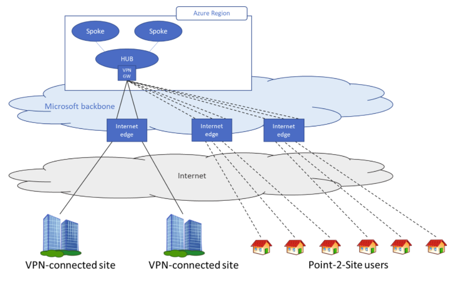

When designing your remote access strategy, you need to take into consideration the different options available and which option is more suitable for the design requirements.

The Azure point-to-site solution is cloud-based and can be provisioned quickly to cater for the increased demand of users to work from home. It can scale up easily and turned off just as easily and quickly when the increased capacity isn't needed anymore. A Point-to-Site (P2S) VPN gateway connection lets you create a secure connection to your virtual network from an individual client computer. A P2S connection is established by starting it from the client computer. This solution is useful for telecommuters who want to connect to Azure VNets or on-premises datacenters from a remote location, such as from home or a conference. You could use this solution if of your design requirements states that remote users need to access to resources that are in Azure and in the on-premises datacenters as shown in the image below:

 

At a high level, the following steps are needed to enable users to connect to Azure resources securely:

1. Create a virtual network gateway (if one does not exist).
1. Configure point-to-site VPN on the gateway
1. Configure a site-to-site tunnel on the Azure virtual network gateway with BGP enabled.
1. Configure the on-premises device to connect to Azure virtual network gateway.
1. Download the point-to-site profile from the Azure portal and distribute to clients

If your design requirements states that you need to connect two sites, for example headquarter and branch office, you could use Site-to-Site VPN. A Site-to-Site (S2S) VPN gateway connection is a connection over IPsec/IKE (IKEv1 or IKEv2) VPN tunnel. S2S connections can be used for cross-premises and hybrid configurations. A S2S connection requires a VPN device located on-premises that has a public IP address assigned to it.

In some scenarios, the remote worker may just need access to resources deployed in Azure, for this scenario the remote worker could use Azure Bastion solution, instead of VPN connection to get secure shell access using Remote Desktop Protocol (RDP) or Secure Shell Protocol (SSH) without requiring public IPs on the VMs being accessed, as shown in the example below:

 

Below you have some benefits of using this solution:

| Benefit                                                    | Description                                                                                                                                                                                                                                                                                                             |
|------------------------------------------------------------|-------------------------------------------------------------------------------------------------------------------------------------------------------------------------------------------------------------------------------------------------------------------------------------------------------------------------|
| RDP and SSH through the Azure portal                       | You can get to the RDP and SSH session directly in the Azure portal using a single-click seamless experience.                                                                                                                                                                                                           |
| Remote Session over TLS and firewall traversal for RDP/SSH | Azure Bastion uses an HTML5 based web client that is automatically streamed to your local device. Your RDP/SSH session is over TLS on port 443. This enables the traffic to traverse firewalls more securely.                                                                                                           |
| No Public IP address required on the Azure VM              | Azure Bastion opens the RDP/SSH connection to your Azure VM by using the private IP address on your VM. You don't need a public IP address on your virtual machine.                                                                                                                                                     |
| No hassle of managing Network Security Groups (NSGs)       | You don't need to apply any NSGs to the Azure Bastion subnet. Because Azure Bastion connects to your virtual machines over private IP, you can configure your NSGs to allow RDP/SSH from Azure Bastion only. This removes the hassle of managing NSGs each time you need to securely connect to your virtual machines.  |
| No need to manage a separate bastion host on a VM          | Azure Bastion is a fully managed platform PaaS service from Azure that is hardened internally to provide you secure RDP/SSH connectivity.                                                                                                                                                                               |
| Protection against port scanning                           | Your VMs are protected against port scanning by rogue and malicious users because you don't need to expose the VMs to the internet.                                                                                                                                                                                     |
| Hardening in one place only                                | Azure Bastion sits at the perimeter of your virtual network, so you don't need to worry about hardening each of the VMs in your virtual network.                                                                                                                                                                        |
| Protection against zero-day exploits                       | The Azure platform protects against zero-day exploits by keeping the Azure Bastion hardened and always up to date for you.

Work from home policies requires many IT organizations to address fundamental changes in capacity, network, security, and governance. Employees aren't protected by the layered security policies associated with on-premises services while working from home. This type of scenario could lead you to choose a solution where you can respond faster to changes in the environment, and that€™s where the use of Virtual Desktop Infrastructure (VDI) becomes appropriate. VDI deployments on Azure can help organizations rapidly respond to this changing environment. However, you need a way to protect inbound/outbound Internet access to and from these VDI deployments. You can use Azure Firewall DNAT rules along with its threat intelligence-based filtering capabilities to protect your VDI deployments.

Azure Virtual Desktop is a comprehensive desktop and app virtualization service running in Azure. It's the only virtual desktop infrastructure (VDI) that delivers simplified management, multi-session Windows 10/11, optimizations for Microsoft 365 apps for enterprise, and support for Remote Desktop Services (RDS) environments. You can deploy and scale your Windows desktops and apps on Azure in minutes, and get built-in security and compliance features. Azure Virtual Desktop doesn't require you to open any inbound access to your virtual network. However, you must allow a set of outbound network connections for the Azure Virtual Desktop virtual machines that run in your virtual network.
