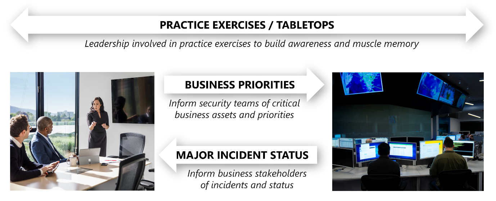

The responsibility of the security operation team (also known as Security Operations Center (SOC), or SecOps) is to rapidly detect, prioritize, and triage potential attacks. These operations help eliminate false positives and focus on real attacks, reducing the mean time to remediate real incidents. 

Watch the video below for an overview about Security Operations:

> [!VIDEO https://www.microsoft.com/videoplayer/embed/RWVECU]

Central SecOps team monitors security-related telemetry data and investigates security breaches. It's important that any communication, investigation, and hunting activities are aligned with the application team. Here are some general best practices for conducting security operations:

-   Follow the NIST Cybersecurity Framework functions as part of operations:

    -   **Detect** the presence of adversaries in the system.
    -   **Respond** by quickly investigating whether it's an actual attack or a false alarm.
    -   **Recover** and restore the confidentiality, integrity, and availability of the workload during and after an attack.

-   Acknowledge an alert quickly. A detected adversary must not be ignored while defenders are triaging false positives.
-   Reduce the time to remediate a detected adversary. Reduce their opportunity time to conduct and attack and reach sensitive systems.
-   Prioritize security investments into systems that have high intrinsic value. For example, administrator accounts.
-   Proactively hunt for adversaries as your system matures. This effort will reduce the time that a higher skilled adversary can operate in the environment. For example, skilled enough to evade reactive alerts.

SecOps has multiple potential interactions with business leadership, which includes:

 

-   **Business context to SecOps**: SecOps must understand what is most important to the organization so that the team can apply that context to fluid real-time security situations. What would have the most negative impact on the business? Downtime of critical systems? A loss of reputation and customer trust? Disclosure of sensitive data? Tampering with critical data or systems? We've learned it's critical that key leaders and staff in the SOC understand this context. They'll wade through the continuous flood of information and triage incidents and prioritize their time, attention, and effort.
-   **Joint practice exercises with SecOps**: Business leaders should regularly join SecOps in practicing response to major incidents. This training builds the muscle memory and relationships that are critical to fast and effective decision making in the high pressure of real incidents, reducing organizational risk. This practice also reduces risk by exposing gaps and assumptions in the process that can be fixed before a real incident occurs.
-   **Major incidents updates from SecOps**: SecOps should provide updates to business stakeholders for major incidents as they happen. This information allows business leaders to understand their risk and take both proactive and reactive steps to manage that risk.
-   **Business intelligence from the SOC**: Sometimes SecOps finds that adversaries are targeting a system or data set that isn't expected. As these discoveries are made, the threat intelligence team should share these signals with business leaders as they might trigger insight for business leaders. For example, someone outside the company is aware of a secret project or unexpected attacker targets highlight the value of an otherwise overlooked dataset.

### People and process

Security operations can be highly technical, but more importantly, it's a human discipline. People are the most valuable asset in security operations. Their experience, skill, insight, creativity, and resourcefulness are what make the discipline effective.

Attacks on your organization are also planned and conducted by people like criminals, spies, and hacktivists. While some commodity attacks are fully automated, the most damaging ones are often done by live human attack operators.

- **Focus on empowering people**: your goal shouldn't be to replace people with automation. Empower your people with tools that simplify their daily workflows. These tools enable them to keep up with or get ahead of the human adversaries they face.
 Rapidly sorting out signal (real detections) from the noise (false positives) requires investing in both humans and automation. Automation and technology can reduce human work, but attackers are human and human judgment is critical in defeating them.
- **Diversify your thinking portfolio**: security operations can be highly technical, but it's also just another new version of forensic investigation that shows up in many career fields like criminal justice. Don't be afraid to hire people with a strong competency in investigation or deductive or inductive reasons and train them on technology.

### Metrics

Metrics drive behavior, so measuring success is a critical element to get right. Metrics translate culture into clear measurable goals that drive outcomes.

We've learned that it's critical to consider what you measure, and the ways that you focus on and enforce those metrics. Recognize that security operations must manage significant variables that are out of their direct control, like attacks and attackers. Any deviations from targets should be viewed primarily as a learning opportunity for process or tool improvement, rather than assumed to be a failure by the SOC to meet a goal.

The main metrics to focus on that have a direct influence on organizational risk are:

-   **Mean time to acknowledge (MTTA)**: Responsiveness is one of the few elements SecOps has more direct control over. Measure the time between an alert, like when the light starts to blink, and when an analyst sees that alert and begins the investigation. Improving this responsiveness requires that analysts don't waste time investigating false positives. It can be achieved with ruthless prioritization, ensuring that any alert feed that requires an analyst response must have a track record of 90 percent true positive detections.
-   **Mean time to remediate (MTTR)**: Effectiveness of reducing risk measures the next period of time. That period is the time the analyst begins the investigation to when the incident is remediated. MTTR identifies how long it takes SecOps to remove the attacker's access from the environment. This information helps identify where to invest in processes and tools to help analysts reduce risk.
-   **Incidents remediated (manually or with automation)**: Measuring how many incidents are remediated manually and how many are resolved with automation is another key way to inform staffing and tool decisions.
-   **Escalations between each tier**: Track how many incidents escalated between tiers. It helps ensure accurate tracking of the workload to inform staffing and other decisions. For example, so that work done on escalated incidents isn't attributed to the wrong team.
