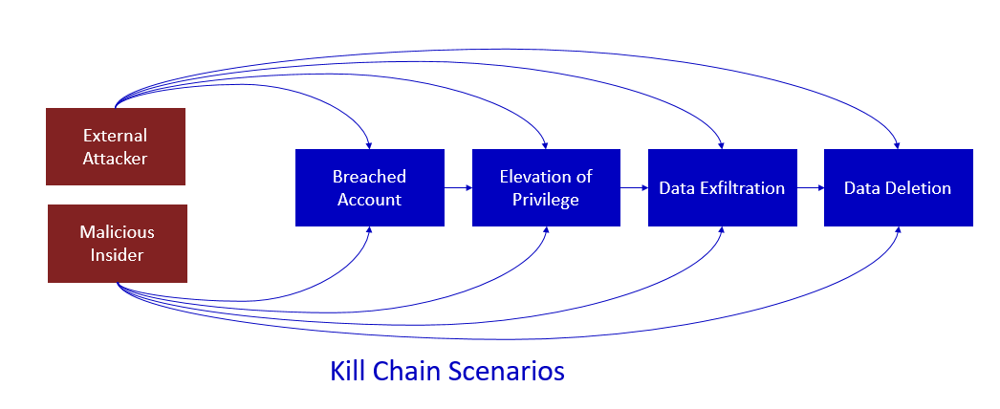
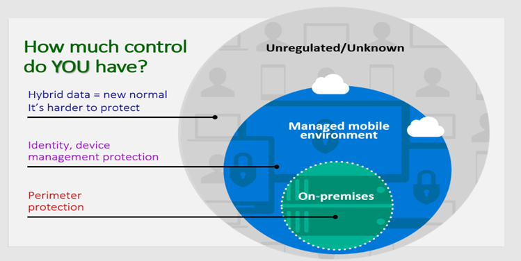

Cybersecurity weaknesses identified in your organization are mapped to
actionable security recommendations and prioritized by their impact.
Prioritized recommendations help shorten the time to mitigate or
remediate vulnerabilities and drive compliance.

Most attacks follow a common process referred to within the security
industry as the "Kill Chain." An attack follows a basic pattern and
proceeds from one step to the next to achieve the wanted outcomes. This
step-wise process can be defended against by implementing security
measures on choke points in the chain. Since any step can be bypassed
through various exploitation techniques, the best strategies apply
defenses at every step along the chain.

 

### How much control do companies have?

 

In an on-premises environment, you have firewalls, email gateways, and
proxies that can conduct a content inspection. That protection boundary
has now expanded to include mobile devices, tablets, and cloud assets.
Often the devices that have access to a company's data are either
lightly managed or not managed at all. Some companies may use Mobile
Device Management (MDM) solutions to help enforce some level of
security, such as encrypting the device or configuring it for remote
wipe in the event the device gets stolen. However, they still don't have
any control when data on those devices moves outside their controlled
environment.

In today's cloud-centric world, organizations are faced with the
unregulated (such as files on cloud storage services) and the unknown
(such as advanced threats targeting users' email). This situation is
more difficult to protect because data is now stored everywhere - it's
on-premises, on PCs, on phones, and in the cloud.

### Security recommendations to mitigate threats to data

| Product/Service               | Article                                                                                             |
|-------------------------------|-----------------------------------------------------------------------------------------------------|
| Machine Trust Boundary        | Ensure that binaries are obfuscated if they contain sensitive information                           |
|                               | Consider using an Encrypted File System (EFS) to protect confidential user-specific data    |
|                               | Ensure that sensitive data stored by the application on the file system is encrypted                |
| Web Application               | Ensure that sensitive content isn't cached on the browser                                          |
|                               | Encrypt sections of Web App's configuration files that contain sensitive data                       |
|                               | Explicitly disable the autocomplete HTML attribute in sensitive forms and inputs                    |
|                               | Ensure that sensitive data displayed on the user screen is masked                                   |
| Database                      | Implement dynamic data masking to limit sensitive data exposure non privileged users                |
|                               | Ensure that passwords are stored in salted hash format                                              |
|                               | Ensure that sensitive data in database columns are encrypted                                        |
|                               | Ensure that database-level encryption (TDE) is enabled                                              |
|                               | Ensure that database backups are encrypted                                                          |
| Web API                       | Ensure that sensitive data relevant to Web API isn't stored in the browser's storage               |
| Azure Document DB             | Encrypt sensitive data stored in Azure Cosmos DB                                                    |
| Azure IaaS VM Trust Boundary  | Use Azure Disk Encryption to encrypt disks used by Virtual Machines                                 |
| Service Fabric Trust Boundary | Encrypt secrets in Service Fabric applications                                                      |
| Dynamics CRM                  | Perform security modeling and use Business Units/Teams where required                               |
|                               | Minimize access to share feature on critical entities                                               |
|                               | Train users on the risks associated with the Dynamics CRM Share feature and good security practices |
|                               | Include a development standards rule proscribing showing config details in exception management     |
| Azure Storage                 | Use Azure Storage Service Encryption (SSE) for Data at Rest (Preview)                               |
|                               | Use Client-Side Encryption to store sensitive data in Azure Storage                                 |
| Mobile Client                 | Encrypt sensitive or personally-identifiable information (PII) data written to phones' local storage |
|                               | Obfuscate generated binaries before distributing to end users                                       |
| WCF                           | Set clientCredentialType to Certificate or Windows                                                  |
|                               | WCF-Security Mode isn't enabled                                                                    |

### Ransomware Protection

Mitigating ransomware and extortion attacks is an urgent priority for
organizations because of the high impact of these attacks and high
likelihood an organization will experience one.

Ransomware is a type of extortion attack that encrypts files and
folders, preventing access to important data. Criminals use ransomware
to extort money from victims by demanding money, usually in form of
cryptocurrency, in exchange for a decryption key. Criminals also often
use ransomware to extort money from victims in exchange for not
releasing sensitive data to the dark web or the public internet.

These attacks can be catastrophic to business operations and are
difficult to clean up, requiring complete adversary eviction to protect
against future attacks. Unlike early forms of ransomware that only
required malware remediation, human-operated ransomware can continue to
threaten your business operations after the initial encounter.

### Prevent and Recover from Ransomware

#### Phase 1. Prepare your recovery plan

This phase is designed to [minimize the monetary incentive from ransomware attackers](/security/compass/protect-against-ransomware-phase1) by making it:

-   Much harder to access and disrupt systems or encrypt or damage key
    organization data.

-   Easier for your organization to recover from an attack without
    paying the ransom.

#### Phase 2. Limit the scope of damage

Make the attackers work a lot harder to [gain access to multiple business critical systems through privileged access roles](/security/compass/protect-against-ransomware-phase2).
Limiting the attacker's ability to get privileged access makes it much
harder to profit off of an attack on your organization, making it more
likely they will give up and go elsewhere.

#### Phase 3. Make it harder to get in

This last set of tasks is important to raise friction for entry but will
take time to complete as part of a larger security journey. The goal of
this phase is for attackers to have to work a lot harder to [obtain access to your on-premises or cloud infrastructures](/security/compass/protect-against-ransomware-phase3) at
the various common points of entry. There are a lot of these tasks, so
it's important to prioritize your work here based on how fast you can
accomplish these with your current resources.

For a comprehensive view of ransomware and extortion and how to protect
your organization, use the information in the [**Human-Operated Ransomware Mitigation Project Plan**](https://download.microsoft.com/download/7/5/1/751682ca-5aae-405b-afa0-e4832138e436/RansomwareRecommendations.pptx) PowerPoint
presentation.

Here's a summary of the guidance:

:::image type="content" source="../media/summary-guidance.png" alt-text="Diagram that shows the summary of the guidance in the Human-Operated Ransomware Mitigation Project Plan." lightbox="../media/summary-guidance.png":::

-   The stakes of ransomware and extortion-based attacks are high.
-   However, the attacks have weaknesses that can mitigate your  likelihood of being attacked.
-   There are three phases to configure your infrastructure to exploit attack weaknesses.

**For additional information on Mitigating Threats to Data, see thefollowing:**

-   [**Defender for Cloud App Best Practices**](/defender-cloud-apps/best-practices)
-   [**Threat Remediation**](/defender-cloud-apps/tutorial-flow)
-   [**Manage Multicloud Environment**](/defender-cloud-apps/tutorial-cloud-platform-security)
-   [**Ransomware Protection**](/security/compass/protect-against-ransomware)
