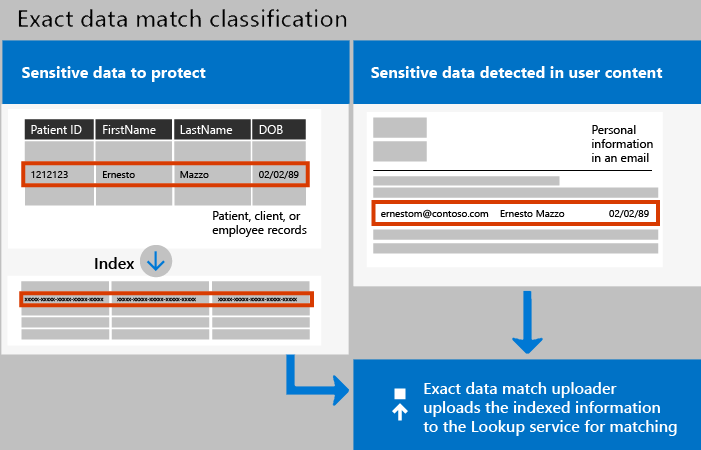
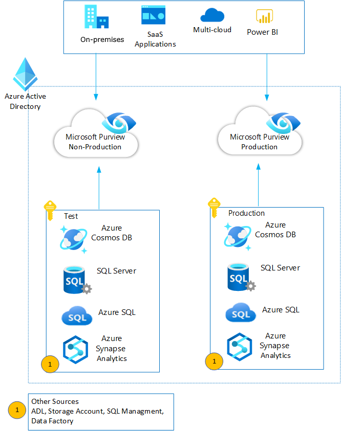
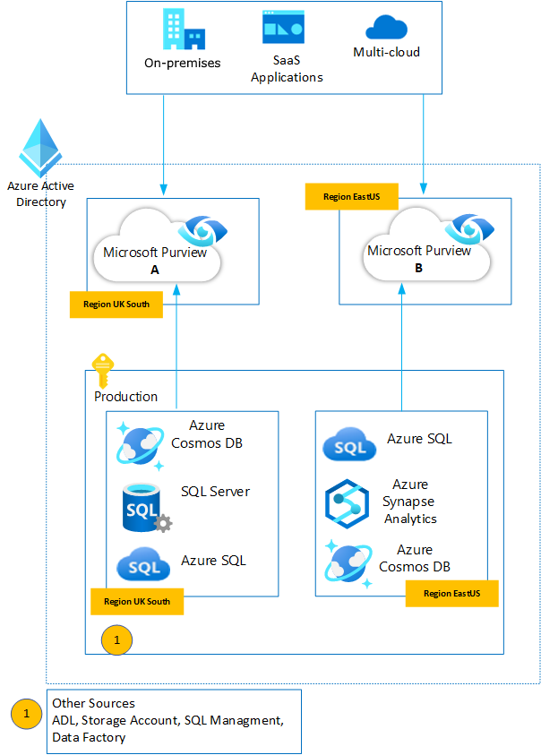

In a perfect world, all your employees understand the importance of
information protection and work within your policies. In the real world,
it's likely that a busy partner who frequently works with accounting
information will inadvertently upload a sensitive document to your Box
repository with incorrect permissions. A week later, you realize your
enterprise's confidential information was leaked to your competition.

The basic strategy for data identification and protection relies on the
following elements - depending on which product you use, there may be a
greater emphasis on certain concepts:

-  **Data discovery** - create an inventory of all of the data stores and knowledge bases within your organization.
-  **Data classification** - define what counts as sensitive for your organization.
-  **Data protection** - define policies to control access to and sharing of data. To apply flexible protection actions that include encryption, access restrictions, and visual markings
-  **Usage monitoring** - reporting and auditing on data access activity and policy violations.
-  **Data loss prevention** - To help prevent accidental oversharing of sensitive information

## Data discovery - know your data

It's vital for organizations to identify what kind of, and how much,
data exists in their environment. You need a deep understanding of how
much sensitive data exists and where it is stored before it can be
protected and governed. This information is critical to assess your
overall risk, which helps you define your strategy for protecting and
governing the data. Start your journey by discovering and classifying
important data across your environment. Here are some of the types of
questions you'll answer during this process:

-   Who owns my data?

-   What types of data do I have?

-   Where is my data?

-   Why is it a risk?

-   What methods can I use to classify my data?

-   Where can I classify my data?

-   How can I see what happens to my data over its lifecycle?

## Data classification

Classification is the process of identifying and labeling content in
your organization to get a better understanding of your data landscape.
This is accomplished by applying one or more of the following to your
data:

| Capability | What problems does it solve? |
|---|---|
| **Sensitive information types** | Identifies sensitive data by using built-in or custom regular expressions or a function. Corroborative evidence includes keywords, confidence levels, and proximity. |
| **Trainable classifiers** | Identifies sensitive data by using examples of the data you're interested in rather than identifying elements in the item (pattern matching). You can use built-in classifiers or train a classifier with your own content. |
| **Data classification** | A graphical identification of items in your organization that have a sensitivity label, a retention label, or have been classified. You can also use this information to gain insights into the actions that your users are taking on these items. |
| **Policies** | Sensitive information types, trainable classifiers, sensitivity labels, and retention labels act as inputs into policies. Policies define behaviors, like if there will be a default label, if labeling is mandatory, what locations the label will be applied to, and under what conditions. |

### What is a data classification framework?

Often codified in a formal, enterprise-wide policy, a data
classification framework (sometimes called a 'data classification
policy') is typically comprised of 3-5 classification levels. These
usually include three elements: a name, description, and real-world
examples.

Microsoft recommends no more than five top-level parent labels, each
with five sub-labels (25 total) to keep the user interface (UI)
manageable. Levels are typically arranged from least to most sensitive:

-   Public
-   Internal
-   Confidential
-   Highly Confidential

Other level name variations you may encounter
include *Restricted*, *Unrestricted*, and *Consumer Protected*.
Microsoft recommends label names that are self-descriptive and that
highlight their relative sensitivity clearly. For
example, *Confidential* and *Restricted* may leave users guessing which
label is appropriate, while *Confidential* and *Highly Confidential* are
clearer on which is more sensitive.

Another important component of a data classification framework is the
controls associated with each level. Data classification levels by
themselves are simply labels (or tags) that indicate the value or
sensitivity of the content. To *protect* that content, data
classification frameworks define the controls that should be in place
for each of your data classification levels. These controls may include
requirements related to:

-   Storage type and location
-   Encryption
-   Access control
-   Data destruction
-   Data loss prevention
-   Public disclosure
-   Logging and tracking access
-   Other control objectives, as needed

## Custom sensitive data types

Sensitive information types are used to help identify sensitive items so
that you can prevent them from being inadvertently or inappropriately
shared, to help in locating relevant data in eDiscovery (Premium), and to apply
governance actions to certain types of information. You define a custom
sensitive information type (SIT) based on:

-   patterns
-   keyword evidence such as *employee*, *social security number*,
    or *ID*
-   character proximity to evidence in a particular pattern
-   confidence levels

But what if you wanted a custom sensitive information type (SIT) that
uses exact or nearly exact data values, instead of one that found
matches based on generic patterns? With Exact Data Match (EDM) based
classification, you can create a custom sensitive information type that
is designed to:

-   be dynamic and easily refreshed
-   be more scalable
-   result in fewer false-positives
-   work with structured sensitive data
-   handle sensitive information more securely, not sharing it with
    anyone, including Microsoft
-   be used with several Microsoft cloud services

It can include Exact Data Match (EDM) where a customer can take millions
of pieces of data like SSNs or Credit Card numbers and use them to
inform DLP or MCAS policies. The database can be updated dynamically.
The database for this exact match can have up to 100 MM rows of data.
This is really good for say if a retailer wants to put rules around
sensitive information like Credit Card numbers with strict rules around
the specific numbers it has for its customers and perhaps less strict
rules for Credit Card numbers identified from the out of the box
classifiers.

 

## Data Protection

The data protection component essentially acts as an enforcement point
where the policies regarding access to and sharing of different types of
sensitive information are applied to the data that has been discovered
across the data estate.

### Microsoft Information Protection: Process and Capabilities

Information protection can be split into different phases depending on
the product which is being used:

-   Defender for Cloud Apps: Discover, Classify, Protect, Monitor.
    Microsoft Defender for Cloud Apps provides you with an expansive
    suite of DLP capabilities that cover the various data leak points
    that exist in organizations.

-   Microsoft Purview: Know your data, Protect your data, Prevent Data
    loss, Govern your data. Microsoft Purview is a unified data
    governance service that helps you manage and govern your
    on-premises, multicloud, and software-as-a-service (SaaS) data.
    Create a holistic, up-to-date map of your data landscape with
    automated data discovery, sensitive data classification, and
    end-to-end data lineage. Enable data curators to manage and secure
    your data estate. Empower data consumers to find valuable,
    trustworthy data.

:::image type="content" source="../media/microsoft-info-protection.png" alt-text="Diagram that depicts Microsoft Information Protection." lightbox="../media/microsoft-info-protection.png":::

### Purview Phase 1: Know your data

Automated data discovery and classification with Microsoft Purview

Microsoft Purview merges the phases of data discovery and classification
under the pillar of "Know your data".

To understand your data landscape and identify sensitive data across
your hybrid environment, use the following capabilities:

| Capability                  | What problems does it solve?                                                                                                                                                                                                                       | Get started                                     |
|-----------------------------|----------------------------------------------------------------------------------------------------------------------------------------------------------------------------------------------------------------------------------------------------|-------------------------------------------------|
| Sensitive information types | Identifies sensitive data by using built-in or custom regular expressions or a function. Corroborative evidence includes keywords, confidence levels, and proximity.                                                                               | Customize a built-in sensitive information type |
| Trainable classifiers       | Identifies sensitive data by using examples of the data you're interested in rather than identifying elements in the item (pattern matching). You can use built-in classifiers or train a classifier with your own content.                        | Get started with trainable classifiers          |
| Data classification         | A graphical identification of items in your organization that have a sensitivity label, a retention label, or have been classified. You can also use this information to gain insights into the actions that your users are taking on these items. | Get started with content explorer               |
|                             |                                                                                                                                                                                                                                                    | Get started with activity explorer              |

### Defender Phase 1: Discover your data

Automated data discovery with Defender for Cloud Apps:

1.  **Connect apps:** The first step in discovering which data is being
    used in your organization is to connect cloud apps used in your
    organization to Defender for Cloud Apps. Once connected, Defender
    for Cloud Apps can scan data, add classifications, and enforce
    policies and controls. Depending on how apps are connected affects
    how and when scans and controls are applied. You can connect your
    apps in one of the following ways:
1.  **Investigate**: After you connect an app to Defender for Cloud Apps
    using its API connector, Defender for Cloud Apps scans all the files
    it uses. You can then go to the file investigation page
    by clicking **Investigate** > **Files** to get an overview of the files
    shared by your cloud apps, their accessibility, and their status.
    For more information, see [Investigate files](/defender-cloud-apps/file-filters).

    - Use an app connector - Microsoft app connectors use the APIs supplied by app providers. They provide greater visibility into and control over the apps used in your organization. Scans are performed periodically (every 12 hours) and in real time (triggered each time a change is detected). For more information and instructions on how to add apps.
    - Use Conditional Access App Control - Conditional Access App Control solution uses a reverse proxy architecture that is uniquely integrated with Azure Active Directory (AD) Conditional Access. Once configured in Azure AD, users will be routed to Defender for Cloud Apps where access and session policies are enforced to protect the data apps attempt to use. This connection method allows you to apply controls to any app. For more information, see Protect apps with Defender for Cloud Apps Conditional Access App Control.

### Defender Phase 2: Classify sensitive information

Data Classification with Defender for Cloud Apps is natively integrated with Microsoft Information Protection, which is part of Microsoft Purview.

### Purview Phase 2: Protect your data (Phase 3 Defender)

Data protection with Microsoft Purview (including Defender for Cloud Apps as a capability):

| Capability | What problems does it solve? |
|---|---|
| Sensitivity labels | A single labeling solution across apps, services, and devices to protect your data as it travels inside and outside your organization.  |
| Azure Information Protection unified labeling client | For Windows computers, extends labeling to File Explorer and PowerShell, with additional features for Office apps if needed |
| Double Key Encryption | Under all circumstances, only your organization can ever decrypt protected content or for regulatory requirements, you must hold encryption keys within a geographical boundary. |
| Office 365 Message Encryption (OME) | Encrypts email messages and attached documents that are sent to any user on any device, so only authorized recipients can read emailed information.  |
| Service encryption with Customer Key | Protects against viewing of data by unauthorized systems or personnel, and complements BitLocker disk encryption in Microsoft datacenters. |
| SharePoint Information Rights Management (IRM) | Protects SharePoint lists and libraries so that when a user checks out a document, the downloaded file is protected so that only authorized people can view and use the file according to policies that you specify. |
| Rights Management connector | Protection-only for existing on-premises deployments that use Exchange or SharePoint Server, or file servers that run Windows Server and File Classification Infrastructure (FCI). |
| Information protection scanner | Discovers, labels, and protects sensitive information that resides in data stores that are on premises. |
| Microsoft Defender for Cloud Apps | Discovers, labels, and protects sensitive information that resides in data stores that are in the cloud. |
| Microsoft Purview Data Map | Identifies sensitive data and applies automatic labeling to content in Microsoft Purview Data Map assets. These include files in storage such as Azure Data Lake and Azure Files, and schematized data such as columns in Azure SQL DB and Azure Cosmos DB. |
| Microsoft Information Protection SDK | Extends sensitivity labels to third-party apps and services.  |

### Defender Phase 4: Monitor and report on your data

Monitoring and reporting is a greater emphasis in the data protection
story with Defender for Cloud Apps.

Your policies are all in place to inspect and protect your data. Now,
you'll want to [check your dashboard](/defender-cloud-apps/daily-activities-to-protect-your-cloud-environment#check-the-dashboard) daily
to see what new alerts have been triggered. It's a good place to keep
an eye on the health of your cloud environment. Your dashboard helps you
get a sense of what's happening and, if necessary, launch
an [investigation](/defender-cloud-apps/investigate).

One of the most effective ways of monitoring sensitive file incidents is
to head over to the **Policies** page and review the matches for
policies you have configured. Additionally, if you configured alerts,
you should also consider regularly monitoring file alerts by heading
over to the **Alerts** page, specifying the category as **DLP**, and
reviewing which file-related policies are being triggered. Reviewing
these incidents can help you fine-tune your policies to focus on threats
that are of interest to your organization.

In conclusion, managing sensitive information in this way ensures that
data saved to the cloud has maximal protection from malicious
exfiltration and infiltration. Also, if a file is shared or lost,
authorized users can only access it.

### Purview Phase 4: Govern your data

In Microsoft Purview, governance consists of:

-   Data Lifecycle Management
    -   Retention policies for workloads
    -   Inactive and archive mailboxes
-   Records Management
    -   Retention labels for items
    -   Disposition review

## Microsoft Purview Data Lifecycle Management

To keep what you need and delete what you don't:

| Capability| What problems does it solve? |
|---|---|
| Retention policies for Microsoft 365 workloads, with retention labels for exceptions | Lets you retain or delete content with policy management for email, documents, Teams and Yammer messages.|
| Inactive mailboxes | Lets you retain mailbox content after employees leave the organization so that this content remains accessible to administrators, compliance officers, and records managers. |
| Archive mailboxes | Provides additional mailbox storage space for users.|
| Import service for PST files| Supports bulk-importing PST files to Exchange Online mailboxes to retain and search email messages for compliance or regulatory requirements.|

## Microsoft Purview Records Management

Manage high-value items for business, legal, or regulatory
record-keeping requirements:

| Capability| What problems does it solve? |
|---|---|
| File plan | Lets you create retention labels interactively or import in bulk, and export for analysis. Labels support additional administrative information (optional) to help you identify and track business or regulatory requirements. |
| Retention labels for individual items, retention policies if needed for baseline retention | Labels support flexible retention and deletion schedules that can be applied manually or automatically, with records declaration when needed.|
| Disposition review and proof of disposition| Manual review of content before it's permanently deleted, with proof of disposition of records.|

## Best Practices

### Isolating production and non-production environments

Consider deploying separate instances of Microsoft Purview accounts for
development, testing, and production environments, especially when you
have separate instances of data for each environment.

In this scenario, production and non-production data sources can be
registered and scanned inside their corresponding Microsoft Purview
instances. Optionally, you can register a data source in more than one
Microsoft Purview instance, if needed.

### Enforcing compliance Requirements

If your organization has data in multiple geographies and you must keep
metadata in the same region as the actual data, you must deploy multiple
Microsoft Purview instances, one for each geography. In this case, data
sources from each region should be registered and scanned in the
Microsoft Purview account that corresponds to the data source region or
geography.

More information about alert policies and searching the audit log:

-   [Turn audit log search on or off](/microsoft-365/compliance/turn-audit-log-search-on-or-off?view=o365-worldwide&preserve-view=true)
-   [Search the audit log](/microsoft-365/compliance/search-the-audit-log-in-security-and-compliance?view=o365-worldwide&preserve-view=true)
-   [Search-UnifiedAuditLog](/powershell/module/exchange/search-unifiedauditlog) (cmdlet)
-   [Detailed properties in the audit log](/microsoft-365/compliance/detailed-properties-in-the-office-365-audit-log?view=o365-worldwide&preserve-view=true)

## Data Protection Best Practices

### DP-1: Discover, classify and label sensitive data

Guidance: Microsoft Defender for Cloud Apps manages sensitive data; all
data flow is covered by the Microsoft privacy review and SDL process.
Customers have no ability to control the data,

### DP-2: Protect sensitive data

Guidance: Microsoft Defender for Cloud Apps manages sensitive data and
uses Azure Active Directory (Azure AD) roles to control permissions for
different types of data. For more information, see [Azure AD roles with access to Microsoft Defender for Cloud Apps](/cloud-app-security/manage-admins#office-365-and-azure-ad-roles-with-access-to-cloud-app-security).

### DP-3: Monitor for unauthorized transfer of sensitive data

Guidance: Monitor for unauthorized transfer of data to locations outside
of enterprise visibility and control. This typically involves monitoring
for abnormal activities (large or unusual transfers) that could indicate
unauthorized data exfiltration.

### DP-4: Encrypt sensitive information in transit

Microsoft Defender for Cloud Apps supports data encryption in transit
with TLS v1.2 or greater. While this is optional for traffic on private
networks, this is critical for traffic on external and public networks.
Ensure that any clients connecting to your Azure resources can negotiate
TLS v1.2 or greater for HTTP traffic. For remote management, use SSH
(for Linux) or RDP/TLS (for Windows) instead of an unencrypted protocol.
Obsolete SSL, TLS, SSH versions and protocols, and weak ciphers should
be disabled.

By default, Azure provides encryption for data in transit between Azure
data centers.

-   [Microsoft Defender for Cloud Apps data security and privacy](/cloud-app-security/cas-compliance-trust#encryption)
-   [Understand encryption in transit with Azure](/azure/security/fundamentals/encryption-overview#encryption-of-data-in-transit)
-   [Information on TLS Security](/security/engineering/solving-tls1-problem)
-   [Double encryption for Azure data in transit](/azure/security/fundamentals/double-encryption#data-in-transit)
