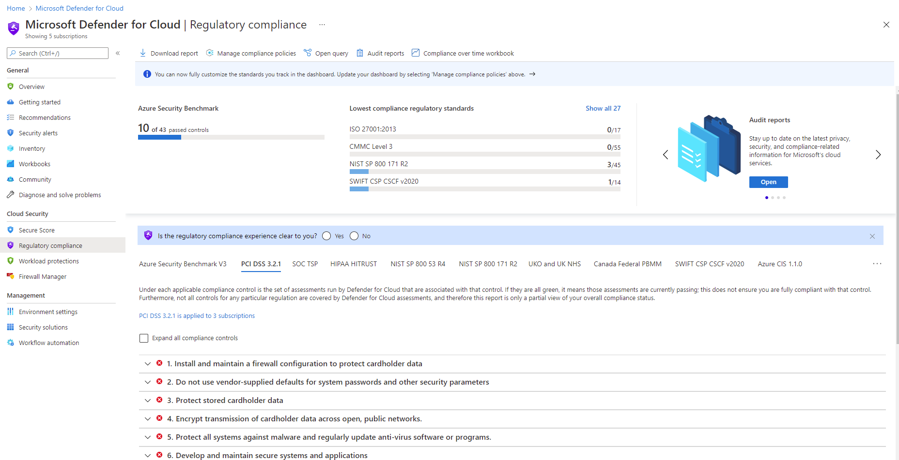

As you establish corporate policy and plan your governance strategies, you can use tools and services like Azure Policy, Azure Blueprints, and Microsoft Defender for Cloud to enforce and automate your organization's governance decisions.

Microsoft Defender for Cloud plays an important part in your governance strategy. It helps you stay on top of security because it:

- Provides a unified view of security across your workloads.
- Collects, searches, and analyzes security data from a variety of sources, which includes firewalls and other partner solutions.
- Provides actionable security recommendations to fix issues before they can be exploited.
- Can be used to apply security policies across your hybrid cloud workloads to ensure compliance with security standards.

Many security features, like security policy and recommendations, are available for free. Some of the more advanced features, like just-in-time VM access and hybrid workload support, are available under the Defender for Cloud Standard tier. Just-in-time VM access can help reduce the network attack surface by controlling access to management ports on Azure VMs.

The regulatory compliance dashboard in Microsoft Defender for Cloud shows your selected compliance standards with all their requirements, where supported requirements are mapped to applicable security assessments. The status of these assessments reflects your compliance with the standard. Below you have an example of the Regulatory Compliance Dashboard in Microsoft Defender for Cloud:

The regulatory compliance dashboard shows the status of all the assessments within your environment for your chosen standards and regulations. As you act on the recommendations and reduce risk factors in your environment, your compliance posture improves.

Using the information in the regulatory compliance dashboard, you can improve your compliance posture by resolving recommendations directly within the dashboard. You can select any of the failing assessments that appear in the dashboard to view the details for that recommendation. Each recommendation includes a set of remediation steps to resolve the issue. From there you can select any of the failing assessments that appear in the dashboard to view the details for that recommendation. Each recommendation includes a set of remediation steps to resolve the issue.
