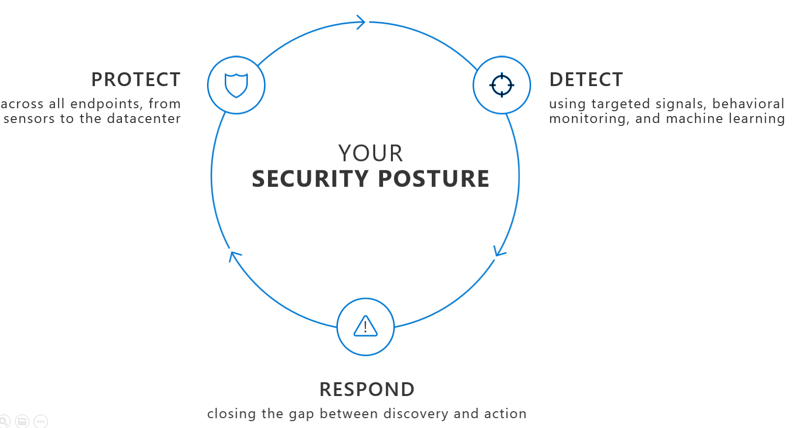
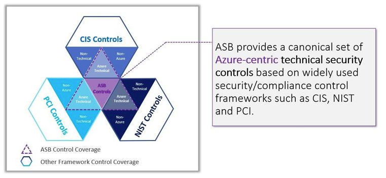
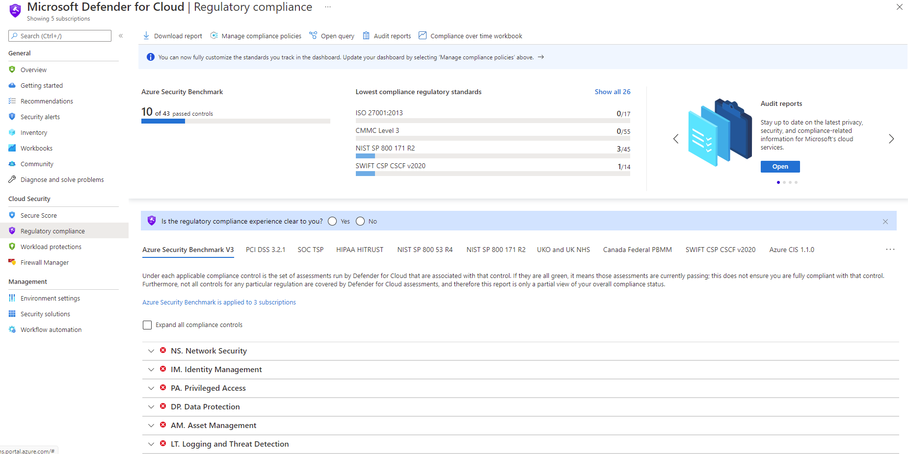

Governance in the cloud age must have an active component that continuously engages with other teams. Security posture management is an emerging function. It represents a step forward in the long-term convergence of security functions. These functions answer the question "how secure is the environment?", including vulnerability management and security compliance reporting. 

## Posture management and the Security operating model 

In the on-premises world, security governance followed the cadence of data it could get about the environment. This way of getting data might take time and be constantly out of date. Cloud technology now provides on-demand visibility into the current security posture and asset coverage. This visibility drives a major transformation of governance into a more dynamic organization. This organization provides a closer relationship to other security teams to monitor security standards, provide guidance, and improve processes. In its ideal state, governance is the heart of continuous improvement. This improvement engages across your organization to constantly improve security posture, which is called Posture Management and it fits in the overall security governance as shown in the diagram below: 

:::image type="content" source="../media/security-governance.png" alt-text="Diagram showing how Security Governance functions within a security organization." lightbox="../media/security-governance.png":::

Continuous improvement of asset security posture means that governance teams should focus on improving standards, and enforcement of those standards, to keep up with the cloud and attackers. Information technology (IT) organizations must react quickly to new threats and adapt accordingly. Attackers are continuously evolving their techniques, and defenses are continuously improving and might need to be enabled. You can't always get all the security you need into the initial configuration.

This Rapid Modernization Plan (RaMP) shown in the diagram below will enable you to quickly improve your security posture with the least number of challenges.

:::image type="content" source="../media/posture-management.png" alt-text="Diagram showing the Rapid Modernization Plan (RaMP)." lightbox="../media/posture-management.png":::
 
The posture management function will need to grow and continuously improve to tackle the full set of technical debt that the organization has accrued from over 30+ years of security being a low priority. Posture management will need to secure all the technologies and teams in the organization plus meet the needs of the organization as it changes (new platforms are adopted, new security tools become available to monitor and reduce risk, etc.). Any expansions in scope will take preparation to build leadership support, relationships across technical teams, posture management team skillsets, and processes.

Security posture refers to the current state of an organization's security---that is, its overall state of protection to its identities, endpoints, user data, apps and infrastructure.. The diagram below shows the three major pillars of security posture management.

 

These three pillars are:

- Protect: An organization's security posture is not static, it changes constantly in response to emerging new threats and variabilities in the environment. Enabling protections, like multifactor authentication (MFA) for administrators, strengthens a company's posture. A lack of vigilance, such as failing to update endpoints or use available protections can weaken an organizations security posture. The security hygiene of your environment helps to reduce the likelihood that threat actors will successfully compromise your workloads.
- Detect: After mitigating all security recommendations, you also must ensure that you have threat detection in place to quickly identify suspicious activities in your workloads and trigger an alert to bring awareness about it.
- Respond: Finally, ensure that you have automation in place to take immediate action on the alerts that you receive by appropriately responding to it with actions that can contain and mitigate the attack.

The use of benchmarks to evaluate your current environment, understand
the current gaps and provide guidance on how to improve, is a very common
practice in the IT industry. When it comes to security posture
enhancement, benchmarks can give you tangible actions based on industry
standards, such as ISO 27001 or by using cloud provider's benchmark,
such as Azure Security Benchmark for Azure workloads, or Center for
Internet Security (CIS) AWS Foundations Benchmark which is crafted for
AWS workloads. Benchmarks will also help you to accelerate the
identification of security gaps by providing remediation steps to harden
your workloads. As you remediate these security recommendations, your
workloads will get more secure, and your overall cloud security posture
is enhanced. As an architect, you'll look to benchmarks as a tool to
guide your efforts to improve the cloud security posture while follow
industry standards.

When evaluating your security hygiene for cloud workloads, consider all
available options. Take into account that every security program may
include multiple workflows. These processes might include notifying
relevant stakeholders, launching a change management process, and
applying specific remediation steps. Consider automating as many steps
of those procedures as you can, since automation reduces overhead. It
can also improve your security by ensuring the process steps are done
quickly, consistently, and according to your predefined requirements.

To improve the security hygiene of the cloud workloads, you also need to
ensure that you're using security best practices to harden these
workloads. Each workload has a different set of security best practices
that must be in place to improve its security hygiene. Make sure to
visit <https://aka.ms/MyASIS> for more information about security best
practices for Azure workloads.

## Evaluating security posture in Azure workloads

The Microsoft cloud security benchmark (MCSB) provides prescriptive best practices and recommendations to help improve the security of workloads, data, and services on Azure and your multicloud environment. This benchmark focuses on cloud-centric control areas with input from a set of holistic Microsoft and industry security guidance that includes:

* Cloud Adoption Framework: Guidance on security, including [strategy, roles and responsibilities](/azure/cloud-adoption-framework/organize/cloud-security), [Azure Top 10 Security Best Practices](/azure/cloud-adoption-framework/get-started/security#step-1-establish-essential-security-practices), and [reference implementation](/azure/cloud-adoption-framework/ready/enterprise-scale).
* Azure Well-Architected Framework: Guidance on [securing your workloads on Azure](/assessments/?mode=pre-assessment&session=local).
* The Chief Information Security Officer (CISO) Workshop: [Program guidance and reference strategies to accelerate security modernization using Zero Trust principles](/security/ciso-workshop/the-ciso-workshop).
* Other industry and cloud service providers security best practice standards and framework: Examples include the Amazon Web Services (AWS) Well-Architected Framework, Center for Internet Security (CIS) Controls, National Institute of Standards and Technology (NIST), and Payment Card Industry Data Security Standard (PCI-DSS).

Here's what's new in the Microsoft cloud security benchmark v1:

1. Comprehensive multicloud security framework: Organizations often have to build an internal security standard to reconcile security controls across multiple cloud platforms to meet security and compliance requirements on each of them. This often requires security teams to repeat the same implementation, monitoring and assessment across the different cloud environments (often for different compliance standards). This creates unnecessary overhead, cost, and effort. To address this concern, we enhanced the ASB to MCSB to help you quickly work with different clouds by:

    - Providing a single control framework to easily meet the security controls across clouds
    - Providing consistent user experience for monitoring and enforcing the multicloud security benchmark in Defender for Cloud
    - Staying aligned with Industry Standards (e.g., CIS, NIST, PCI)

     

1. Automated control monitoring for AWS in Microsoft Defender for Cloud: You can use Microsoft Defender for Cloud Regulatory Compliance Dashboard to monitor your AWS environment against MCSB just like how you monitor your Azure environment. We developed approximately 180 AWS checks for the new AWS security guidance in MCSB, allowing you to monitor your AWS environment and resources in Microsoft Defender for Cloud.

 

1. A refresh of the existing Azure guidance and security principles: We also refreshed some of the existing Azure security guidance and security principles during this update so you can stay current with the latest Azure features and capabilities.

For more information, see [Microsoft cloud security benchmark](/security/benchmark/azure/overview).