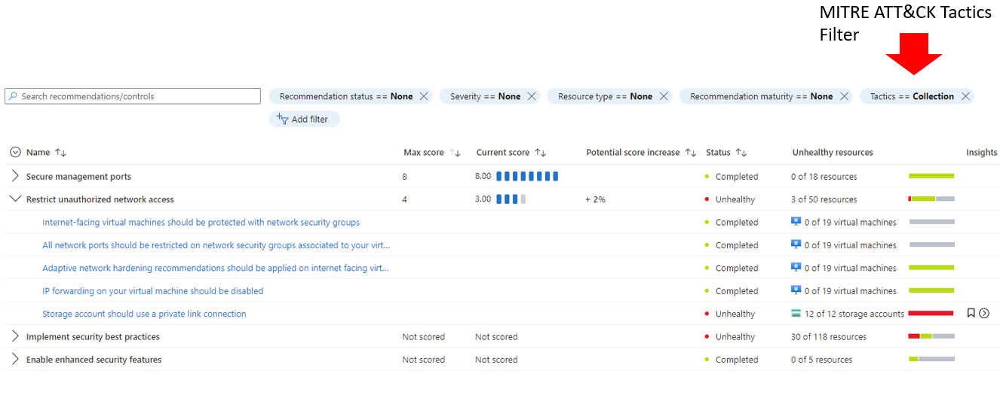

Defender for Cloud continually assesses your resources, subscriptions,
and organization for security issues. It then aggregates all the
findings into a single score so that you can tell, at a glance, your
current security situation: the higher the score, the lower the
identified risk level.

:::image type="content" source="../media/single-secure-score-via-ui.png" alt-text="Screenshot of Azure portal showing Microsoft Defender for cloud secure score metrics." border="true":::

To increase your security, review Defender for Cloud's recommendations page and remediate the recommendation by implementing the remediation instructions for each issue. Recommendations are grouped into security controls. Each control is a logical group of related security recommendations, and reflects your vulnerable attack surfaces. Your score only improves when you remediate all of the recommendations for a single resource within a control. To see how well your organization is securing each individual attack surface, review the scores for each security control.

For security analysts, it's essential to identify the potential risks
associated with security recommendations and understand the attack
vectors, so they can prioritize more effectively. To make prioritization
easier, Microsoft Defender for Cloud maps its security recommendations
against the [MITRE ATTACK framework](https://attack.mitre.org/), a
globally accessible knowledge base of adversary tactics and techniques
based on real-world observations. Using this capability, customers can
strengthen the security posture of their environment with
recommendations that are mapped to the MITRE ATTACK framework and
prioritize based on the potential risk across the cyber kill chain.

The advantage of using MITRE ATTACK when evaluating your security
posture is that you can create campaigns to remediate recommendations
based on the different phases of the MITRE ATTACK framework. The
rationale is that if you remediate recommendations that are mapped to
early stages of the MITRE ATTACK framework, you can prevent a threat
actor from gaining further access to your workloads. Defender for Cloud
has a filter that enables you to create this visualization as shown in
the image below:

For a walkthrough of using Microsoft Defender for Cloud to manage your cloud security posture, view the following interactive guide.

[:::image type="content" source="../media/manage-cloud-security-posture-defender-cloud-interactive-guide.png" alt-text="Screenshot that shows an interactive guide with the title 'Manage your cloud security posture with Microsoft Defender for Cloud'." border="true":::](https://mslearn.cloudguides.com/guides/Manage%20your%20cloud%20security%20posture%20with%20Microsoft%20Defender%20for%20Cloud)

