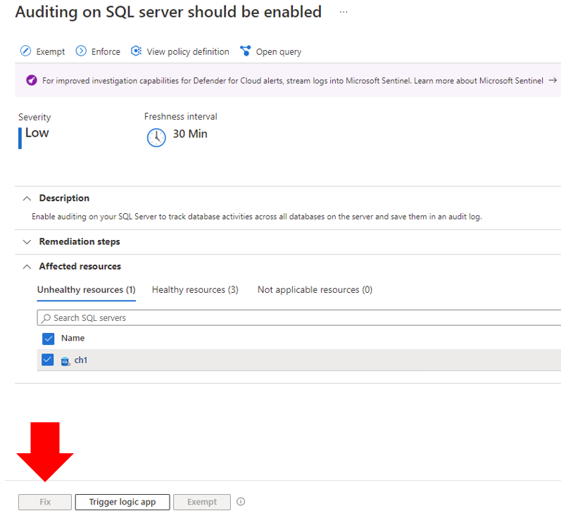
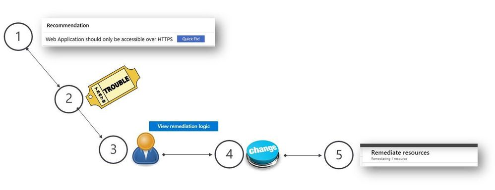
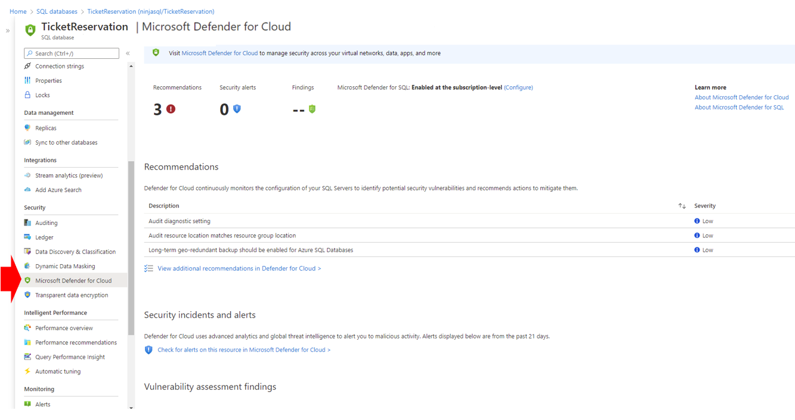

Depending on the size and structure of your organization, multiple
individuals and teams may use Defender for Cloud to perform different
security-related tasks. In the following diagram, you have an example of
fictitious personas and their respective roles and security
responsibilities:

 

Defender for Cloud enables these individuals to meet these various
responsibilities. For example:

-   Jeff (Workload Owner)

    -   Manage a cloud workload and its related resources

    -   Responsible for implementing and maintaining protections in
        accordance with company security policy

-   Ellen (CISO/CIO)

    -   Responsible for all aspects of security for the company

    -   Wants to understand the company's security posture across cloud
        workloads

    -   Needs to be informed of major attacks and risks

-   David (IT Security)

    -   Sets company security policies to ensure the appropriate
        protections are in place

    -   Monitors compliance with policies

    -   Generates reports for leadership or auditors

-   Judy (Security Operations)

    -   Monitors and responds to security alerts 24/7

    -   Escalates to cloud workload Owner or IT Security Analyst

-   Sam (Security Analyst)

    -   Investigate attacks

    -   Work with cloud workload Owner to apply remediation

In many scenarios the IT Security Admin does not have the right level of
privileges in the workload to expedite the remediation of
recommendations. When a user doesn't have the right level of privilege
in the workload and tries to remediate a recommendation by using the
\*Fix\* button, they will have the experience shown in the image below,
where the Fix button is grey out.

 

For this reason, workload owners must be able to receive notifications
when there are open security recommendations for them to remediate. In
Defender for Cloud you can use the [Workflow
Automation](https://docs.microsoft.com/azure/defender-for-cloud/workflow-automation)
capability to activate actions such as sending an email to the resource
owner, when a recommendation is triggered. An example of this workflow
is shown below:

 

1.  The team that is responsible for Microsoft Defender for Cloud
    identifies that there's a security recommendation that needs to be
    addressed and which resources are affected.

2.  A ticket is open and assigned to the workload owner. In this ticket
    they have details about the security recommendation and the
    suggested steps to remediate.

3.  The workload owner reviews the ticket and identifies that there's a
    quick fix for this recommendation. They can use the View remediation
    logic button to understand what changes will be made to the system.

4.  Once they few comfortable with the changes, they start a change
    management process to schedule the remediation.

5.  The remediation is applied on the day that was scheduled.

Workload owners can also use the built-in integration with Defender
for Cloud available in the workload's proprieties. For example, a
Database Administrator that manages multiple databases can see security
recommendations that will improve the security hygiene of its workloads
by visiting the Microsoft Defender for Cloud option as shown in the
example below:

 
