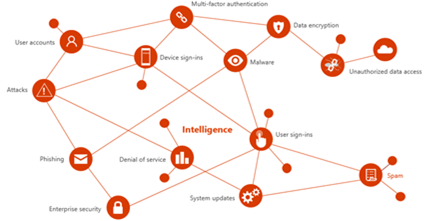

Threat intelligence at Microsoft includes signals inside and outside the
company, related to areas shown in the figure below, like denial of
service, malware, or unauthorized data access. With the right context,
this intelligence leads to targeted actions---for example, releasing
system updates, enforcing security policies like multi-factor
authentication, or applying other security measures.

Threat intelligence is used as a tool to learn about threat and help
mitigate risks. This is because threat intelligence gives context,
relevance, and priority. Threat intelligence goes beyond the lists of
bad domains or bad hashes. It provides the necessary context, relevance,
and priority---sometimes called enrichment. This helps people to make
faster, better, and more proactive cybersecurity decisions. Below you
have examples of scenarios where threat intelligence can be used:

-   A security analyst who uses threat intelligence to analyze the
    highest priority signals and takes action.

-   An information worker who knows to watch for emails with links that
    appear suspicious and could be a phishing campaign targeting the
    company. This awareness could, for example, influence the email
    recipient to be vigilant, avoid opening files or clicking
    questionable links, and report the email as suspicious.

-   An organization that uses threat intelligence to alert employees
    that a particular email attachment is associated with ransomware
    that has affected other companies in the same sector.

Security concerns aren't limited to any sector. All organizations need
to defend themselves against cyberthreats, making it a core part of
their strategies and operations. Visibility and intelligence into
threats are crucial for preparedness---for example, knowing the type of
attack, who's being targeted, how often, and the source of attacks.
Through threat intelligence, organizations can gain visibility, context,
and relevance of security events. Having access to---and sharing this
knowledge---helps decision makers both inside and outside security teams
prioritize actions and reduce risk.

## Identify technical threat intelligence

Cyber threat intelligence (CTI) can come from many sources, such as
open-source data feeds, threat intelligence sharing communities, paid
intelligence feeds, and security investigations within organizations.
CTI can range from written reports on a threat actor's motivations,
infrastructure, and techniques, to specific observations of IP
addresses, domains, and file hashes. CTI provides essential context for
unusual activity, so security personnel can act quickly to protect
people and assets.

The most utilized CTI in SIEM solutions like Microsoft Sentinel is
threat indicator data, sometimes called Indicators of Compromise (IoCs).
Threat indicators associate URLs, file hashes, IP addresses, and other
data with known threat activity like phishing, botnets, or malware. This
form of threat intelligence is often called tactical threat
intelligence, because security products and automation can use it in
large scale to protect and detect potential threats. The diagram below
shows the core architecture of this solution:

 

Microsoft Sentinel can help detect, respond to, and provide CTI context for malicious cyber activity. You can also use Microsoft Sentinel to:

-   Import threat indicators from Structured Threat Information Expression (STIX) and Trusted Automated Exchange of Intelligence Information (TAXII) servers, or from any threat intelligence platform (TIP) solution
-   View and query threat indicator data
-   Create analytics rules to generate security alerts, incidents, and automated responses from CTI data
-   Visualize key CTI information in workbooks

Another product that also uses threat intelligence is Microsoft
Defender for Cloud. Defender for Cloud's threat protection works by
monitoring security information from your Azure resources, the network,
and connected partner solutions. It analyzes this information, often
correlating information from multiple sources, to identify threats. When
Defender for Cloud identifies a threat, it triggers a security alert,
which contains detailed information regarding the event, including
suggestions for remediation. To help incident response teams investigate
and remediate threats, Defender for Cloud provides threat intelligence
reports containing information about detected threats. The report
includes information such as:

-   Attacker's identity or associations (if this information is available)
-   Attackers' objectives
-   Current and historical attack campaigns (if this information is available)
-   Attackers' tactics, tools, and procedures
-   Associated indicators of compromise (IoC) such as URLs and file hashes
-   Victimology, which is the industry and geographic prevalence to assist you in determining if your Azure resources are at risk
-   Mitigation and remediation information Defender for Cloud has three types of threat reports, which can vary according to the attack. The reports available are:
    -   Activity Group Report: provides deep dives into attackers, their objectives, and tactics.
    -   Campaign Report: focuses on details of specific attack campaigns.
    -   Threat Summary Report: covers all of the items in the previous two reports.

This type of information is useful during the incident response process,
where there's an ongoing investigation to understand the source of the
attack, the attacker's motivations, and what to do to mitigate this
issue in the future.

Threat intelligence is also used in other Microsoft Security
solutions, such as Azure AD Identity Protection, which has a featured
called Risk Detection. Risk detections (both user and sign-in linked)
contribute to the overall user risk score that is found in the Risky
Users report. These risks are calculated offline using Microsoft's
internal and external threat intelligence sources including security
researchers, law enforcement professionals, security teams at Microsoft,
and other trusted sources. The image below has an example of the risk
detection capability in Azure AD Identity Protection:

:::image type="content" source="../media/security-risk-detections.png" alt-text="Diagram showing an example of the risk detection capability in Azure A D Identity Protection." lightbox="../media/security-risk-detections.png":::

## Risk mitigations

Thinking of risks in this manner is sometimes referred to as the
event-driven risk model. This term implies that a list of risks is a
list of potential future events. Each risk describes some event that
could occur in the future. The risk might include some information about
the probability of occurrence. It should include a description of the
impact that such an occurrence would have on the project plan. It may
also include a description of ways to reduce the probability of
occurrence and ways to mitigate the impact of occurrence.

Risk management activities fall into four phases: identification,
assessment, response, and monitoring and reporting. In the list below
you have more details about each phase:

-   Identification: The risk management process starts with identifying
    all possible risks to all key control areas, internal and external
    threats, and vulnerabilities in the environment. The identification
    phase is also when decision logs, active security and compliance
    exceptions, and mitigation work from previous risk assessments are
    reviewed

-   Assessment: Each identified risk is assessed using three metrics:
    impact, likelihood, and control deficiency. Impact refers to the
    damage that would occur to the service or business. Likelihood
    defines the probability of the potential risk being realized and
    control deficiency measures the effectiveness of implemented
    mitigation controls.

-   Response: How you'll respond to the risk that was identified,
    which could be based on the following options:

    -   Tolerate: Areas of low-risk exposure with a low level of
        control.
    -   Operate: Areas of low-risk exposure where controls are deemed
        adequate.
    -   Monitor: Areas of high-risk exposure where controls are deemed
        adequate and should be monitored for effectiveness.
    -   Improve: Areas of high-risk exposure with a low level of control
        that are top priorities in addressing.

-   Monitoring and reporting: Risks identified as part of the risk
    assessment are monitored and reported to relevant stakeholders.
    Monitoring strategies include security monitoring, periodic risk
    reviews, penetration testing, and vulnerability scanning.