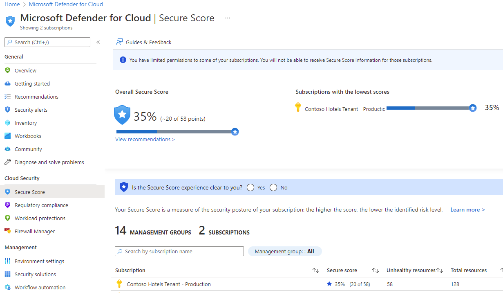
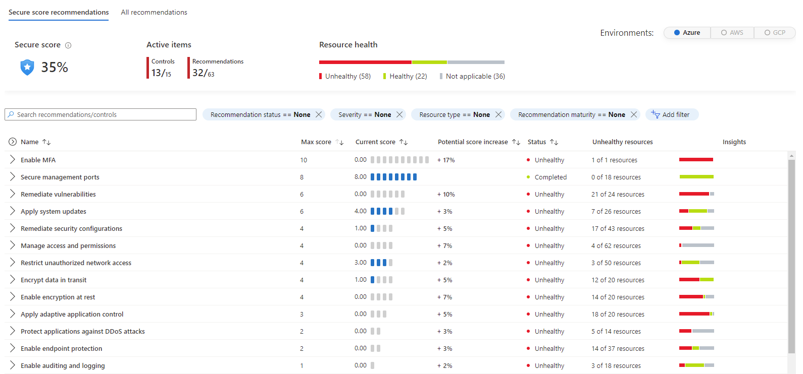
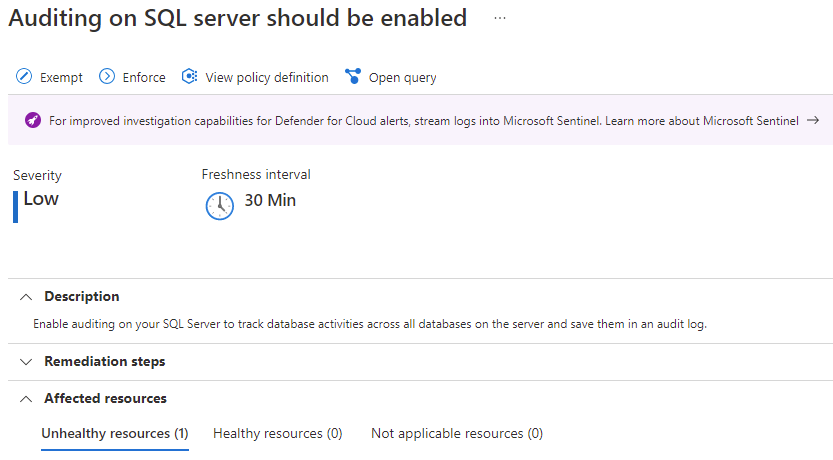

The secure score dashboard in Defender for Cloud shows the secure score
on the subscription level for one or more subscriptions (depending on
how many subscriptions are selected in the Azure portal).

 

To increase your security, review Defender for Cloud's recommendations
page and remediate the recommendation by implementing the remediation
instructions for each issue. Recommendations are grouped into security
controls. Each control is a logical group of related security
recommendations and reflects your vulnerable attack surfaces. Your score
only improves when you remediate all the recommendations for a single
resource within a control. To see how well your organization is securing
each individual attack surface, review the scores for each security
control.

The example below shows the Recommendations dashboard with all security
controls organized in a top-down list, where the controls on top will
have a higher impact on the secure score improvement.

 

When you use Secure Score as your Key Performance Indicators (KPI), you
can track progress as you continuously remediate security
recommendations to drive your secure score up.

While driving security posture enhancement by remediating security
recommendations triggered by Microsoft Defender for Cloud and using
Secure Score to track your progress is the recommended choice, more can
be done to keep positively progressing towards a better security
posture. When a company doesn't have a very mature Azure Governance,
chances are that they will experience a fluctuation in the secure score
(ups and downs), and this can happen if you continue provisioning new
resources that are not secure by default.

Having a solid Azure Governance enables you to ensure that new resources
that are deployed, are going to have certain standards, patterns, and
configurations. To ensure proper governance you can use Azure
Policy and Azure Blueprints. This will allow you to enforce policies and
reject deployment of resources that are not following certain standards.

Defender for Cloud can help the governance of those workloads by
using Azure Policy to enforce secure configuration, based on a
specific recommendation. Some recommendations will be based on policies
that can use the *Deny* effect, which in this case can stop unhealthy
resources from being created. Some other recommendations are based on
the *DeployIfNotExist* effect, which can automatically remediate
non-compliant resources upon creation. Below you have an example of a
recommendation that has the *Enforce* button, which behind the scene is
implementing the *DeployIfNotExist* effect.

