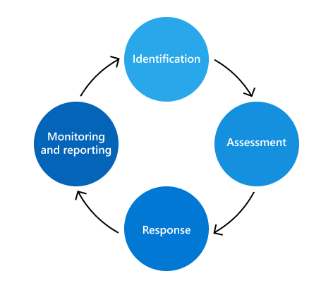
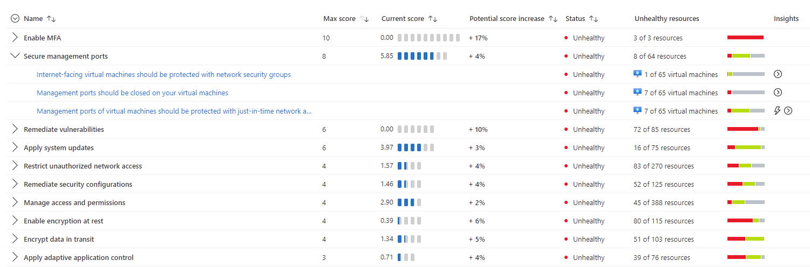
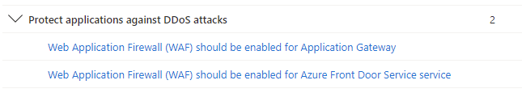
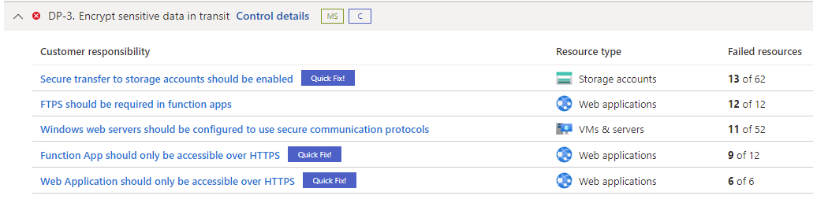

Increasingly, employees have more access to create, manage, and share
data across a broad spectrum of platforms and services. In most cases,
organizations have limited resources and tools to identify and mitigate
organization-wide risks while also meeting compliance requirements and
employee privacy standards. These risks may include data theft by
departing employees and data leaks of information outside your
organization by accidental oversharing or malicious intent.

The top priority should be to proactively identify and address risks
that could impact your organization's service infrastructure and their
data. In addition, a robust risk management program is necessary to meet
contractual obligations. Each risk management activity will have outputs
that will feed the next phase, as shown in the diagram below:

Let's use as an example a scenario where you're the Cybersecurity Architect that is recommending security capabilities and controls to mitigate the identified risks. 

* During the *Identification* of the risks, you found a production subscription that has ten Azure Storage accounts
that are widely open to the Internet. 
* During the *Assessment* phase, you determined that five of these storage accounts have low impact in case of compromise. The low impact was because they do not contain important information. However, you found five other storage accounts that could have a high impact in case of compromise.
* The *Response* for the first five is to tolerate the risk while the other five will need to be improved by adding technical controls to mitigate the risk. 

In this case technical controls include:
-  Require secure transfer (HTTPS) to the storage account
-  Lock storage account to prevent accidental or malicious deletion or
    configuration changes
-   Use Azure Active Directory (Azure AD) to authorize access to blob
    data
-   Disable anonymous public read access to containers and blobs
-   Configure the minimum required version of Transport Layer Security
    (TLS) for a storage account.
-   Enable firewall rules
-   Enable Defender for Storage

As part of the *Monitoring and Reporting* phase, ensure that the storage account has diagnostic logging enabled. Also ensure that Microsoft Defender for Cloud is enabled on the subscription level for continuous assessment of storage accounts as well as security recommendations.

Risk mitigations should be evaluated case-by-case based on those
parameters mentioned above, which also includes the type of threat. If
during the Identification it was established that there's a high
probably that Windows VMs with management port open could be compromised
by RDP Brute Force Attack, then you need to mitigate this risk, and one
technical control that can reduce the attack vector is Defender for
Servers feature called Just-in-Time VM access.

Defender for Cloud provides a list of security controls organized in a
top-down approach that can help you to use a priority list to address
security recommendations. As you remediate all security recommendations
that belong to a security control, you'll see an increase in your
overall security score, which means you're improving your security
posture. The example below shows the *Secure management ports* security
control expanded with three recommendations that needs to be addressed.

Once all three are remediated, you'll receive eight points in your
secure score, as shown in the Max score column. There are also security
controls that will suggest the implementation of a security capability,
for example the security control *Protect applications against DDoS
attacks* shown below, suggests the enablement of WAF to mitigate this
risk.

 

You can also use Azure Security Benchmark to identify the resources
that are in risk enable security capabilities to mitigate these risks
based on the remediation steps suggested by the benchmark, as shown in
the example below:

Notice that in this scenario, you have a security control called *DP-3
Encrypt sensitive data in transit*, and within this control, you have a
series of security recommendations for different workloads (storage
account, web applications, VMs and servers). The advantage of this
approach is that you're mitigating a specific scenario, which is the
encryption of sensitive data in transit, and you're looking at this
scenario across different workloads.

As a cybersecurity architect, you need to select the appropriate security capability for a given risk. For certain scenarios that may mean the addition of a new service. 

Let's use as an example of a scenario where a company needs to
provide customized remote access to employees based on a series of
conditions, including limiting access upon an abnormal behavior.
Although most users have a normal behavior that can be tracked, when
they fall outside of this norm it could be risky to allow them to just
sign in. 

In scenarios like this, you may want to block that user or maybe
just ask them to perform multifactor authentication to prove that they
really are who they say they are. To address this risk, you can use
Azure AD Conditional Access and use the *Sign-in risk-based Conditional Access* policy.

There are also the scenarios that you'll need to select the
appropriate security control for a given risk and in this case the
security control may be just hardening the current resource. An example
could be to reduce the risk on of an attacker compromise a database by
hardening the database and enabling security controls such as
Transparent Data Encryption (TDE). This enables you to encrypt data at
rest without changing existing applications.

