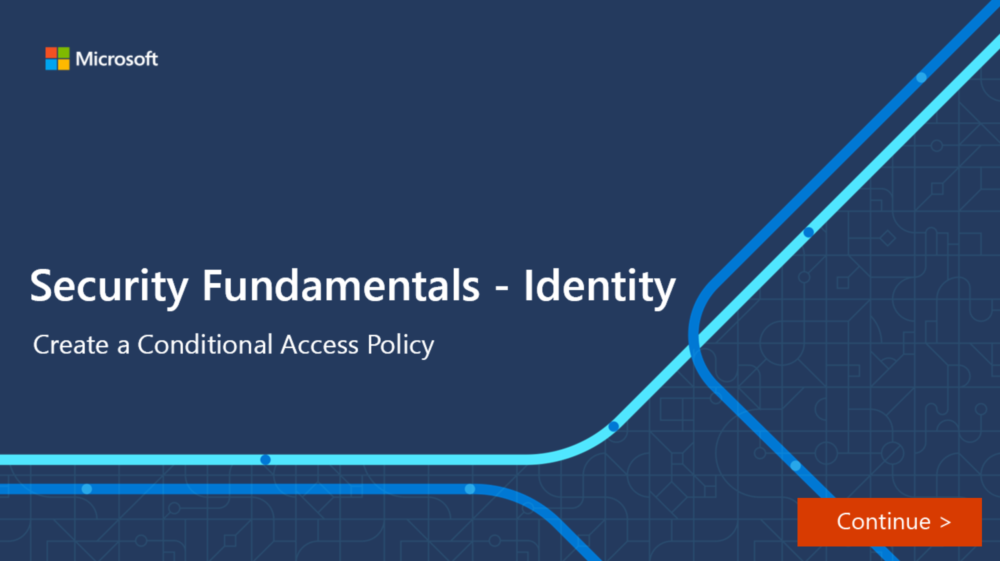

Conditional Access is a feature of Azure AD that provides an extra layer of security before allowing authenticated users to access data or other assets. Conditional Access is implemented through policies that are created and managed in Azure AD. A Conditional Access policy analyses signals including user, location, device, application, and risk to automate decisions for authorizing access to  resources (apps and data).

:::image type="content" source="../media/2-conditional-access-policies.png" alt-text="Conditional Access policies use signals to decide whether to allow or block access":::

A Conditional Access policy might state that *if* a user belongs to a certain group, then they're required to provide multifactor authentication to sign in to an application.

Watch the video to see how Conditional Access policies work.

> [!VIDEO https://www.microsoft.com/videoplayer/embed/RE4INyI]

## Conditional Access signals

Conditional Access can use the following signals to control the who, what, and where of the policy:

- **User or group membership**. Policies can be targeted to specific users and groups (including admin roles), giving administrators fine-grained control over access.
- **Named location information**. Named location information can be created using IP address ranges, and used when making policy decisions. Also, administrators can opt to block or allow traffic from an entire country's IP range.
- **Device**. Users with devices of specific platforms or marked with a specific state can be used.
- **Application**. Users attempting to access specific applications can trigger different Conditional Access policies.
- **Real-time sign-in risk detection**. Signals integration with Azure AD Identity Protection allows Conditional Access policies to identify risky sign-in behavior. Policies can then force users to perform password changes or multifactor authentication to reduce their risk level or be blocked from access until an administrator takes manual action.
- **Cloud apps or actions**. Cloud apps or actions can include or exclude cloud applications or user actions that will be subject to the policy.
- **User risk**. For customers with access to Identity Protection, user risk can be evaluated as part of a Conditional Access policy. User risk represents the probability that a given identity or account is compromised. User risk can be configured for high, medium, or low probability.

## Access controls

When the Conditional Access policy has been applied, an informed decision is reached on whether to grant access, block access, or require extra verification. Common decisions are:

- Block access
- Grant access
- Require one or more conditions to be met before granting access:

  - Require multifactor authentication.
  - Require device to be marked as compliant.
  - Require hybrid Azure AD joined device.
  - Require approved client app.
  - Require app protection policy.
  - Require password change.
- Control user access based on session controls to enable limited experiences within specific cloud applications.  As an example, Conditional Access App Control uses signals from Microsoft Cloud App Security (MCAS) to block, download, cut, copy and print sensitive documents, or to require labeling of sensitive files.  Other session controls include sign-in frequency and application enforced restrictions that, for selected applications, use the device information to provide users with a limited or full experience, depending on the device state.

Conditional Access policies can be targeted to members of specific groups or guests. For example, you can create a policy to exclude all guest accounts from accessing sensitive resources.
Conditional Access is a feature of paid Azure AD editions.

## Interactive guide

In this interactive guide, you'll create a Conditional Access policy for a group of users.

