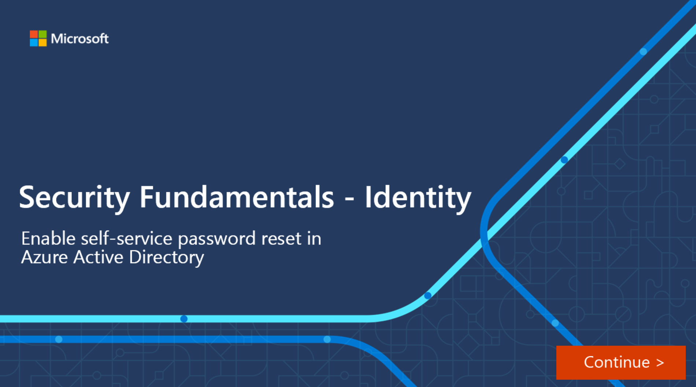

Self-service password reset (SSPR) is a feature of Azure AD that allows users to change or reset their password, without administrator or help desk involvement.

If a user's account is locked or they forget the password, they can follow a prompt to reset it and get back to work. This ability reduces help desk calls and loss of productivity when a user can't sign in to their device or an application.

Self-service password reset works in the following scenarios:

- **Password change**: when a user knows their password but wants to change it to something new.
- **Password reset**: when a user can't sign in, such as when they forget the password, and want to reset it.
- **Account unlock**: when a user can't sign in because their account is locked out.

To use self-service password reset, users must be:

- Assigned an Azure AD license. Refer to the Learn More section of the summary and resources unit for a link to the Licensing requirements for Azure Active Directory self-service password reset.
- Enabled for SSPR by an administrator.
- Registered, with the authentication methods they want to use. Two or more authentication methods are recommended in case one is unavailable.

The following authentication methods are available for SSPR:

- Mobile app notification
- Mobile app code
- Email
- Mobile phone
- Office phone
- Security questions

When users register for SSPR, they're prompted to choose the authentication methods to use. If they choose to use security questions, they pick from a set of questions to prompt for and then provide their own answers. Security questions can only be used during the self-service password reset (SSPR) process to confirm who you are. Security questions aren't used as an authentication method during a sign-in event. Administrator accounts can't use security questions as verification method with SSPR.

> [!NOTE]
> By default, administrator accounts are enabled for self-service password reset and are required to use two authentication methods to reset their password, such as an email address, authenticator app, or a phone number. Administrators don't have the ability to use security questions.

When a user resets their password using self-service password reset, it can also be written back to an on-premises Active Directory. Password write-back allows users to use their updated credentials with on-premises devices and applications without a delay.

To keep users informed about account activity, admins can configure email notifications to be sent when an SSPR event happens. These notifications can cover both regular user accounts and admin accounts. For admin accounts, this notification provides an extra layer of awareness when a privileged administrator account password is reset using SSPR. All global admins would be notified when SSPR is used on an admin account.

In this interactive guide, you'll enable self-service password reset for users in Azure Active Directory. Select the image below to get started and follow the prompts on the screen.

