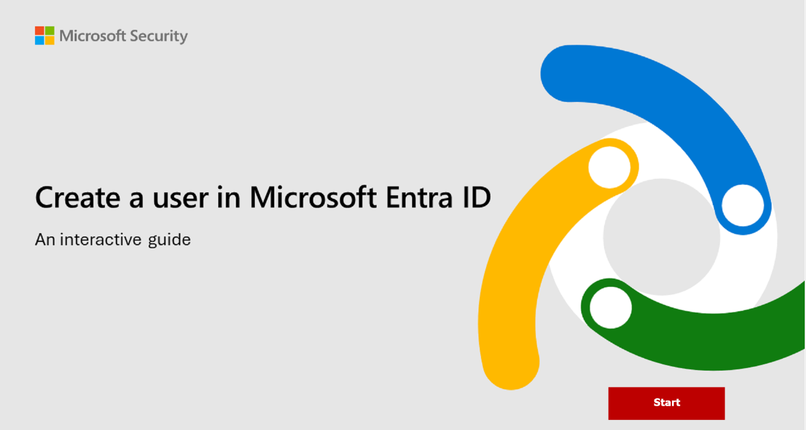

In Microsoft Entra ID, there are different types of identities that are supported.  The terms you'll hear and are introduced in this unit are user identities, workload identities, device identities, external identities, and hybrid identities. Each of these terms is described in more detail in the sections that follow.

When you ask the question, to what can I assign an identity in Microsoft Entra ID, there are three categories.

- You can assign identities to people (humans).  Examples of identities assigned to people are employees of an organization that are typically configured as internal users, and external users that include customers, consultants, vendors, and partners.  For our purposes, we'll refer to these as user identities.
- You can assign identities to physical devices, such as mobile phones, desktop computers, and IoT devices.
- Lastly, you can assign identities to software-based objects, such as applications, virtual machines, services, and containers. These identities are referred to as workload identities.

:::image type="content" source="../media/identity-types-inline.png" lightbox="../media/identity-types-expanded.png" alt-text="A block diagram showing the categories of identity types. The categories consist of Workload identities, device identities, and human identities. Workload and device identities are grouped under machine identities.":::

In this unit, we consider each type of Microsoft Entra ID identity.

### User

User identities represent people such as employees and external users (customers, consultants, vendors, and partners).  In Microsoft Entra ID, user identities are characterized by how they authenticate and the user type property.

How the user authenticates is asked relative to the host organization’s Microsoft Entra ID tenant and can be internal or external.  Internal authentication means the user has an account on the host organization’s Microsoft Entra ID and uses that account to authenticate to Microsoft Entra ID. External authentication means the user authenticates using an external Microsoft Entra ID account that belongs to another organization, a social network identity, or other external identity provider.

The user type property describes the user’s relationship to the organization or more specifically, the host organization’s tenancy. The user can be a guest or a member of the organization’s Microsoft Entra ID tenant. By default, guests of the organization have limited privileges in the organization’s directory, relative to members of the organization.

:::image type="content" source="../media/entra-id-user-properties-v3-inline.png" lightbox="../media/entra-id-user-properties-v2-expanded.png" alt-text="A four by four matrix showing the types of user identities supported based on whether they're a guest or member user. The matrix also shows type of user based on whether they use internal or external authentication.":::

- Internal member: These users are typically considered employees of your organization. The user authenticates internally via their organization’s Microsoft Entra ID, and the user object created in the resource Microsoft Entra ID directory has a UserType of Member.
- External guest: External users or guests, including consultants, vendors, and partners, typically fall into this category. The user authenticates using an external Microsoft Entra ID account or an external identity provider (such as a social identity). The user object created in the resource Microsoft Entra ID directory has a UserType of Guest, giving them limited, guest-level permissions.
- External member: This scenario is common in organizations consisting of multiple tenants.  Consider the scenario where the Contoso Microsoft Entra ID tenant and the Fabrikam Microsoft Entra ID tenant are tenants within one large organization.  Users from the Contoso tenant need member level access to resources in Fabrikam. In this scenario, Contoso users are configured in the Fabrikam Microsoft Entra ID directory such that they authenticate with their Contoso account, which is external to Fabrikam, but have a UserType of Member to enable member-level access to Fabrikam’s organizational resources.
- Internal guest: This scenario exists when organizations who collaborate with distributors, suppliers, and vendors set up internal Microsoft Entra ID accounts for these users but designate them as guests by setting the user object UserType to Guest. As a guest, they have reduced permissions in the directory. This is considered a legacy scenario as it is now more common to use B2B collaboration.  With B2B collaboration users can use their own credentials, allowing their external identity provider to manage authentication and their account lifecycle.

External guests and external members are business-to-business (B2B) collaboration users that fall under the category of external identities in Microsoft Entra ID and is described in more detail in the subsequent unit.

In the following interactive guide, you'll add a new user to Microsoft Entra ID. Select the image that follows to get started and follow the prompts on the screen.

### Workload identities

A workload identity is an identity you assign to a software workload.  This enables the software workload to authenticate to and access other services and resources. This helps secure your workload. In Microsoft Entra, workload identities are applications, service principals, and managed identities.

#### Applications and service principals

A service principal is essentially, an identity for an application. For an application to delegate its identity and access functions to Microsoft Entra ID, the application must first be registered with Microsoft Entra ID to enable its integration.  Once an application is registered, a service principal is created in each Microsoft Entra ID tenant where the application is used. The service principal enables core features such as authentication and authorization of the application to resources that are secured by the Microsoft Entra ID tenant.

For the service principals to be able to access resources secured by the Microsoft Entra ID tenant, application developers must manage and protect the credentials. If not done correctly, this can introduce security vulnerabilities. Managed identities help offload that responsibility from the developer.

#### Managed identities

Managed identities are a type of service principal that are automatically managed in Microsoft Entra ID and eliminate the need for developers to manage credentials. Managed identities provide an identity for applications to use when connecting to Azure resources that support Microsoft Entra ID authentication and can be used without any extra cost.

:::image type="content" source="../media/managed-identities-inline.png" lightbox="../media/managed-identities-expanded.png" alt-text="A Diagram that shows how a developer may use managed identities to get access to resources from their code without managing credentials.":::

For a list of Azure Services that support managed identities, refer to the Learn more section of the Summary and resources unit.

There are two types of managed identities: system-assigned and user-assigned.

- **System-assigned**. Some Azure resources, such as virtual machines, allow you to enable a managed identity directly on the resource. When you enable a system-assigned managed identity an identity is created in Microsoft Entra ID that's tied to the lifecycle of that Azure resource.  Because the identity is tied to the lifecycle of that Azure resource when the resource is deleted, Azure automatically deletes the identity for you.  An example where you may find a system-assigned identity is when a workload is contained within a single Azure resource, such as an application that runs on a single virtual machine.

- **User-assigned**. You may also create a managed identity as a standalone Azure resource. Once you create a user-assigned managed identity, you can assign it to one or more instances of an Azure service.  For example, a user-assigned managed identity can be assigned to multiple VMs. With user-assigned managed identities, the identity is managed separately from the resources that use it.  Deleting the resources that use the user-assigned managed identity doesn't delete the identity. The user-assigned managed identity must be explicitly deleted.  This is useful in a scenario where you may have multiple VMs that all have the same set of permissions but may get recycled frequently.  Deleting any of the VMs doesn’t impact the user-assigned managed identity.  Similarly, you can create a new VM and assign it the existing user-assigned managed identity.  

### Device

A device is a piece of hardware, such as mobile devices, laptops, servers, or printers. A device identity gives administrators information they can use when making access or configuration decisions.  Device identities can be set up in different ways in Microsoft Entra ID.

- **Microsoft Entra ID registered devices**. The goal of Microsoft Entra ID registered devices is to provide users with support for bring your own device (BYOD) or mobile device scenarios. In these scenarios, a user can access your organization’s resources using a personal device. Microsoft Entra ID registered devices register to Microsoft Entra ID without requiring an organizational account to sign in to the device.  
- **Microsoft Entra ID joined**. A Microsoft Entra ID joined device is a device joined to Microsoft Entra ID through an organizational account, which is then used to sign in to the device. Microsoft Entra ID joined devices are generally owned by the organization.
- **Hybrid Microsoft Entra ID joined devices**. Organizations with existing on-premises Active Directory implementations can benefit from the functionality provided by Microsoft Entra ID by implementing hybrid Microsoft Entra ID joined devices. These devices are joined to your on-premises Active Directory and Microsoft Entra ID requiring organizational account to sign in to the device.

Registering and joining devices to Microsoft Entra ID gives users Single Sign-on (SSO) to cloud-based resources.  Additionally, devices that are Microsoft Entra ID joined benefit from the SSO experience to resources and applications that rely on on-premises Active Directory.

IT admins can use tools like Microsoft Intune, a cloud-based service that focuses on mobile device management (MDM) and mobile application management (MAM), to control how an organization’s devices are used. For more information, see [Microsoft Intune](/mem/intune/fundamentals/what-is-intune).

### Groups

In Microsoft Entra ID, if you have several identities with the same access needs, you can create a group. You use groups to give access permissions to all members of the group, instead of having to assign access rights individually. Limiting access to Microsoft Entra ID resources to only those identities who need access is one of the core security principles of Zero Trust.

There are two group types:

- Security:  A security group is the most common type of group and it's used to manage user and device access to shared resources. For example, you may create a security group for a specific security policy such as Self-service password reset or for use with a conditional access policy to require MFA. Members of a security group can include users (including external users), devices, other groups, and service principals. Creating security groups requires a Microsoft Entra ID administrator role.

- Microsoft 365:  A Microsoft 365 group, which is also often referred to as a distribution group, is used for grouping users according to collaboration needs. For example, you can give members of the group access to a shared  mailbox, calendar, files SharePoint sites, and more. Members of a Microsoft 365 group can only include users, including users outside of your organization. Because Microsoft 365 groups are intended for collaboration, the default is to allow users to create Microsoft 365 groups, so you don’t need an administrator role.

Groups can be configured to allow members to be assigned, that is manually selected, or they can be configured for dynamic membership.  Dynamic membership uses rules to automatically add and remove identities.  
