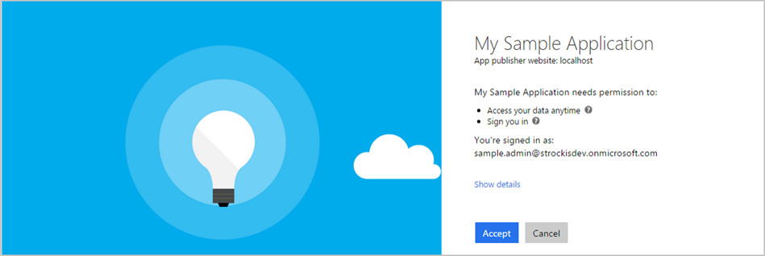

## Permissions and consent in the Microsoft identity platform endpoint

Applications that integrate with Microsoft identity platform follow an authorization model that gives users and administrators control over how data can be accessed. The implementation of the authorization model has been updated on the Microsoft identity platform endpoint, and it changes how an app must interact with the Microsoft identity platform. This unit covers the basic concepts of this authorization model, including scopes, permissions, and consent.

## Scopes and permissions

The Microsoft identity platform implements the OAuth 2.0 authorization protocol, a method through which a third-party app can access web-hosted resources on behalf of a user. Any web-hosted resource that integrates with the Microsoft identity platform has a resource identifier, or *Application ID URI*. For example, Microsoft's web-hosted resources include:

- Microsoft Graph: **https<nolink>://graph.microsoft.com**

- Microsoft 365 Mail API: **https<nolink>://outlook.office.com**

- Azure Key Vault: **https<nolink>://vault.azure.net**

The same is true for any third-party resources that have integrated with the Microsoft identity platform. Any of these resources also can define a set of permissions that can be used to divide the functionality of that resource into smaller chunks. As an example, Microsoft Graph has defined permissions for tasks such as:

- Read a user's calendar.

- Write to a user's calendar.

- Send mail as a user.

By defining these types of permissions, the resource has fine-grained control over its data and how API functionality is exposed. A third-party app can request these permissions from users and administrators who must approve the request before the app can access data or act on a user's behalf. By chunking the resource's functionality into smaller permission sets, developers can build third-party apps to request only the specific permissions that they need to perform their function. Users and administrators can know exactly what data the app has access to, and they can be more confident that it isn't behaving with malicious intent. Developers should always abide by the concept of least privilege, asking for only the permissions they need for their applications to function.

In OAuth 2.0, these types of permissions are called *scopes*. They are also often referred to as *permissions*. A permission is represented in the Microsoft identity platform as a string value. Continuing with the Microsoft Graph example, the string value for each permission is:

- Read a user's calendar by using Calendars.Read

- Write to a user's calendar by using Calendars.ReadWrite

- Send mail as a user using by Mail.Send

An app most commonly requests these permissions by specifying the scopes in requests to the Microsoft identity platform authorize endpoint. However, certain high-privilege permissions can only be granted through administrator consent and requested/granted using the administrator consent endpoint. 

## Permission types

Microsoft identity platform supports two types of permissions: **delegated permissions** and **application permissions**.

- **Delegated permissions** are used by apps that have a signed-in user present. For these apps, either the user or an administrator consents to the permissions that the app requests, and the app is delegated permission to act as the signed-in user when making calls to the target resource. Some delegated permissions can be consented to by non-administrative users, but some higher-privileged permissions require administrator consent. To learn which administrator roles can consent to delegated permissions, see Administrator role permissions in Azure AD.

- **Application permissions** are used by apps that run without a signed-in user present; for example, apps that run as background services or daemons. Only an administrator can consent to application permissions.

*Effective permissions* are those that your app will have when making requests to the target resource. It's important to understand the difference between the delegated and application permissions that your app is granted and its effective permissions when making calls to the target resource.

- For delegated permissions, the *effective permissions* of your app will be the least privileged intersection of the delegated permissions the app has been granted (via consent) and the privileges of the currently signed-in user. Your app can never have more privileges than the signed-in user. Within organizations, the privileges of the signed-in user may be determined by policy or by membership in one or more administrator roles. To learn which administrator roles can consent to delegated permissions, see Administrator role permissions in Azure AD.

- For example, assume your app has been granted the *User.ReadWrite.All* delegated permission. This permission nominally grants your app permission to read and update the profile of every user in an organization. If the signed-in user is a global administrator, your app will be able to update the profile of every user in the organization. However, if the signed-in user isn't in an administrator role, your app will be able to update only the profile of the signed-in user. It will not be able to update the profiles of other users in the organization, because the user whom it has permission to act on behalf of does not have those privileges.

- For application permissions, the *effective permissions* of your app will be the full level of privileges implied by the permission. For example, an app that has the *User.ReadWrite.All* application permission can update the profile of every user in the organization.

## OpenID Connect Scopes

The Microsoft identity platform implementation of OpenID Connect has a few well-defined scopes that are also hosted on the Microsoft Graph: openid, email, profile, and offline_access. The address and phone OpenID Connect scopes are not supported.

Requesting the OIDC scopes and a token will give you a token to call the UserInfo endpoint.

### Openid

If an app performs sign-in by using OpenID Connect, it must request the openid scope. The openid scope shows on the work account consent page as the "Sign you in" permission and on the personal Microsoft account consent page as the "View your profile and connect to apps and services using your Microsoft account" permission. With this permission, an app can receive a unique identifier for the user in the form of the sub claim. It also gives the app access to the UserInfo endpoint. The openid scope can be used at the Microsoft identity platform token endpoint to acquire ID tokens, which can be used by the app for authentication.

### email

The email scope can be used with the openid scope and any others. It gives the app access to the user's primary email address in the form of the email claim. The email claim is included in a token only if an email address is associated with the user account, which isn't always the case. If it uses the email scope, your app should be prepared to handle a case in which the email claim does not exist in the token.

### profile

The profile scope can be used with the openid scope and any others. It gives the app access to a substantial amount of information about the user. The information it can access includes, but isn't limited to, the user's given name, surname, preferred username, and object ID. For a complete list of the profile claims available in the id_tokens parameter for a specific user, see the id_tokens reference.

### offline_access

The offline_access scope gives your app access to resources on behalf of the user for an extended time. On the consent page, this scope appears as the "Maintain access to data you have given it access to" permission. When a user approves the offline_access scope, your app can receive refresh tokens from the Microsoft identity platform token endpoint. Refresh tokens are long-lived. Your app can get new access tokens as older ones expire.

On the Microsoft identity platform (requests made to the v2.0 endpoint), your app must explicitly request the offline_access scope to receive refresh tokens. This means that when you redeem an authorization code in the OAuth 2.0 authorization code flow, you'll receive only an access token from the /token endpoint. The access token is valid for a short time, usually expiring in one hour. At that point, your app needs to redirect the user back to the /authorize endpoint to get a new authorization code. During this redirect, depending on the type of app, the user might need to enter their credentials again or consent again to permissions.

> [!NOTE]
> This permission appears on all consent screens today, even for flows that don't provide a refresh token (the [implicit flow](https://docs.microsoft.com/azure/active-directory/develop/v2-oauth2-implicit-grant-flow)). This is to cover scenarios where a client can begin within the implicit flow, and then move on to the code flow where a refresh token is expected.

## Requesting individual user consent

In an OpenID Connect or OAuth 2.0 authorization request, an app can request the permissions it needs by using the scope query parameter. When a user signs into an app, the app sends a request for permission. The scope parameter is a space-separated list of delegated permissions that the app is requesting. Each permission is indicated by appending the permission value to the resource's identifier (the Application ID URI). In the request example, the app needs delegated permission to read the user's calendar and send mail as the user.

After the user enters their credentials, the Microsoft identity platform endpoint checks for a matching record of user consent. If the user has not consented to any of the requested permissions in the past, nor has an administrator consented to these permissions on behalf of the entire organization, the Microsoft identity platform endpoint asks the user to grant the requested permissions.

> [!NOTE]
> At this time, the offline_access ("Maintain access to data you have given it access to") and user.read ("Sign you in and read your profile") permissions are automatically included in the initial consent to an application. These permissions are generally required for proper app functionality; offline_access gives the app access to refresh tokens, critical for native and web apps, while user.read gives access to the sub claim, allowing the client or app to correctly identify the user over time and access rudimentary user information.

>[!div class="mx-imgBorder"]
>

When the user approves the permission request, consent is recorded, and the user doesn't have to consent again on subsequent sign-ins to the application.

## Requesting consent for an entire tenant

Often, when an organization purchases a license or subscription for an application, the organization wants to proactively set up the application for use by all members of the organization. As part of this process, an administrator can grant consent for the application to act on behalf of any user in the tenant. If the admin grants consent for the entire tenant, the organization's users won't see a consent page for the application. Additionally, applications must use the admin consent endpoint to request application permissions.

