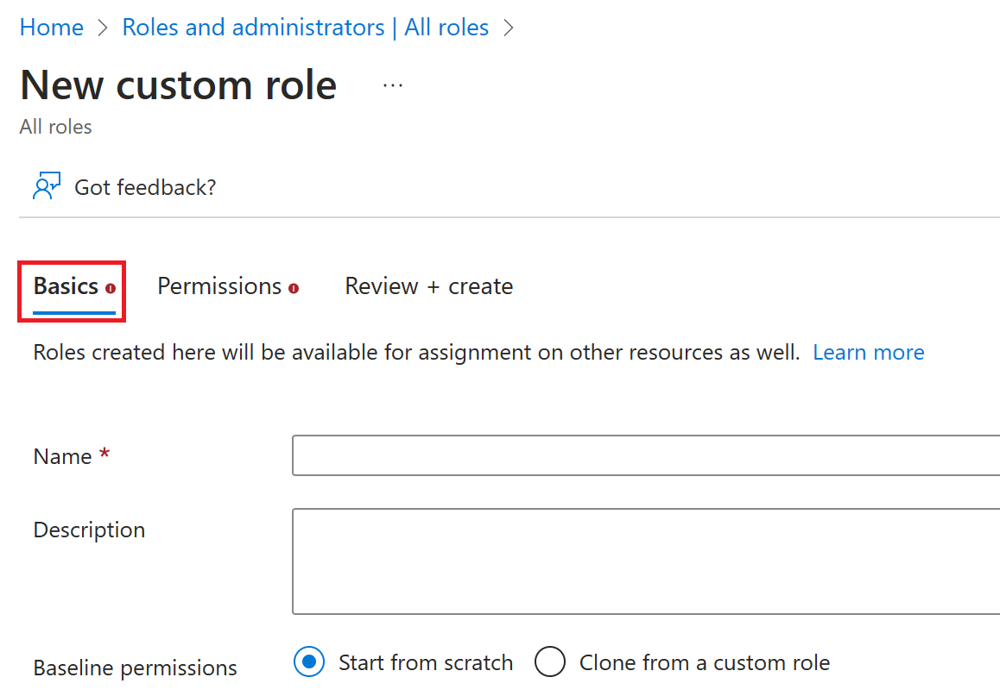
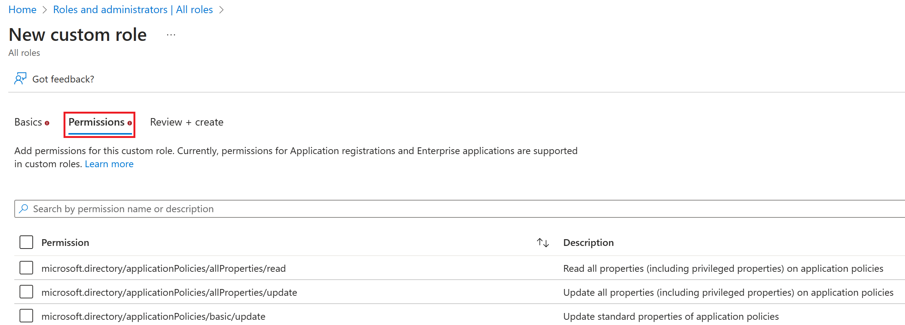

Azure Active Directory (Azure AD) is Microsoft’s cloud-based identity and access management service, which helps your employees sign in and access resources in:

- External resources, such as Microsoft 365, the Azure portal, and thousands of other SaaS applications.

- Internal resources, such as apps on your corporate network and intranet, along with any cloud apps developed by your own organization.

## Who uses Azure AD?

Azure AD is intended for:

- **IT admins** - As an IT admin, you can use Azure AD to control access to your apps and your app resources, based on your business requirements. For example, you can use Azure AD to require multi-factor authentication when accessing important organizational resources. Additionally, you can use Azure AD to automate user provisioning between your existing Windows Server AD and your cloud apps, including Microsoft 365. Finally, Azure AD gives you powerful tools to automatically help protect user identities and credentials and to meet your access governance requirements.
- **App developers** - As an app developer, you can use Azure AD as a standards-based approach for adding single sign-on (SSO) to your app, allowing it to work with a user's pre-existing credentials. Azure AD also provides APIs that can help you build personalized app experiences using existing organizational data.
- **Microsoft 365, Office 365, Azure, or Dynamics CRM Online subscribers** - As a subscriber, you're already using Azure AD. Each Microsoft 365, Office 365, Azure, and Dynamics CRM Online tenant is automatically an Azure AD tenant. You can immediately start to manage access to your integrated cloud apps.

In Azure AD, if one of your users needs permission to manage Azure AD resources, you must assign them to a role that provides the permissions they need.

If you are new to Azure, you may find it a little challenging to understand all the different roles in Azure. The following section helps explain the following roles and provides additional information on Azure roles and Azure AD roles:

- Classic subscription administrator roles
- Azure roles
- Azure AD roles

## Azure AD roles

Azure AD roles are used to manage Azure AD resources in a directory such as create or edit users, assign administrative roles to others, reset user passwords, manage user licenses, and manage domains. The following table describes a few of the more important Azure AD roles.

| **Azure AD role**| **Permissions**| **Notes**|
| :--- | :--- | :--- |
| Global Administrator| <ul><li>Manage access to all administrative features in Azure Active Directory, as well as services that federate to Azure Active Directory </li> <li>Assign administrator roles to others</li> <li>Reset the password for any user and all other administrators</li></ul>| The person who signs up for the Azure Active Directory tenant becomes a Global Administrator.|
| User Administrator| <ul><li>Create and manage all aspects of users and groups</li> <li>Manage support tickets</li> <li>Monitor service health</li> <li>Change passwords for users, Helpdesk administrators, and other User Administrators</li></ul>||
| Billing Administrator| <ul><li>Make purchases</li> <li>Manage subscriptions</li> <li>Manage support tickets</li> <li>Monitors service health</li></ul>||

In the Azure portal, you can see the list of Azure AD roles on the **Roles and administrators** blade. 

> [!div class="mx-imgBorder"]
> 

## Differences between Azure roles and Azure AD roles

At a high level, Azure roles control permissions to manage Azure resources, while Azure AD roles control permissions to manage Azure AD resources. The following table compares some of the differences.

| **Azure roles**| **Azure AD roles**|
| :--- | :--- |
| Manage access to Azure resources| Manage access to Azure AD resources|
| Supports custom roles| Supports custom roles|
| Scope can be specified at multiple levels (management group, subscription, resource group, resource)| Scope is at the tenant level|
| Role information can be accessed in Azure portal, Azure CLI, Azure PowerShell, Azure Resource Manager templates, REST API| Role information can be accessed in Azure admin portal, Microsoft 365 admin center, Microsoft Graph, Azure AD PowerShell|

### Do Azure roles and Azure AD roles overlap?

By default, Azure roles and Azure AD roles do not span Azure and Azure AD. However, if a Global Administrator elevates their access by choosing the **Access management for Azure resources** switch in the Azure portal, the Global Administrator will be granted the User Access Administrator role (an Azure role) on all subscriptions for a particular tenant. The User Access Administrator role enables the user to grant other users access to Azure resources. This switch can be helpful to regain access to a subscription.

Several Azure AD roles span Azure AD and Microsoft 365, such as the Global Administrator and User Administrator roles. For example, if you are a member of the Global Administrator role, you have global administrator capabilities in Azure AD and Microsoft 365, such as making changes to Microsoft Exchange and Microsoft SharePoint. However, by default, the Global Administrator doesn't have access to Azure resources.

> [!div class="mx-imgBorder"]
> 

## Assign roles

There are multiple ways to assign roles within Azure AD.  You need to pick the one the best meets your needs.  The user interface might be slightly different each method, however the configuration options are similar.  Methods for assigning roles include:

- Assign a role to a user or group
   - **Azure AD** --> **Roles and administration** --> **Select a role** --> **+ Add Assignment**
- Assign a user or group to a role
   - **Azure AD** --> Open **Users** (or Groups) --> Select an **User** (or group) --> **Assigned roles** --> **+ Add Assignment**
- Assign a role to a broad-scope, like a Subscription, Resource Group, or Management Group
   - Done via the **Access control (IAM)** within each blade
- Assign a role using PowerShell or Microsoft Graph API
- Assign a role using Privileged Identity Management (PIM)

The best method for your configuration needs can be used, but care must be taken as there are no built in restrictions.  You could accidentally assign an administrative role to a group with users who do not need administratrive access.  This could lead to a solution modified by a user without proper knowledge of what they are doing, or even a potential avenue for attackers.  Proper identity governance is the key.

### Example - using PIM to assign a role

A common way to assign Azure AD roles to a user is on the Assigned roles page for a user. You can also configure the user eligibility to be elevated just-in-time into a role using **Privileged Identity Management (PIM)**.

> [!NOTE]
> If you have an Azure AD Premium P2 license plan and already use PIM, all role management tasks are performed in the Privileged Identity Management experience. This feature is currently limited to assigning only one role at a time. You can't currently select multiple roles and assign them to a user all at once.

> [!div class="mx-imgBorder"]
> 

## Create and assign a custom role in Azure Active Directory

This section describes how to create new custom roles in Azure AD. For the basics of custom roles, see the [custom roles overview](/azure/active-directory/roles/custom-overview). The role can be assigned either at the directory-level scope or an app registration resource scope only.

Custom roles can be created in the [Roles and administrators](https://portal.azure.com/) tab on the Azure AD overview page.

1. Select **Azure Active Directory** > **Roles and administrators** > **New custom role**.

   > [!div class="mx-imgBorder"]
   > 

2. On the **Basics** tab, provide a name and description for the role and then click **Next**.

   > [!div class="mx-imgBorder"]
   > 

3. On the **Permissions** tab, select the permissions necessary to manage basic properties and credential properties of app registrations.

4. First, enter "credentials" in the search bar and select the `microsoft.directory/applications/credentials/update `permission.

   > [!div class="mx-imgBorder"]
   > 

6. Next, enter "basic" in the search bar, select the `microsoft.directory/applications/basic/update `permission, and then click **Next**.

7. On the **Review + create** tab, review the permissions and select **Create**.

Your custom role will show up in the list of available roles to assign.

