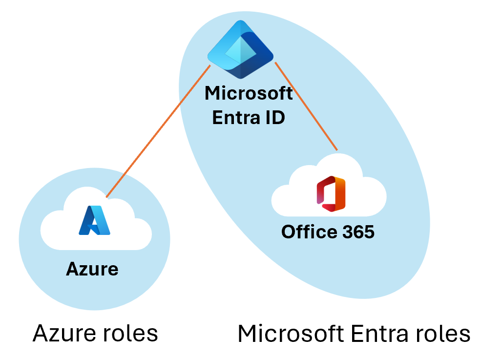
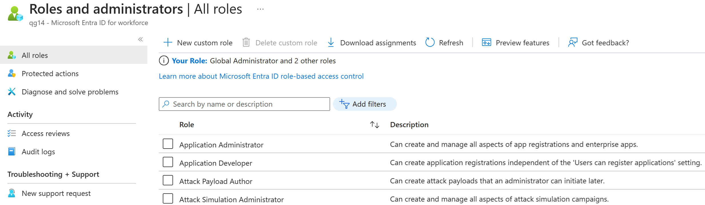

(from https://docs.microsoft.com/en-us/azure/active-directory/fundamentals/active-directory-users-assign-role-azure-portal )

## Introduction

In Azure Active Directory (Azure AD), if one of your users needs permission to manage Azure AD resources, you must assign them to a role that provides the permissions they need.

(The following content is from https://docs.microsoft.com/en-us/azure/role-based-access-control/rbac-and-directory-admin-roles)

If you are new to Azure, you may find it a little challenging to understand all the different roles in Azure. This section helps explain the following roles and provides additional information on Azure roles and Azure Active Directory (Azure AD) roles:

- Classic subscription administrator roles

- Azure roles

- Azure Active Directory (Azure AD) roles

## How the roles are related
Now is the time to publish

To better understand roles in Azure, it helps to know some of the history. When Azure was initially released, access to resources was managed with just three administrator roles: Account Administrator, Service Administrator, and Co-Administrator. Later, Azure role-based access control (Azure RBAC) was added. Azure RBAC is a newer authorization system that provides fine-grained access management to Azure resources. Azure RBAC includes many built-in roles, can be assigned at different scopes, and allows you to create your own custom roles. To manage resources in Azure AD, such as users, groups, and domains, there are several Azure AD roles.

The following diagram is a high-level view of how the classic subscription administrator roles, Azure roles, and Azure AD roles are related.

## Azure roles

Azure RBAC is an authorization system built on Azure Resource Manager that provides fine-grained access management to Azure resources, such as compute and storage. Azure RBAC includes over 70 built-in roles. There are four fundamental Azure roles. The first three apply to all resource types:

| **Azure role**| **Permissions**| **Notes**|
| :--- | :--- | :--- |
| Owner| Full access to all resources - Delegate access to others| The Service Administrator and Co-Administrators are assigned the Owner role at the subscription scope - Applies to all resource types.|
| Contributor| Create and manage all of types of Azure resources - Create a new tenant in Azure Active Directory - Cannot grant access to others| Applies to all resource types.|
| Reader| View Azure resources| Applies to all resource types.|
| User Access Administrator| Manage user access to Azure resources||

The rest of the built-in roles allow management of specific Azure resources. For example, the Virtual Machine Contributor role allows the user to create and manage virtual machines. For a list of all the built-in roles, see [Azure built-in roles](https://docs.microsoft.com/en-us/azure/role-based-access-control/built-in-roles).

Only the Azure portal and the Azure Resource Manager APIs support Azure RBAC. Users, groups, and applications that are assigned Azure roles cannot use the Azure classic deployment model APIs.

In the Azure portal, role assignments using Azure RBAC appear on the **Access control (IAM)** blade. This blade can be found throughout the portal, such as management groups, subscriptions, resource groups, and various resources.

When you click the **Roles** tab, you will see the list of built-in and custom roles.

## Azure AD roles

Azure AD roles are used to manage Azure AD resources in a directory such as create or edit users, assign administrative roles to others, reset user passwords, manage user licenses, and manage domains. The following table describes a few of the more important Azure AD roles.

| **Azure AD role**| **Permissions**| **Notes**|
| :--- | :--- | :--- |
| Global Administrator| Manage access to all administrative features in Azure Active Directory, as well as services that federate to Azure Active Directory

Assign administrator roles to others

Reset the password for any user and all other administrators| The person who signs up for the Azure Active Directory tenant becomes a Global Administrator.|
| User Administrator| Create and manage all aspects of users and groups

Manage support tickets

Monitor service health

Change passwords for users, Helpdesk administrators, and other User Administrators||
| Billing Administrator| Make purchases

Manage subscriptions

Manage support tickets

Monitors service health||

In the Azure portal, you can see the list of Azure AD roles on the **Roles and administrators** blade. 

## Differences between Azure roles and Azure AD roles

At a high level, Azure roles control permissions to manage Azure resources, while Azure AD roles control permissions to manage Azure Active Directory resources. The following table compares some of the differences.

| **Azure roles**| **Azure AD roles**|
| :--- | :--- |
| Manage access to Azure resources| Manage access to Azure Active Directory resources|
| Supports custom roles| Supports custom roles|
| Scope can be specified at multiple levels (management group, subscription, resource group, resource)| Scope is at the tenant level|
| Role information can be accessed in Azure portal, Azure CLI, Azure PowerShell, Azure Resource Manager templates, REST API| Role information can be accessed in Azure admin portal, Microsoft 365 admin center, Microsoft Graph, AzureAD PowerShell|

### Do Azure roles and Azure AD roles overlap?

By default, Azure roles and Azure AD roles do not span Azure and Azure AD. However, if a Global Administrator elevates their access by choosing the **Access management for Azure resources** switch in the Azure portal, the Global Administrator will be granted the User Access Administrator role (an Azure role) on all subscriptions for a particular tenant. The User Access Administrator role enables the user to grant other users access to Azure resources. This switch can be helpful to regain access to a subscription.

Several Azure AD roles span Azure AD and Microsoft 365, such as the Global Administrator and User Administrator roles. For example, if you are a member of the Global Administrator role, you have global administrator capabilities in Azure AD and Microsoft 365, such as making changes to Microsoft Exchange and Microsoft SharePoint. However, by default, the Global Administrator doesn't have access to Azure resources.

## Assign roles

A common way to assign Azure AD roles to a user is on the Assigned roles page for a user. You can also configure the user eligibility to be elevated just-in-time into a role using **Privileged Identity Management (PIM)**.

> [!NOTE]
> NoteIf you have an Azure AD Premium P2 license plan and already use PIM, all role management tasks are performed in the Privileged Identity Management experience. This feature is currently limited to assigning only one role at a time. You can't currently select multiple roles and assign them to a user all at once.

## Create and assign a custom role in Azure Active Directory

This section describes how to create new custom roles in Azure Active Directory (Azure AD). For the basics of custom roles, see the [custom roles overview](https://docs.microsoft.com/en-us/azure/active-directory/roles/custom-overview). The role can be assigned either at the directory-level scope or an app registration resource scope only.

Custom roles can be created in the [Roles and administrators](https://portal.azure.com/) tab on the Azure AD overview page.

### Create a new custom role to grant access to manage app registrations

1. Sign in to the [Azure AD admin center](https://aad.portal.azure.com/) with Privileged role administrator or Global administrator permissions in the Azure AD organization.

1. Select **Azure Active Directory** > **Roles and administrators** > **New custom role**.

1. On the **Basics** tab, provide a name and description for the role and then click **Next**.

1. On the **Permissions** tab, select the permissions necessary to manage basic properties and credential properties of app registrations.

   1. First, enter "credentials" in the search bar and select the `microsoft.directory/applications/credentials/update `permission.

   1. Next, enter "basic" in the search bar, select the `microsoft.directory/applications/basic/update `permission, and then click **Next**.

1. On the **Review + create** tab, review the permissions and select **Create**.

Your custom role will show up in the list of available roles to assign.

## Assign a custom role scoped to a resource

Like built-in roles, custom roles are assigned by default at the default organization-wide scope to grant access permissions over all app registrations in your organization. But unlike built-in roles, custom roles can also be assigned at the scope of a single Azure AD resource. This allows you to give the user the permission to update credentials and basic properties of a single app without having to create a second custom role.

1. Sign in to the [Azure AD admin center](https://aad.portal.azure.com/) with Application developer permissions in the Azure AD organization.

1. Select **App registrations**.

1. Select the app registration to which you are granting access to manage. You might have to select **All applications** to see the complete list of app registrations in your Azure AD organization.

1. In the app registration, select **Roles and administrators**. If you haven't already created one, instructions are in the [preceding procedure](https://docs.microsoft.com/en-us/azure/active-directory/roles/custom-create).

1. Select the role to open the **Assignments** page.

1. Select **Add assignment** to add a user. The user will be granted any permissions over only the selected app registration.

