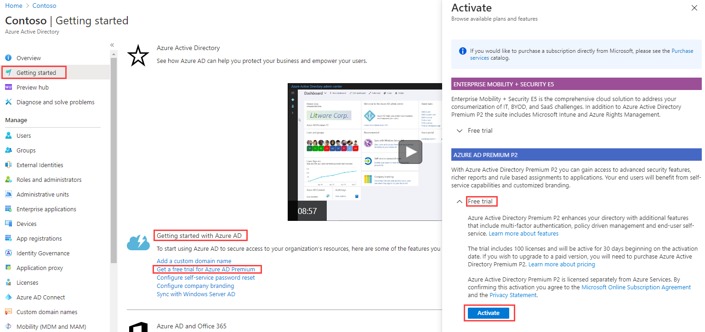

- 10 minutes

The exercises in this learning path require an Azure subscription. The exercises are optional and are not required to complete this module. Participating in the interactive exercises in this module will result in charges billed to the Azure subscription you use to complete them. Incurred charges can be minimized by cleaning up the resources you create as soon as possible.

You will need a valid credit card to create your Azure free account. This card is used for identity validation only. Your card will not be charged until you choose to upgrade.

## Sign up for a free account

A catalog is a container of resources and access packages. You create a catalog when you want to group related resources and access packages. Whoever creates the catalog becomes the first catalog owner. A catalog owner can add additional catalog owners.

1. In a web browser, go to [https://azure.microsoft.com/free](https://azure.microsoft.com/free).

1. Scroll down through the page to learn more about the benefits and free services available.

1. Select **Start free**.

1. Sign in with your Microsoft or GitHub account or create a free Microsoft account.

1. On the About you page, select your correct country or region. Enter your first and last name, email address, and phone number. Depending on your country, you might see additional fields, such as a VAT number. Select **Next** to continue.

1. On the Identity verification by phone screen, select your country code, and type the number of a telephone to which you have immediate access.

1. You have the option of text or callback to obtain a verification code. Select the relevant button, type the code in the Verification code box, and select **Verify code**.

1. If the verification code is correct, you are asked to enter details of a valid credit card. Enter the card information and select **Next**.

1. The last step is to review the agreement and privacy statement then select **Sign up**.

1. Congratulations! You have successfully set up a free account and should be on the Azure portal home page.

## Get a free trial for Azure AD Premium

You will need to an Azure AD P2 license to complete some of the exercises in this module. Use the following instructions to add a free Azure AD Premium P2 license.

1. In the organization you created, search for and then select **Azure Active Directory**.

1. In the left navigation menu, select **Getting started**.

1. Under Getting started with Azure AD, select **Get a free trial for Azure AD Premium**.

1. In the Activate pane, under AZURE AD PREMIUM P2, select **Free trial** and then select **Activate**.

1. In the navigation menu on the left, select **Overview**.

1. Refresh the browser until you see Azure AD Premium P2 under the organization name. It may take a couple of minutes.

1. You may need to sign out and sign back in to Microsoft Azure if you encounter any problems with expected features not being available.

