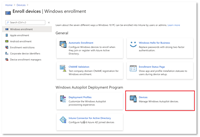

(from https://docs.microsoft.com/en-us/azure/active-directory/devices/overview)

With the proliferation of devices of all shapes and sizes and the Bring Your Own Device (BYOD) concept, IT professionals are faced with two somewhat opposing goals:

- Allow end users to be productive wherever and whenever

- Protect the organization's assets

To protect these assets, IT staff need to first manage the device identities. IT staff can build on the device identity with tools like Microsoft Intune to ensure standards for security and compliance are met. Azure Active Directory (Azure AD) enables single sign-on to devices, apps, and services from anywhere through these devices.

- Your users get access to your organization's assets they need.

- Your IT staff get the controls they need to secure your organization.

## Azure AD registered devices

The goal of Azure AD registered devices is to provide your users with support for the Bring Your Own Device (BYOD) or mobile device scenarios. In these scenarios, a user can access your organization’s Azure Active Directory controlled resources using a personal device.

| **Azure AD Registered**| **Description**|
| :--- | :--- |
| Definition| Registered to Azure AD without requiring organizational account to sign in to the device|
| Primary audience| Applicable to all users with the following criteria:

- Bring your own device (BYOD)

- Mobile devices|
| Device ownership| User or Organization|
| Operating systems| Windows 10, iOS, Android, and MacOS|
| Provisioning| Windows 10 – Settings

iOS/Android – Company Portal or Microsoft Authenticator app

MacOS – Company Portal|
| Device sign in options| End-user local credentials

Password

Windows Hello

PIN

Biometrics or Pattern for other devices|
| Device management| Mobile Device Management (example: Microsoft Intune)

Mobile Application Management|
| Key capabilities| SSO to cloud resources

Conditional Access when enrolled into Intune

Conditional Access via App protection policy

Enables Phone sign in with Microsoft Authenticator app|

Azure AD registered devices are signed in to using a local account like a Microsoft account on a Windows 10 device, but additionally have an Azure AD account attached for access to organizational resources. Access to resources in the organization can be further limited based on that Azure AD account and Conditional Access policies applied to the device identity.

Administrators can secure and further control these Azure AD registered devices using Mobile Device Management (MDM) tools like Microsoft Intune. MDM provides a means to enforce organization-required configurations like requiring storage to be encrypted, password complexity, and security software kept updated.

Azure AD registration can be accomplished when accessing a work application for the first time or manually using the Windows 10 Settings menu.

### Scenarios

A user in your organization wants to access tools for email, reporting time-off, and benefits enrollment from their home PC. Your organization has these tools behind a Conditional Access policy that requires access from an Intune compliant device. The user adds their organization account and registers their home PC with Azure AD and the required Intune policies are enforced giving the user access to their resources.

Another user wants to access their organizational email on their personal Android phone that has been rooted. Your company requires a compliant device and has created an Intune compliance policy to block any rooted devices. The employee is stopped from accessing organizational resources on this device.

## Azure AD joined devices

Azure AD join is intended for organizations that want to be cloud-first or cloud-only. Any organization can deploy Azure AD joined devices no matter the size or industry. Azure AD join works even in a hybrid environment, enabling access to both cloud and on-premises apps and resources.

| **Azure AD Registered**| **Description**|
| :--- | :--- |
| Definition| Joined only to Azure AD requiring organizational account to sign in to the device|
| Primary audience| Suitable for both cloud-only and hybrid organizations.

Applicable to all users in an organization|
| Device ownership| Organization|
| Operating systems| All Windows 10 devices except Windows 10 Home

Windows Server 2019 Virtual Machines running in Azure (Server core is not supported)|
| Provisioning| Self-service: Windows OOBE or Settings

Bulk enrollment

Windows Autopilot|
| Device sign in options| Organizational accounts using:

- Password

- Windows Hello for Business

- FIDO2.0 security keys (preview)|
| Device management| Mobile Device Management (example: Microsoft Intune)

Co-management with Microsoft Intune and Microsoft Endpoint Configuration Manager|
| Key capabilities| SSO to both cloud and on-premises resources

Conditional Access through MDM enrollment and MDM compliance evaluation

Self-service Password Reset and Windows Hello PIN reset on lock screen

Enterprise State Roaming across devices|

Azure AD joined devices are signed in to using an organizational Azure AD account. Access to resources in the organization can be further limited based on that Azure AD account and Conditional Access policies applied to the device identity.

Administrators can secure and further control Azure AD joined devices using Mobile Device Management (MDM) tools like Microsoft Intune or in co-management scenarios using Microsoft Endpoint Configuration Manager. These tools provide a means to enforce organization-required configurations like requiring storage to be encrypted, password complexity, software installations, and software updates. Administrators can make organization applications available to Azure AD joined devices using Configuration Manager.

Azure AD join can be accomplished using self-service options like the Out of Box Experience (OOBE), bulk enrollment, or Windows Autopilot.

Azure AD joined devices can still maintain single sign-on access to on-premises resources when they are on the organization's network. Devices that are Azure AD joined can still authenticate to on-premises servers like file, print, and other applications.

### Scenarios

While Azure AD join is primarily intended for organizations that do not have an on-premises Windows Server Active Directory infrastructure, you can certainly use it in scenarios where:

- You want to transition to cloud-based infrastructure using Azure AD and MDM like Intune.

- You can’t use an on-premises domain join, for example, if you need to get mobile devices such as tablets and phones under control.

- Your users primarily need to access Microsoft 365 or other SaaS apps integrated with Azure AD.

- You want to manage a group of users in Azure AD instead of in Active Directory. This scenario can apply, for example, to seasonal workers, contractors, or students.

- You want to provide joining capabilities to workers in remote branch offices with limited on-premises infrastructure.

You can configure Azure AD joined devices for all Windows 10 devices with the exception of Windows 10 Home.

The goal of Azure AD joined devices is to simplify:

- Windows deployments of work-owned devices

- Access to organizational apps and resources from any Windows device

- Cloud-based management of work-owned devices

- Users to sign in to their devices with their Azure AD or synced Active Directory work or school accounts.

Azure AD Join can be deployed by using any of the following methods, which are described in greater detail in the following subsections:

- Windows Autopilot

- Bulk deployment

- Self-service experience

### Windows Autopilot registration overview

Before deploying a device using Windows Autopilot, the device must be registered with the Windows Autopilot deployment service.

Successful registration requires that two processes are complete:

1. The device's unique hardware identity (known as a hardware hash) is captured and uploaded to the Autopilot service.

1. The device is associated to an Azure tenant ID.

Ideally, both of these processes are performed by the OEM, reseller, or distributor from which the devices were purchased. An OEM or other device provider uses the registration authorization process to perform device registration on your behalf.

Registration can also be performed within your organization by collecting the hardware identity from new or existing devices and uploading it manually. If devices meet certain requirements, they can also be configured for automatic registration with Windows Autopilot. For more information about the ways in which devices can be registered with Windows Autopilot, see the following overview topics:

- [OEM registration](https://docs.microsoft.com/en-us/mem/autopilot/oem-registration)

- [Reseller, distributor, or partner registration](https://docs.microsoft.com/en-us/mem/autopilot/partner-registration)

- [Automatic registration](https://docs.microsoft.com/en-us/mem/autopilot/automatic-registration)

- [Manual registration](https://docs.microsoft.com/en-us/mem/autopilot/manual-registration)

### Terms

The following terms are used to refer to various steps in the registration process:

| **Term**| **Definition**|
| :--- | :--- |
| device registration| Device registration happens when a device's hardware hash is associated with the Windows Autopilot service. This process can be automated for new enterprise devices manufactured by OEMs that are Windows Autopilot partners.|
| add devices| Adding a device is the process of registering a device with the Windows Autopilot service, (if it is not already registered) **and associating it to a tenant ID**.|
| import devices| Importing devices is the process of uploading a comma-separated-values (CSV) file that contains device information such as the model and serial number in order to manually add devices.|
| enroll devices| Enrolling a device is the process of adding devices to Intune.|

### Device identification

To identify a device with Windows Autopilot, the device's unique hardware hash must be captured and uploaded to the service. As previously mentioned, this step is ideally done by the hardware vendor (OEM, reseller, or distributor) automatically associating the device with an organization. It's also possible to do identify a device with a [harvesting process](https://docs.microsoft.com/en-us/mem/autopilot/add-devices) that collects the device's hardware hash from within a running Windows 10 installation.

The hardware hash contains details about the device, such as:

- manufacturer

- model

- device serial number

- hard drive serial number

- details about when the ID was generated

- many other attributes that can be used to uniquely identify the device

The hardware hash changes each time it's generated because it includes details about when it was generated. When the Windows Autopilot deployment service attempts to match a device, it considers changes like that. It also considers large changes such as a new hard drive, and is still able to match successfully. But large changes to the hardware, such as a motherboard replacement, wouldn't match, so a new hash would need to be generated and uploaded.

For more information about device IDs, see the following topics:

- [Windows Autopilot device guidelines](https://docs.microsoft.com/en-us/mem/autopilot/autopilot-device-guidelines)

- [Add devices to a customer account](https://docs.microsoft.com/en-us/partner-center/autopilot)

### Windows Autopilot devices

Devices that have been registered with the Windows Autopilot service are displayed in the [admin center](https://go.microsoft.com/fwlink/?linkid=2109431) under **Devices | Windows enrollment** > **Windows Autopilot Deployment Program** > **Devices**:

> [!NOTE]
> Note
> Devices that are listed in Intune under Devices > Windows | Windows devices are not the same as Windows Autopilot devices (Devices > Enroll devices | Windows enrollment > Windows Autopilot Deployment Program | Devices). Windows Autopilot devices are added to the list of Windows devices when both of the following are complete:
>
>- The Autopilot registration process is successful.
>- A licensed user has signed in on the device.
>

