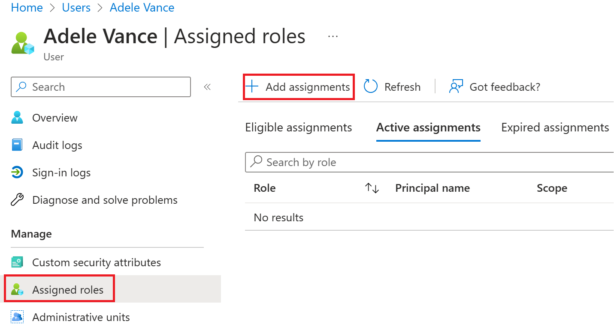
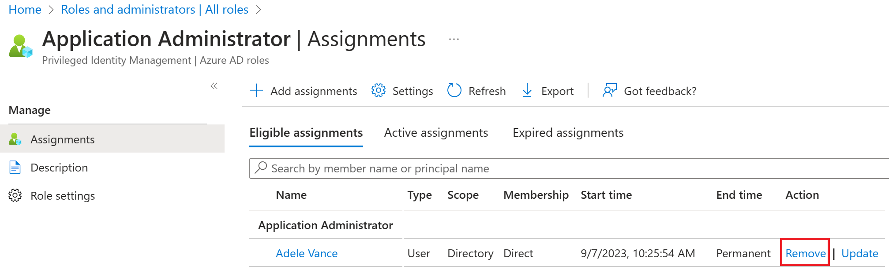

- 10 minutes

You need to assign additional permissions to one of your newly created administrators.

In this exercise, you will create a user account to use in the exercises.

## Add a new user

Now, let's create a user account.

1. Sign in to the [Azure portal](https://portal.azure.com/) as a Global administrator

1. Search for and then select **Azure Active Directory**.

1. In the left navigation menu, under **Manage**, select **Users > New User**.

1. Create a user using the following information:

| **Setting**| **Value**|
| :--- | :--- |
| User name| Chris|
| Name| Chris Green|
| First name| Chris|
| Last name| Green|
| Password| Pass@word1|

1. Select **Create**. The user is now created and registered to your organization.

## Assign a role to a user

Using Azure Active Directory (Azure AD), you can designate limited administrators to manage identity tasks in less-privileged roles. Administrators can be assigned for such purposes as adding or changing users, assigning administrative roles, resetting user passwords, managing user licenses, and managing domain names.

1. In Azure Active Directory, All users blade, select **Chris Green**.

1. On the **user’s profile** page, select **Assigned roles**. The **Assigned roles** page appears.

1. Select **Add assignments**, select the role to assign to the user (for example, *Application administrator*), and then select **Add**.

The newly assigned Application administrator role appears on the user’s **Assigned roles** page.

## Remove a role assignment

If you need to remove the role assignment from a user, you can also do that from the **Assigned roles** page.

### To remove a role assignment from a user

1. In **Azure Active Directory**, select **Users**, and then select the user getting the role assignment removed. For example, *Chris Green*.

1. Select **Assigned roles**, select the name of the role your wish to removed.

1. Select the check box for the user who will be removed from the role, and then select **Remove assignments**.

The Application administrator role is removed from the user and it no longer appears on the **Alain Charon – Assigned roles** page.

