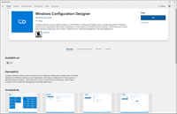
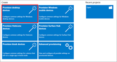
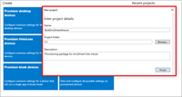
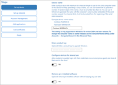
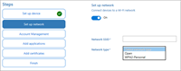
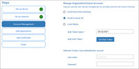
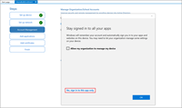
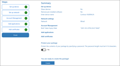
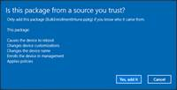

As an administrator, you can join large numbers of new Windows devices to Azure Active Directory and Intune. To bulk enroll devices for your Azure AD tenant, you create a provisioning package with the Windows Configuration Designer (WCD) app. Applying the provisioning package to corporate-owned devices joins the devices to your Azure AD tenant and enrolls them for Intune management. Once the package is applied, it's ready for your Azure AD users to sign in.

Azure AD users are standard users on these devices and receive assigned Intune policies and required apps. Windows devices that are enrolled into Intune using Windows bulk enrollment can use the Company Portal app to install available apps.

### Prerequisites for Windows devices bulk enrollment

- Devices running Windows 10 Creator update (build 1709) or later

- [Windows automatic enrollment](https://docs.microsoft.com/en-us/mem/intune/enrollment/windows-enroll)

### Create a provisioning package

1. Download Windows Configuration Designer (WCD) from the Microsoft Store.

1. Open the **Windows Configuration Designer** app and select **Provision desktop devices**.

1. A **New project** window opens where you specify the following information:

- **Name** - A name for your project

- **Project folder** - Save location for the project

- **Description** - An optional description of the project

1. Enter a unique name for your devices. Names can include a serial number (%SERIAL%) or a random set of characters. Optionally, you can also enter a product key if you are upgrading the edition of Windows, configure the device for shared use, and remove pre-installed software.

1. Optionally, you can configure the Wi-Fi network devices connect to when they first start. If the network devices aren't configured, a wired network connection is required when the device is first started.

1. Select **Enroll in Azure AD**, enter a **Bulk Token Expiry** date, and then select **Get Bulk Token**.

1. Provide your Azure AD credentials to get a bulk token.

1. In the **Stay signed in to all your apps** page, select **No, sign in to this app only**.

1. Click **Next** when **Bulk Token** is fetched successfully.

1. Optionally, you can **Add applications** and **Add certificates**. These apps and certificates are provisioned on the device.

1. Optionally, you can password protect your provisioning package. Click **Create**.

### Provision devices

1. Access the provisioning package in the location specified in **Project folder** specified in the app.

1. Choose how you're going to apply the provisioning package to the device. A provisioning package can be applied to a device one of the following ways:

- Place the provisioning package on a USB drive, insert the USB drive into the device you'd like to bulk enroll, and apply it during initial setup

- Place the provisioning package on a network folder, and apply it after initial setup

For step-by-step instruction on applying a provisioning package, see [Apply a provisioning package](https://docs.microsoft.com/en-us/windows/configuration/provisioning-packages/provisioning-apply-package).

1. After you apply the package, the device will automatically restart in one minute.

1. When the device restarts, it connects to the Azure Active Directory and enrolls in Microsoft Intune.

### Self-service experience

(from https://docs.microsoft.com/en-us/azure/active-directory/devices/azuread-joined-devices-frx)

With Windows 10, it's possible for users to join a new device to Azure AD during the first-run experience (FRX), sometimes referred to as self-service experience. This capability enables you to distribute shrink-wrapped devices to your employees or students.

If either Windows 10 Professional or Windows 10 Enterprise is installed on a device, the experience defaults to the setup process for company-owned devices.

In the Windows out-of-box experience, joining an on-premises Active Directory (AD) domain is not supported. If you plan to allow users to join a computer to an AD domain, during setup, they should select the link Set up Windows with a local account. They can then join the domain from the settings on their computer.

### Prerequisites

To join a Windows 10 device, the device registration service must be configured to enable you to register devices. In addition to having permission to joining devices in your Azure AD tenant, you must have fewer devices registered than the configured maximum.

In addition, if your tenant is federated, your Identity provider MUST support WS-Fed and WS-Trust username/password endpoint. This can be version 1.3 or 2005. This protocol support is required to both join the device to Azure AD and sign in to the device with a password.

### Joining a Windows 10 device to Azure AD during FRX

1. When you turn on your new device and start the setup process, you should see the **Getting Ready** message. Follow the prompts to set up your device.

1. Start by customizing your region and language. Then accept the Microsoft Software License Terms.

1. Select the network you want to use for connecting to the Internet.

1. Click **This device belongs to my organization**.

1. Enter the credentials that were provided to you by your organization, and then click **Sign in**.

1. Your device locates a matching tenant in Azure AD. If you are in a federated domain, you are redirected to your on-premises Secure Token Service (STS) server, for example, Active Directory Federation Services (AD FS).

1. If you are a user in a non-federated domain, enter your credentials directly on the Azure AD-hosted page.

1. You are prompted for a multi-factor authentication challenge.

1. Azure AD checks whether an enrollment in mobile device management is required.

1. Windows registers the device in the organization’s directory in Azure AD and enrolls it in mobile device management, if applicable.

1. If you are:

- A managed user, Windows takes you to the desktop through the automatic sign-in process.

- A federated user, you are directed to the Windows sign-in screen to enter your credentials.

### Verification

To verify whether a device is joined to your Azure AD, review the **Access work or school** dialog on your Windows device. The dialog should indicate that you are connected to your Azure AD directory.

## Hybrid Azure AD joined devices

For more than a decade, many organizations have used the domain join to their on-premises Active Directory to enable:

- IT departments to manage work-owned devices from a central location.

- Users to sign in to their devices with their Active Directory work or school accounts.

Typically, organizations with an on-premises footprint rely on imaging methods to provision devices, and they often use **Configuration Manager** or **group policy (GP)** to manage them.

If your environment has an on-premises AD footprint and you also want benefit from the capabilities provided by Azure Active Directory, you can implement hybrid Azure AD joined devices. These devices are devices that are joined to your on-premises Active Directory and registered with your Azure Active Directory.

| **Azure AD Registered**| **Description**|
| :--- | :--- |
| Definition| Joined to on-premises AD and Azure AD requiring organizational account to sign in to the device|
| Primary audience| Suitable for hybrid organizations with existing on-premises AD infrastructure

Applicable to all users in an organization|
| Device ownership| Organization|
| Operating systems| Windows 10, 8.1 and 7

Windows Server 2008/R2, 2012/R2, 2016 and 2019|
| Provisioning| Windows 10, Windows Server 2016/2019

Domain join by IT and autojoin via Azure AD Connect or ADFS config

Domain join by Windows Autopilot and autojoin via Azure AD Connect or ADFS config

Windows 8.1, Windows 7, Windows Server 2012 R2, Windows Server 2012, and Windows Server 2008 R2 - Require MSI|
| Device sign in options| Organizational accounts using:

- Password

- Windows Hello for Business for Win10|
| Device management| Group Policy

Configuration Manager standalone or co-management with Microsoft Intune|
| Key capabilities| SSO to both cloud and on-premises resources

Conditional Access through Domain join or through Intune if co-managed

Self-service Password Reset and Windows Hello PIN reset on lock screen

Enterprise State Roaming across devices|

### Scenarios

Use Azure AD hybrid joined devices if:

- You have Win32 apps deployed to these devices that rely on Active Directory machine authentication.

- You want to continue to use Group Policy to manage device configuration.

- You want to continue to use existing imaging solutions to deploy and configure devices.

- You must support down-level Windows 7 and 8.1 devices in addition to Windows 10.

