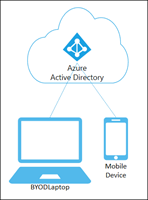
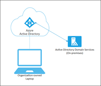
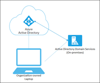

With the proliferation of devices of all shapes and sizes and the bring your own device (BYOD) concept, IT professionals are faced with two somewhat opposing goals:

- Allow end users to be productive wherever and whenever

- Protect the organization's assets

To protect assets, IT staff need to first manage the device identities. IT staff can build on the device identity with tools like Microsoft Intune to ensure standards for security and compliance are met. Azure Active Directory (Azure AD) enables single sign-on to devices, apps, and services from anywhere through these devices.

- Your users get access to your organization's assets they need.

- Your IT staff get the controls they need to secure your organization.

## Azure AD registered devices

The goal of Azure AD registered devices is to provide your users with support for the BYOD or mobile device scenarios. In these scenarios, a user can access your organization’s Azure Active Directory controlled resources using a personal device.

| **Azure AD registered**| **Description**|
| :--- | :--- |
| Definition| Registered to Azure AD without requiring organizational account to sign in to the device|
| Primary audience| <ul><li>Applicable to all users with the following criteria:</li> <li>--Bring your own device (BYOD)</li> <li>--Mobile devices</li></ul>|
| Device ownership| User or Organization|
| Operating systems| Windows 10, iOS, Android, and MacOS|
| Provisioning| <ul><li>Windows 10 – Settings</li> <li>iOS/Android – Company Portal or Microsoft Authenticator app</li> <li>MacOS – Company Portal</li></ul>|
| Device sign in options| <ul><li>End-user local credentials</li> <li>Password</li> <li>Windows Hello</li> <li>PIN</li> <li>Biometrics or Pattern for other devices</li></ul>|
| Device management| <ul><li>Mobile Device Management (example: Microsoft Intune)</li> <li>Mobile Application Management</li></ul>|
| Key capabilities| <ul><li>SSO to cloud resources</li> <li>Conditional Access when enrolled into Intune</li> <li>Conditional Access via App protection policy</li> <li>Enables Phone sign in with Microsoft Authenticator app</li></ul>|

Azure AD registered devices are signed in to using a local account like a Microsoft account on a Windows 10 device, but additionally have an Azure AD account attached for access to organizational resources. Access to resources in the organization can be further limited based on that Azure AD account and Conditional Access policies applied to the device identity.

Administrators can secure and further control these Azure AD registered devices using Mobile Device Management (MDM) tools like Microsoft Intune. MDM provides a means to enforce organization-required configurations like requiring storage to be encrypted, password complexity, and security software kept updated.

Azure AD registration can be accomplished when accessing a work application for the first time or manually using the Windows 10 Settings menu.

### Scenarios

A user in your organization wants to access tools for email, reporting time-off, and benefits enrollment from their home PC. Your organization has these tools behind a Conditional Access policy that requires access from an Intune compliant device. The user adds their organization account and registers their home PC with Azure AD and the required Intune policies are enforced giving the user access to their resources.

Another user wants to access their organizational email on their personal Android phone that has been rooted. Your company requires a compliant device and has created an Intune compliance policy to block any rooted devices. The employee is stopped from accessing organizational resources on this device.

## Azure AD joined devices

Azure AD join is intended for organizations that want to be cloud-first or cloud-only. Any organization can deploy Azure AD joined devices no matter the size or industry. Azure AD join works even in a environment, enabling access to both cloud and on-premises apps and resources.

| **Azure AD joined**| **Description**|
| :--- | :--- |
| Definition| Joined only to Azure AD requiring organizational account to sign in to the device|
| Primary audience| <ul><li>Suitable for both cloud-only and hybrid organizations</li> <li>Applicable to all users in an organization</li></ul>|
| Device ownership| Organization|
| Operating systems| <ul><li>All Windows 10 devices except Windows 10 Home</li> <li>Windows Server 2019 Virtual Machines running in Azure (Server core is not supported)</li></ul>|
| Provisioning| <ul><li>Self-service: Windows OOBE or Settings</li> <li>Bulk enrollment</li> <li>Windows Autopilot</li></ul>|
| Device sign in options| <ul><li>Organizational accounts using:</li> <li>--Password</li> <li>--Windows Hello for Business</li> <li>--FIDO2.0 security keys (preview)</li></ul>|
| Device management| <ul><li>Mobile Device Management (example: Microsoft Intune)</li> <li>Co-management with Microsoft Intune and Microsoft Endpoint Configuration Manager</li></ul>|
| Key capabilities| <ul><li>SSO to both cloud and on-premises resources</li> <li>Conditional Access through MDM enrollment and MDM compliance evaluation</li> <li>Self-service Password Reset and Windows Hello PIN reset on lock screen</li> <li>Enterprise State Roaming across devices</li></ul>|

Azure AD joined devices are signed in to using an organizational Azure AD account. Access to resources in the organization can be further limited based on that Azure AD account and Conditional Access policies applied to the device identity.

Administrators can secure and further control Azure AD joined devices using Mobile Device Management (MDM) tools like Microsoft Intune or in co-management scenarios using Microsoft Endpoint Configuration Manager. These tools provide a means to enforce organization-required configurations like requiring storage to be encrypted, password complexity, software installations, and software updates. Administrators can make organization applications available to Azure AD joined devices using Configuration Manager.

Azure AD join can be accomplished using self-service options like the Out of Box Experience (OOBE), bulk enrollment, or Windows Autopilot.

Azure AD joined devices can still maintain single sign-on access to on-premises resources when they are on the organization's network. Devices that are Azure AD joined can still authenticate to on-premises servers like file, print, and other applications.

### Scenarios

Although Azure AD join is primarily intended for organizations that do not have an on-premises Windows Server Active Directory infrastructure, you can certainly use it in scenarios where:

- You want to transition to cloud-based infrastructure using Azure AD and MDM like Intune.

- You can’t use an on-premises domain join, for example, if you need to get mobile devices such as tablets and phones under control.

- Your users primarily need to access Microsoft 365 or other SaaS apps integrated with Azure AD.

- You want to manage a group of users in Azure AD instead of in Active Directory. This scenario can apply, for example, to seasonal workers, contractors, or students.

- You want to provide joining capabilities to workers in remote branch offices with limited on-premises infrastructure.

You can configure Azure AD joined devices for all Windows 10 devices with the exception of Windows 10 Home.

The goal of Azure AD joined devices is to simplify:

- Windows deployments of work-owned devices

- Access to organizational apps and resources from any Windows device

- Cloud-based management of work-owned devices

- Users to sign in to their devices with their Azure AD or synced Active Directory work or school accounts.

Azure AD Join can be deployed by using a number of different methods. The following  subsection focuses on the self-service experience method.

### Self-service experience

With Windows 10, it's possible for users to join a new device to Azure AD during the first-run experience (FRX), sometimes referred to as self-service experience. This capability enables you to distribute shrink-wrapped devices to your employees or students.

If either Windows 10 Professional or Windows 10 Enterprise is installed on a device, the experience defaults to the setup process for company-owned devices.

In the Windows out-of-box experience, joining an on-premises Active Directory (AD) domain is not supported. If you plan to allow users to join a computer to an AD domain, during setup, they should select the link Set up Windows with a local account. They can then join the domain from the settings on their computer.

### Prerequisites

To join a Windows 10 device, the device registration service must be configured to enable you to register devices. In addition to having permission to joining devices in your Azure AD tenant, you must have fewer devices registered than the configured maximum.

In addition, if your tenant is federated, your Identity provider MUST support WS-Fed and WS-Trust username/password endpoint. This can be version 1.3 or 2005. This protocol support is required to both join the device to Azure AD and sign in to the device with a password.

### Joining a Windows 10 device to Azure AD during FRX

1. When you turn on your new device and start the setup process, you should see the **Getting Ready** message. Follow the prompts to set up your device.

1. Start by customizing your region and language. Then review and accept the Microsoft Software License Terms.

1. Select the network you want to use for connecting to the Internet.

1. Click **This device belongs to my organization**.

1. Enter the credentials that were provided to you by your organization, and then click **Sign in**.

1. Your device locates a matching tenant in Azure AD. If you are in a federated domain, you are redirected to your on-premises Secure Token Service (STS) server, for example, Active Directory Federation Services (AD FS).

1. If you are a user in a non-federated domain, enter your credentials directly on the Azure AD-hosted page.

1. You are prompted for a multi-factor authentication challenge.

1. Azure AD checks whether an enrollment in mobile device management is required.

1. Windows registers the device in the organization’s directory in Azure AD and enrolls it in mobile device management, if applicable.

1. If you are:

- A managed user, Windows takes you to the desktop through the automatic sign-in process.

- A federated user, you are directed to the Windows sign-in screen to enter your credentials.

### Verification

To verify whether a device is joined to your Azure AD, review the **Access work or school** dialog on your Windows device. The dialog should indicate that you are connected to your Azure AD directory.

## Hybrid Azure AD joined devices

For more than a decade, many organizations have used the domain join to their on-premises Active Directory to enable:

- IT departments to manage work-owned devices from a central location.

- Users to sign in to their devices with their Active Directory work or school accounts.

Typically, organizations with an on-premises footprint rely on imaging methods to provision devices, and they often use **Configuration Manager** or **group policy (GP)** to manage them.

If your environment has an on-premises AD footprint and you also want benefit from the capabilities provided by Azure Active Directory, you can implement hybrid Azure AD joined devices. These devices are devices that are joined to your on-premises Active Directory and registered with your Azure Active Directory.

| **Hybrid Azure AD joined**| **Description**|
| :--- | :--- |
| Definition| Joined to on-premises AD and Azure AD requiring organizational account to sign in to the device|
| Primary audience| <ul><li>Suitable for hybrid organizations with existing on-premises AD infrastructure</li> <li>Applicable to all users in an organization</li></ul>|
| Device ownership| Organization|
| Operating systems| <ul><li>Windows 10, 8.1 and 7</li> <li>Windows Server 2008/R2, 2012/R2, 2016 and 2019</li></ul>|
| Provisioning| <ul><li>Windows 10, Windows Server 2016/2019</li> <li>Domain join by IT and autojoin via Azure AD Connect or ADFS config</li> <li>Domain join by Windows Autopilot and autojoin via Azure AD Connect or ADFS config</li> <li>Windows 8.1, Windows 7, Windows Server 2012 R2, Windows Server 2012, and Windows Server 2008 R2 - Require MSI</li></ul>|
| Device sign in options| <ul><li>Organizational accounts using:</li> <li>--Password</li> <li>--Windows Hello for Business for Win10</li></ul>|
| Device management| <ul><li>Group Policy</li> <li>Configuration Manager standalone or co-management with Microsoft Intune</li></ul>|
| Key capabilities| <ul><li>SSO to both cloud and on-premises resources</li> <li>Conditional Access through Domain join or through Intune if co-managed</li> <li>Self-service Password Reset and Windows Hello PIN reset on lock screen</li> <li>Enterprise State Roaming across devices</li></ul>|

### Scenarios

Use Azure AD hybrid joined devices if:

- You have Win32 apps deployed to these devices that rely on Active Directory machine authentication.

- You want to continue to use Group Policy to manage device configuration.

- You want to continue to use existing imaging solutions to deploy and configure devices.

- You must support down-level Windows 7 and 8.1 devices in addition to Windows 10.

