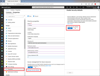
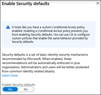
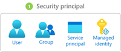
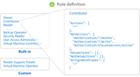
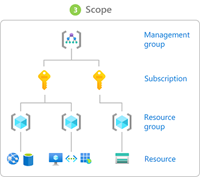
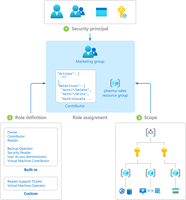
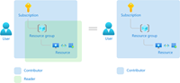

(from https://docs.microsoft.com/en-us/azure/active-directory/fundamentals/active-directory-whatis?context=azure/active-directory/users-groups-roles/context/ugr-context)

(The following material is from https://docs.microsoft.com/en-us/azure/active-directory/fundamentals/users-default-permissions)

## User settings

In Azure Active Directory (Azure AD), all users are granted a set of default permissions. A user’s access consists of the type of user, their role assignments, and their ownership of individual objects. The default user permissions can be changed only in user settings in Azure AD.

### Member and guest users

The set of default permissions received depends on whether the user is a native member of the tenant (member user) or if the user is brought over from another directory as a B2B collaboration guest (guest user).

- Member users can register applications, manage their own profile photo and mobile phone number, change their own password, and invite B2B guests. In addition, users can read all directory information (with a few exceptions).

- Guest users have restricted directory permissions. They can manage their own profile, change their own password, and retrieve some information about other users, groups, and apps; however, they cannot read all directory information. For example, guest users cannot enumerate the list of all users, groups, and other directory objects. Guests can be added to administrator roles, which grant them full read and write permissions contained in the role. Guests can also invite other guests.

The following default permissions for member users can be restricted in the following ways:

| **Permission**| **Setting explanation**|
| :--- | :--- |
| Users can register application| By default, member users can register applications.

Setting this option to No prevents users from creating application registrations. The ability can then be granted back to specific individuals by adding them to the Application Developer role.|
| Restrict access to Azure AD administration portal| Setting this option to No lets non-administrators use the Azure AD administration portal to read and manage Azure AD resources. Yes restricts all non-administrators from accessing any Azure AD data in the administration portal.

**Note**: this setting does not restrict access to Azure AD data using PowerShell or other clients such as Visual Studio. When set to Yes, to grant a specific non-admin user the ability to use the Azure AD administration portal assign any administrative role such as the Directory Readers role.

This role allows reading basic directory information, which member users have by default (guests and service principals do not).|

### Sign in with LinkedIn

(from https://docs.microsoft.com/en-us/linkedin/consumer/integrations/self-serve/sign-in-with-linkedin)

With more than 500 million members worldwide, LinkedIn is the largest and most trusted source of professional identities. Leverage this power to enhance the sign-in experience of your sites and applications.

Use sign in with LinkedIn to:

- Reduce friction and obtain more sign-ups by allowing members to Sign In with LinkedIn, without having the need to create a new account.

- Minimize the costs and time associated with implementing your own login, identity, profile management, and password management.

- Personalize your sites and applications with the latest member profiles.

### Authenticating members

New members logging in to your service for the first time will need to follow the [Authenticating with OAuth 2.0 Guide](https://docs.microsoft.com/en-us/linkedin/shared/authentication/authentication?context=linkedin/consumer/context). When requesting an authorization code in Step 2 of the OAuth 2.0 Guide, make sure to request the `r_liteprofile `and/or `r_emailaddress `scopes!

| **Permission name**| **Description**|
| :--- | :--- |
| r_liteprofile| Required to retrieve the member's lite profile including their id, name, and profile picture.|
| r_emailaddress| Required to retrieve the member's email address.|

After successful authentication, you will acquire an access token that can be used in the next step of the sign-in process.

### Retrieving member profiles

With your newly acquired access token for the authenticated member, you can using the following API request to retrieve the member's profile information.

**API request**

GET https://api.linkedin.com/v2/me

**Response body schema**

| **Field name**| **Description**| **Format**|
| :--- | :--- | :--- |
| ID| The member's unique identifier| Person URN|
| firstName| Member's first name| Text|
| lastName| Member's last name| Text|
| profilePicture| Member's profile picture URL| Text|

**Sample API response**

{

   "id":"REDACTED",

   "firstName":{

      "localized":{

         "en_US":"Tina"

      },

      "preferredLocale":{

         "country":"US",

         "language":"en"

      }

   },

   "lastName":{

      "localized":{

         "en_US":"Belcher"

      },

      "preferredLocale":{

         "country":"US",

         "language":"en"

      }

   },

    "profilePicture": {

        "displayImage": "urn:li:digitalmediaAsset:B54328XZFfe2134zTyq"

    }

}

With the member's profile information successfully retrieved, the sign-in process is now complete and your user can continue to enjoy their personalized experience with your site or application.

### Retrieving member profile picture

In order to retrieve the member's profile picture, you will need to use decoration. Use the API request below to retrieve the member's id, first name, last name, and profile picture.

GET https://api.linkedin.com/v2/me?projection=(id,firstName,lastName,profilePicture(displayImage~:playableStreams))

### Retrieving member email address

In addition to the member's profile, you may be interested in retrieving the member's email address. The r_emailaddress permission scope allows usage of the following API:

**API request**

GET https://api.linkedin.com/v2/emailAddress?q=members&projection=(elements*(handle~))

**Response body schema**

| **Field name**| **Description**| **Format**|
| :--- | :--- | :--- |
| handle| The URN representation of a member's handle.| Email address URN|

**Sample API response**

{

    "handle": "urn:li:emailAddress:3775708763",

    "handle~": {

        "emailAddress": "hsimpson@linkedin.com"

    }

}

### Manage user feature previews

### Manage (enable/disable) security defaults

(from https://docs.microsoft.com/en-us/azure/active-directory/fundamentals/concept-fundamentals-security-defaults)

Managing security can be difficult with common identity-related attacks like password spray, replay, and phishing becoming more and more popular. Security defaults make it easier to help protect your organization from these attacks with preconfigured security settings:

- Requiring all users to register for Azure AD Multi-Factor Authentication.

- Requiring administrators to perform multi-factor authentication.

- Blocking legacy authentication protocols.

- Requiring users to perform multi-factor authentication when necessary.

- Protecting privileged activities like access to the Azure portal.

### Availability

Microsoft is making security defaults available to everyone. The goal is to ensure that all organizations have a basic level of security enabled at no extra cost. You turn on security defaults in the Azure portal. If your tenant was created on or after October 22, 2019, it is possible security defaults are already enabled in your tenant. In an effort to protect all of our users, security defaults is being rolled out to all new tenants created.

### Who's it for?

- If you are an organization that wants to increase your security posture but you don't know how or where to start, security defaults are for you.

- If you are an organization utilizing the free tier of Azure Active Directory licensing, security defaults are for you.

### Who should use Conditional Access?

- If you are an organization currently using Conditional Access policies to bring signals together, to make decisions, and enforce organizational policies, security defaults are probably not right for you.

- If you are an organization with Azure Active Directory Premium licenses, security defaults are probably not right for you.

- If your organization has complex security requirements you should consider Conditional Access.

## Policies enforced

### Unified multi-factor authentication registration

All users in your tenant must register for multi-factor authentication (MFA) in the form of the Azure AD Multi-Factor Authentication. Users have 14 days to register for Azure AD Multi-Factor Authentication by using the Microsoft Authenticator app. After the 14 days have passed, the user won't be able to sign in until registration is completed. A user's 14-day period begins after their first successful interactive sign-in after enabling security defaults.

### Protecting administrators

Users with privileged access have increased access to your environment. Due to the power these accounts have, you should treat them with special care. One common method to improve the protection of privileged accounts is to require a stronger form of account verification for sign-in. In Azure AD, you can get a stronger account verification by requiring multi-factor authentication.

After registration with Azure AD Multi-Factor Authentication is finished, the following nine Azure AD administrator roles will be required to perform additional authentication every time they sign in:

- Global administrator

- SharePoint administrator

- Exchange administrator

- Conditional Access administrator

- Security administrator

- Helpdesk administrator

- Billing administrator

- User administrator

- Authentication administrator

### Protecting all users

We tend to think that administrator accounts are the only accounts that need extra layers of authentication. Administrators have broad access to sensitive information and can make changes to subscription-wide settings. But attackers frequently target end users.

After these attackers gain access, they can request access to privileged information on behalf of the original account holder. They can even download the entire directory to perform a phishing attack on your whole organization.

One common method to improve protection for all users is to require a stronger form of account verification, such as Multi-Factor Authentication, for everyone. After users complete Multi-Factor Authentication registration, they'll be prompted for additional authentication whenever necessary. This functionality protects all applications registered with Azure AD including SaaS applications.

### Blocking legacy authentication

To give your users easy access to your cloud apps, Azure AD supports a variety of authentication protocols, including legacy authentication. *Legacy authentication* is a term that refers to an authentication request made by:

- Clients that don't use modern authentication (for example, an Office 2010 client).

- Any client that uses older mail protocols such as IMAP, SMTP, or POP3.

Today, the majority of compromising sign-in attempts come from legacy authentication. Legacy authentication does not support Multi-Factor Authentication. Even if you have a Multi-Factor Authentication policy enabled on your directory, an attacker can authenticate by using an older protocol and bypass Multi-Factor Authentication.

After security defaults are enabled in your tenant, all authentication requests made by an older protocol will be blocked. Security defaults blocks Exchange Active Sync basic authentication.

> [!WARNING]
> Warning
> Before you enable security defaults, make sure your administrators aren't using older authentication protocols.
### Protecting privileged actions

Organizations use a variety of Azure services managed through the Azure Resource Manager API, including:

- Azure portal

- Azure PowerShell

- Azure CLI

Using Azure Resource Manager to manage your services is a highly privileged action. Azure Resource Manager can alter tenant-wide configurations, such as service settings and subscription billing. Single-factor authentication is vulnerable to a variety of attacks like phishing and password spray.

It's important to verify the identity of users who want to access Azure Resource Manager and update configurations. You verify their identity by requiring additional authentication before you allow access.

After you enable security defaults in your tenant, any user who's accessing the Azure portal, Azure PowerShell, or the Azure CLI will need to complete additional authentication. This policy applies to all users who are accessing Azure Resource Manager, whether they're an administrator or a user.

> [!NOTE]
> Note
Pre-2017 Exchange Online tenants have modern authentication disabled by default. In order to avoid the possibility of a login loop while authenticating through these tenants, you must [enable modern authentication](https://docs.microsoft.com/en-us/exchange/clients-and-mobile-in-exchange-online/enable-or-disable-modern-authentication-in-exchange-online).

> [!NOTE]
> Note
> The Azure AD Connect synchronization account is excluded from security defaults and will not be prompted to register for or perform multi-factor authentication. Organizations should not be using this account for other purposes.
### Deployment considerations

The following additional considerations are related to deployment of security defaults.

### Authentication methods

These free security defaults allow registration and use of Azure AD Multi-Factor Authentication **using only the Microsoft Authenticator app using notifications**. Conditional Access allows the use of any authentication method the administrator chooses to enable.

| **Method**| **Security defaults**| **Conditional Access**|
| :--- | :--- | :--- |
| Notification through mobile app| X| X|
| Verification code from mobile app or hardware token| X**| X|
| Text message to phone|| X|
| Call to phone|| X|
| App passwords|| X***|

** Users may use verification codes from the Microsoft Authenticator app but can only register using the notification option.

*** App passwords are only available in per-user MFA with legacy authentication scenarios only if enabled by administrators.

### Disabled MFA status

If your organization is a previous user of per-user based Azure AD Multi-Factor Authentication, do not be alarmed to not see users in an **Enabled** or **Enforced** status if you look at the Multi-Factor Auth status page. **Disabled** is the appropriate status for users who are using security defaults or Conditional Access based Azure AD Multi-Factor Authentication.

### Conditional Access

You can use Conditional Access to configure policies similar to security defaults, but with more granularity including user exclusions, which are not available in security defaults. If you're using Conditional Access and have Conditional Access policies enabled in your environment, security defaults won't be available to you. If you have a license that provides Conditional Access but don't have any Conditional Access policies enabled in your environment, you are welcome to use security defaults until you enable Conditional Access policies.

### Access management for Azure resources

(from https://docs.microsoft.com/en-us/azure/role-based-access-control/overview)

Access management for cloud resources is a critical function for any organization that is using the cloud. Azure role-based access control (Azure RBAC) helps you manage who has access to Azure resources, what they can do with those resources, and what areas they have access to.

Azure RBAC is an authorization system built on Azure Resource Manager that provides fine-grained access management of Azure resources.

### What can I do with Azure RBAC?

Here are some examples of what you can do with Azure RBAC:

- Allow one user to manage virtual machines in a subscription and another user to manage virtual networks

- Allow a DBA group to manage SQL databases in a subscription

- Allow a user to manage all resources in a resource group, such as virtual machines, websites, and subnets

- Allow an application to access all resources in a resource group

### How Azure RBAC works

The way you control access to resources using Azure RBAC is to create role assignments. This is a key concept to understand – it's how permissions are enforced. A role assignment consists of three elements: security principal, role definition, and scope.

### Security principal

A *security principal* is an object that represents a user, group, service principal, or managed identity that is requesting access to Azure resources. You can assign a role to any of these security principals.

### Role definition

A *role definition* is a collection of permissions. It's typically just called a *role*. A role definition lists the operations that can be performed, such as read, write, and delete. Roles can be high-level, like owner, or specific, like virtual machine reader.

Azure includes several built-in roles that you can use. For example, the Virtual Machine Contributor role allows a user to create and manage virtual machines. If the built-in roles don't meet the specific needs of your organization, you can create your own Azure custom roles.

Azure has data operations that enable you to grant access to data within an object. For example, if a user has read data access to a storage account, then they can read the blobs or messages within that storage account.

### Scope

*Scope* is the set of resources that the access applies to. When you assign a role, you can further limit the actions allowed by defining a scope. This is helpful if you want to make someone a Website Contributor, but only for one resource group.

In Azure, you can specify a scope at four levels: management group, subscription, resource group, or resource. Scopes are structured in a parent-child relationship. You can assign roles at any of these levels of scope.

### Role assignments

A *role assignment* is the process of attaching a role definition to a user, group, service principal, or managed identity at a particular scope for the purpose of granting access. Access is granted by creating a role assignment, and access is revoked by removing a role assignment.

The following diagram shows an example of a role assignment. In this example, the Marketing group has been assigned the Contributor role for the pharma-sales resource group. This means that users in the Marketing group can create or manage any Azure resource in the pharma-sales resource group. Marketing users do not have access to resources outside the pharma-sales resource group, unless they are part of another role assignment.

You can create role assignments using the Azure portal, Azure CLI, Azure PowerShell, Azure SDKs, or REST APIs.

### Multiple role assignments

So what happens if you have multiple overlapping role assignments? Azure RBAC is an additive model, so your effective permissions are the sum of your role assignments. Consider the following example where a user is granted the Contributor role at the subscription scope and the Reader role on a resource group. The sum of the Contributor permissions and the Reader permissions is effectively the Contributor role for the resource group. Therefore, in this case, the Reader role assignment has no impact.

## Deny assignments

Previously, Azure RBAC was an allow-only model with no deny, but now Azure RBAC supports deny assignments in a limited way. Similar to a role assignment, a *deny assignment* attaches a set of deny actions to a user, group, service principal, or managed identity at a particular scope for the purpose of denying access. A role assignment defines a set of actions that are *allowed*, while a deny assignment defines a set of actions that are *not allowed*. In other words, deny assignments block users from performing specified actions even if a role assignment grants them access. Deny assignments take precedence over role assignments.

## How Azure RBAC determines if a user has access to a resource

The following are the high-level steps that Azure RBAC uses to determine if you have access to a resource on the management plane. This is helpful to understand if you are trying to troubleshoot an access issue.

1. A user (or service principal) acquires a token for Azure Resource Manager.

The token includes the user's group memberships (including transitive group memberships).

1. The user makes a REST API call to Azure Resource Manager with the token attached.

1. Azure Resource Manager retrieves all the role assignments and deny assignments that apply to the resource upon which the action is being taken.

1. Azure Resource Manager narrows the role assignments that apply to this user or their group and determines what roles the user has for this resource.

1. Azure Resource Manager determines if the action in the API call is included in the roles the user has for this resource.

1. If the user doesn't have a role with the action at the requested scope, access is not granted. Otherwise, Azure Resource Manager checks if a deny assignment applies.

1. If a deny assignment applies, access is blocked. Otherwise access is granted.

### License requirements

Using this feature is free and included in your Azure subscription.

