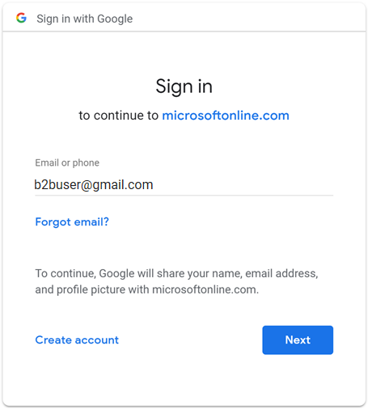
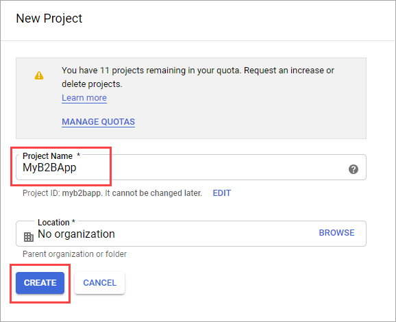
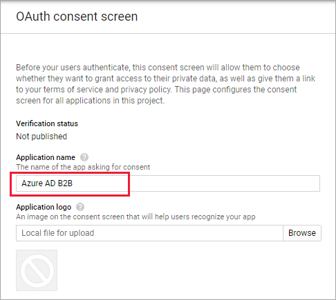
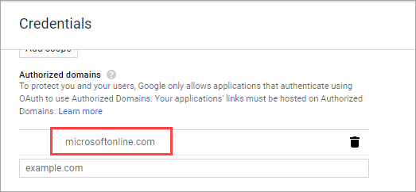
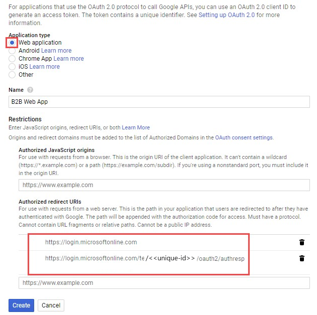
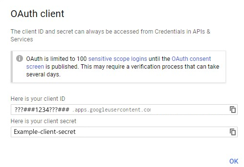
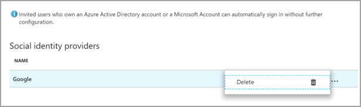
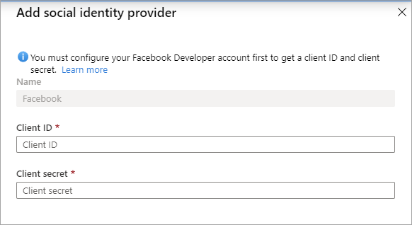

You can set up direct federation with any organization whose identity provider (IdP) supports the Security Assertion Markup Language (SAML) 2.0 or WS-Federation (WS-Fed) protocol. When you set up direct federation with a partner's IdP, new guest users from that domain can use their own IdP-managed organizational account to sign in to your Azure Active Directory (Azure AD) tenant and start collaborating with you. There's no need for the guest user to create a separate Azure AD account.

> [!NOTE]
> Direct federation guest users must sign in using a link that includes the tenant context (for example, https<nolink>://myapps.microsoft.com/?tenantid=<tenant id> or https<nolink>://portal.azure.com/<tenant id>, or in the case of a verified domain, https<nolink>://myapps.microsoft.com/\<verified domain>.onmicrosoft.com). Direct links to applications and resources also work as long as they include the tenant context. Direct federation users are currently unable to sign in using common endpoints that have no tenant context. For example, using https<nolink>://myapps.microsoft.com, https<nolink>://portal.azure.com, or https<nolink>://teams.microsoft.com will result in an error.

## When is a guest user authenticated with direct federation?

After you set up direct federation with an organization, any new guest users you invite will be authenticated using direct federation. Note that setting up direct federation doesn’t change the authentication method for guest users who have already redeemed an invitation from you. Here are some examples:

- If guest users have already redeemed invitations from you, and you subsequently set up direct federation with their organization, those guest users will continue to use the same authentication method they used before you set up direct federation.

- If you set up direct federation with a partner organization and invite guest users, and then the partner organization later moves to Azure AD, the guest users who have already redeemed invitations will continue to use direct federation, as long as the direct federation policy in your tenant exists.

- If you delete direct federation with a partner organization, any guest users currently using direct federation will be unable to sign in.

In any of these scenarios, you can update a guest user’s authentication method by deleting the guest user account from your directory and reinviting them.

Direct federation is tied to domain namespaces, such as contoso.com and fabrikam.com. When establishing a direct federation configuration with AD FS or a third-party IdP, organizations associate one or more domain namespaces to these IdPs.

## End-user experience

With direct federation, guest users sign into your Azure AD tenant using their own organizational account. When they are accessing shared resources and are prompted for sign-in, direct federation users are redirected to their IdP. After successful sign-in, they are returned to Azure AD to access resources. Direct federation users’ refresh tokens are valid for 12 hours, the default length for passthrough refresh token in Azure AD. If the federated IdP has SSO enabled, the user will experience SSO and will not see any sign-in prompt after initial authentication.

## Limitations

Direct federation limitations include those described in the following table.

| **Limitation**| **Description**|
| :--- | :--- |
| DNS-verified domains in Azure AD| The domain you want to federate with must **not** be DNS-verified in Azure AD. You're allowed to set up direct federation with unmanaged (email-verified or "viral") Azure AD tenants because they aren't DNS-verified.|
| Authentication URL| <ul><li>Direct federation is only allowed for policies where the authentication URL’s domain matches the target domain, or where the authentication URL is a specified allowed identity provider. Current providers include:</li><ul> <li><nolink>accounts.google.com</li> <li><nolink>pingidentity.com</li> <li><nolink>okta.com</li> <li><nolink>federation.exostar.com</li> <li>(This list is subject to change.)</li></ul> <li>For example, when setting up direct federation for **<nolink>fabrikam.com**, the authentication URL https<nolink>://fabrikam.com/adfs will pass the validation. A host in the same domain will also pass, for example https<nolink>://sts.fabrikam.com/adfs. However, the authentication URL https<nolink>://fabrikamconglomerate.com/adfs or https<nolink>://fabrikam.com.uk/adfs for the same domain won't pass.</li></ul>|
| Signing certificate renewal| If you specify the metadata URL in the identity provider settings, Azure AD will automatically renew the signing certificate when it expires. However, if the certificate is rotated for any reason before the expiration time, or if you don't provide a metadata URL, Azure AD will be unable to renew it. In this case, you'll need to update the signing certificate manually.|
| Limit on federation relationships| Currently, a maximum of 1,000 federation relationships is supported. This limit includes both internal federations and direct federations.|
| Limit on multiple domains| Microsoft doesn’t currently support direct federation with multiple domains from the same tenant.|

## Security Assertion Markup Language 2.0 configuration

Azure AD B2B can be configured to federate with identity providers that use the SAML protocol with specific requirements listed below.

> [!NOTE]
> The target domain for direct federation must not be DNS-verified on Azure AD. The authentication URL domain must match the target domain or it must be the domain of an allowed identity provider. 

### Required Security Assertion Markup Language 2.0 attributes and claims

The following tables show requirements for specific attributes and claims that must be configured at the third-party identity provider. To set up direct federation, the following attributes must be received in the SAML 2.0 response from the identity provider. These attributes can be configured by linking to the online security token service XML file or by entering them manually.

Required attributes for the SAML 2.0 response from the IdP:

| **Attribute**| **Value**|
| :--- | :--- |
| AssertionConsumerService| https<nolink>://login.microsoftonline.com/login.srf|
| Audience| urn:federation:MicrosoftOnline|
| Issuer| The issuer URI of the partner IdP, for example http<nolink>://www.example.com/exk10l6w90DHM0yi...|

Required claims for the SAML 2.0 token issued by the IdP:

| **Attribute**| **Value**|
| :--- | :--- |
| NameID Format| urn:oasis:names:tc:SAML:2.0:nameid-format:persistent|
| emailaddress| http<nolink>://schemas.xmlsoap.org/ws/2005/05/identity/claims/emailaddress|

## WS-Federation configuration

Azure AD B2B can be configured to federate with identity providers that use the WS-Fed protocol with some specific requirements as listed below. Currently, the two WS-Fed providers have been tested for compatibility with Azure AD include AD FS and Shibboleth.

The target domain for direct federation must not be DNS-verified on Azure AD. The authentication URL domain must match either the target domain or the domain of an allowed identity provider.

### Required WS-Federation attributes and claims

The following tables show requirements for specific attributes and claims that must be configured at the third-party WS-Fed identity provider. To set up direct federation, the following attributes must be received in the WS-Fed message from the identity provider. These attributes can be configured by linking to the online security token service XML file or by entering them manually.

Required attributes in the WS-Fed message from the IdP:

| **Attribute**| **Value**|
| :--- | :--- |
| PassiveRequestorEndpoint| https<nolink>://login.microsoftonline.com/login.srf|
| Audience| urn:federation:MicrosoftOnline|
| Issuer| The issuer URI of the partner IdP, for example http<nolink>://www.example.com/exk10l6w90DHM0yi...|

Required claims for the WS-Fed token issued by the IdP:

| **Attribute**| **Value**|
| :--- | :--- |
| ImmutableID| http<nolink>://schemas.microsoft.com/LiveID/Federation/2008/05/ImmutableID|
| emailaddress| http<nolink>://schemas.xmlsoap.org/ws/2005/05/identity/claims/emailaddress|

## Add Google as an identity provider for B2B guest users

By setting up federation with Google, you can allow invited users to sign in to your shared apps and resources with their own Gmail accounts, without having to create Microsoft accounts.

> [!NOTE]
> Google federation is designed specifically for Gmail users. To federate with G Suite domains, use [direct federation](https://docs.microsoft.com/azure/active-directory/external-identities/direct-federation).

## What is the experience for the Google user?

When you send an invitation to Google Gmail users, the guest users should access your shared apps or resources by using a link that includes the tenant context. Their experience varies depending on whether they're already signed in to Google:

- Guest users who aren't signed in to Google will be prompted to do so.

- Guest users who are already signed in to Google will be prompted to choose the account they want to use. They must choose the account you used to invite them.

Guest users who see a "header too long" error can clear their cookies or open a private or incognito window and try to sign in again.

> [!div class="mx-imgBorder"]
> 

## Deprecation of WebView sign-in support

Starting January 4, 2021, Google is deprecating embedded WebView sign-in support. If you’re using Google federation or self-service sign-up with Gmail, you should test your line-of-business native applications for compatibility. If your apps include WebView content that requires authentication, Google Gmail users won't be able to authenticate. The following are known scenarios that will impact Gmail users:

- Windows apps that use embedded WebView or the WebAccountManager (WAM) on older versions of Windows.

- Other native apps you’ve developed that use an embedded browser framework for authentication.

This change does not affect:

- Windows apps that use embedded WebView or the WebAccountManager (WAM) on the latest versions of Windows

- Microsoft iOS apps

- G Suite identities, for example when you’re using SAML-based direct federation with G Suite

We’re continuing to test various platforms and scenarios, and will update published information accordingly.

### To test your apps for compatibility

1. Follow [Google’s guidance](https://developers.googleblog.com/2020/08/guidance-for-our-effort-to-block-less-secure-browser-and-apps.html) to determine if your apps are affected.

1. Using Fiddler or another testing tool, inject a header during sign-in and use a Google external identity to test sign-in:

   1. Add Google-Accounts-Check-OAuth-Login:true to your HTTP request headers when the requests are sent to accounts.google.com.

   1. Attempt to sign in to the app by entering a Gmail address in the accounts.google.com sign-in page.

   1. If sign-in fails and you see an error such as “This browser or app may not be secure,” your Google external identities will be blocked from signing in.

1. Resolve the issue by doing one of the following:

   - If your Windows app uses embedded WebView or the WebAccountManager (WAM) on an older version of Windows, update to the latest version of Windows.

   - Modify your apps to use the system browser for sign-in. For details, see [Embedded vs System Web UI](https://docs.microsoft.com/azure/active-directory/develop/msal-net-web-browsers) in the MSAL.NET documentation.

## Sign-in endpoints

Teams fully supports Google guest users on all devices. Google users can sign in to Teams from a common endpoint like `https<nolink>://teams.microsoft.com`.

Other applications' common endpoints might not support Google users. Google guest users must sign in by using a link that includes your tenant information. Following are examples:

- https<nolink>://myapps.microsoft.com/?tenantid=<your tenant ID>

- https<nolink>://portal.azure.com/<your tenant ID>

- https<nolink>://myapps.microsoft.com/<your verified domain>.onmicrosoft.com

If Google guest users try to use a link like `https<nolink>://myapps.microsoft.com `or `https<nolink>://portal.azure.com`, they'll get an error.

You can also give Google guest users a direct link to an application or resource, as long as the link includes your tenant information. For example, `https<nolink>://myapps.microsoft.com/signin/Twitter/<application ID?tenantId=<your tenant ID`>.

### Step 1: Configure a Google developer project

First, create a new project in the Google Developers Console to obtain a client ID and a client secret that you can later add to Azure Active Directory (Azure AD).

1. Go to the Google APIs at [https://console.developers.google.com](https://console.developers.google.com/), and sign in with your Google account. We recommend that you use a shared team Google account.

2. Accept the terms of service if you're prompted to do so.

3. Create a new project: On the dashboard, select **Create Project**, give the project a name (for example, **Azure AD B2B**), and then select **Create**:

   > [!div class="mx-imgBorder"]
   > 

4. On the **APIs & Services** page, select **View** under your new project.

5. Select **Go to APIs overview** on the APIs card. Select **OAuth consent screen**.

6. Select **External**, and then select **Create**.

7. On the **OAuth consent screen**, enter an **Application name**:

   > [!div class="mx-imgBorder"]
   > 

8. Scroll to the **Authorized domains** section and enter **microsoftonline.com**:

   > [!div class="mx-imgBorder"]
   > 

9. Select **Save**.

10. Select **Credentials**. On the **Create credentials** menu, select **OAuth client ID**:

      > [!div class="mx-imgBorder"]
      > 

11. Under **Application type**, select **Web application**. Give the application a suitable name, like **Azure AD B2B**. Under **Authorized redirect URIs**, enter the following URIs:

      - https<nolink>://login.microsoftonline.com

      - `https<nolink>://login.microsoftonline.com/te/<tenant ID>/oauth2/authresp`(where `<tenant ID> `is your tenant ID)

      > [!NOTE]
      > To find your tenant ID, go to the [Azure portal](https://portal.azure.com/). Under Azure Active Directory, select Properties and copy the Tenant ID.

      > [!div class="mx-imgBorder"]
      > 

12. Select **Create**. Copy the client ID and client secret. You'll use them when you add the identity provider in the Azure portal.

      > [!div class="mx-imgBorder"]
      > 

## Step 2: Configure Google federation in Azure AD

You'll now set the Google client ID and client secret. You can use the Azure portal or PowerShell to do so. Be sure to test your Google federation configuration by inviting yourself. Use a Gmail address and try to redeem the invitation with your invited Google account.

**To configure Google federation in the Azure portal**

1. Go to the [Azure portal](https://portal.azure.com/). On the left pane, select **Azure Active Directory**.

1. Select **External Identities**.

1. Select **All identity providers**, and then select the **Google** button.

1. Enter the client ID and client secret you obtained earlier. Select **Save**:

   > [!div class="mx-imgBorder"]
   > 

## How do I remove Google federation?

You can delete your Google federation setup. If you do so, Google guest users who have already redeemed their invitation won't be able to sign in. But you can give them access to your resources again by deleting them from the directory and reinviting them.

**To delete Google federation in the Azure AD portal**

1. Go to the [Azure portal](https://portal.azure.com/). On the left pane, select **Azure Active Directory**.

2. Select **External Identities**.

3. Select **All identity providers**.

4. On the **Google** line, select the ellipsis button (**...**) and then select **Delete**.

   > [!div class="mx-imgBorder"]
   > 

5. Select **Yes** to confirm the deletion.

## Add Facebook as an identity provider for external identities

You can add Facebook to your self-service sign-up user flows (Preview) so that users can sign in to your applications using their own Facebook accounts. To allow users to sign in using Facebook, you'll first need to enable self-service sign-up for your tenant. After you add Facebook as an identity provider, set up a user flow for the application and select Facebook as one of the sign-in options.

> [!NOTE]
> Users can only use their Facebook accounts to sign up through apps using self-service sign-up and user flows. Users cannot be invited and redeem their invitation using a Facebook account.

## Create an app in the Facebook developers console

To use a Facebook account as an identity provider, you need to create an application in the Facebook developers console. If you don't already have a Facebook account, you can sign up at [https://www.facebook.com/](https://www.facebook.com/).

> [!NOTE]
> Use the following URLs in the steps 9 and 16 below.

- For **Site URL** enter the address of your application, such as `https<nolink>://contoso.com`.

- For **Valid OAuth redirect URIs**, enter `https<nolink>://login.microsoftonline.com/te/<tenant-id>/oauth2/authresp`. You can find your `<tenant-ID> `in the Azure Active Directory Overview blade.

1. Sign in to [Facebook for developers](https://developers.facebook.com/) with your Facebook account credentials.

2. If you have not already done so, you need to register as a Facebook developer. To do this, select **Get Started** on the upper-right corner of the page, accept Facebook's policies, and complete the registration steps.

3. Select **My Apps** and then **Create App**.

4. Enter a **Display Name** and a valid **Contact Email**.

5. Select **Create App ID**. This may require you to accept Facebook platform policies and complete an online security check.

6. Select **Settings** > **Basic**.

7. Choose a **Category**, for example Business and Pages. This value is required by Facebook, but not used for Azure AD.

8. At the bottom of the page, select **Add Platform**, and then select **Website**.

9. In **Site URL**, enter the appropriate URL (noted above).

10. In **Privacy Policy URL**, enter the URL for the page where you maintain privacy information for your application, for example `http<nolink>://www.contoso.com`.

11. Select **Save Changes**.

12. At the top of the page, copy the value of **App ID**.

13. Select **Show** and copy the value of **App Secret**. You use both of them to configure Facebook as an identity provider in your tenant. **App Secret** is an essential security credential.

14. Select the plus sign next to **PRODUCTS**, and then select **Set up** under **Facebook Login**.

15. Under **Facebook Login**, select **Settings**.

16. In **Valid OAuth redirect URIs**, enter the appropriate URL (noted above).

17. Select **Save Changes** at the bottom of the page.

18. To make your Facebook application available to Azure AD, select the Status selector at the top right of the page and turn it **On** to make the Application public, and then select **Switch Mode**. At this point the Status should change from **Development** to **Live**.

## Configure a Facebook account as an identity provider

Now you'll set the Facebook client ID and client secret, either by entering it in the Azure AD portal or by using PowerShell. You can test your Facebook configuration by signing up via a user flow on an app enabled for self-service sign-up.

### To configure Facebook federation in the Azure AD portal

1. Sign in to the [Azure portal](https://portal.azure.com/) as the global administrator of your Azure AD tenant.

2. Under **Azure services**, select **Azure Active Directory**.

3. In the left menu, select **External Identities**.

4. Select **All identity providers**, then select **Facebook**.

5. For the **Client ID**, enter the **App ID** of the Facebook application that you created earlier.

6. For the **Client secret**, enter the **App Secret** that you recorded.

   > [!div class="mx-imgBorder"]
   > 

7. Select **Save**.

## How do I remove Facebook federation?

You can delete your Facebook federation setup. If you do so, any users who have signed up through user flows with their Facebook accounts will no longer be able to log in.

### To delete Facebook federation in the Azure AD portal:

1. Go to the [Azure portal](https://portal.azure.com/). In the left pane, select **Azure Active Directory**.

1. Select **External Identities**.

1. Select **All identity providers**.

1. On the **Facebook** line, select the context menu (**...**) and then select **Delete**.

1. Select **Yes** to confirm deletion.

