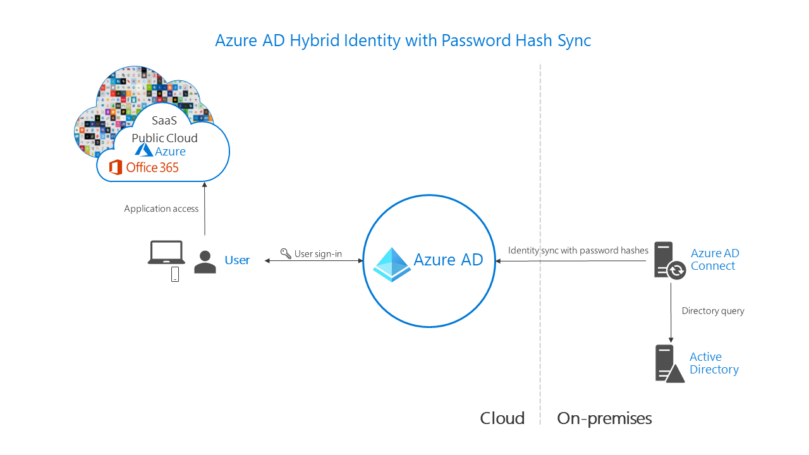
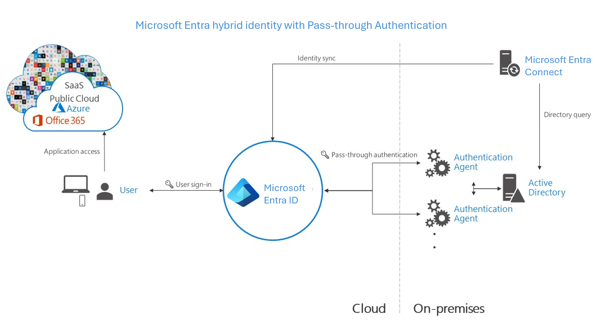
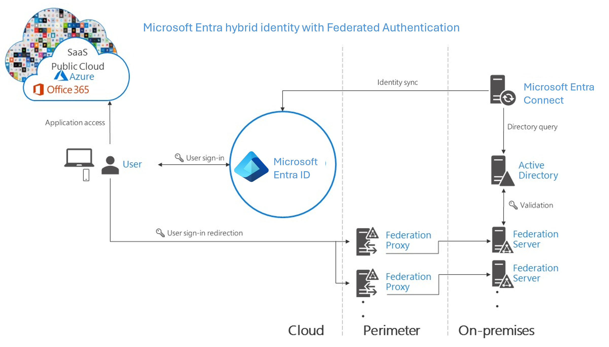
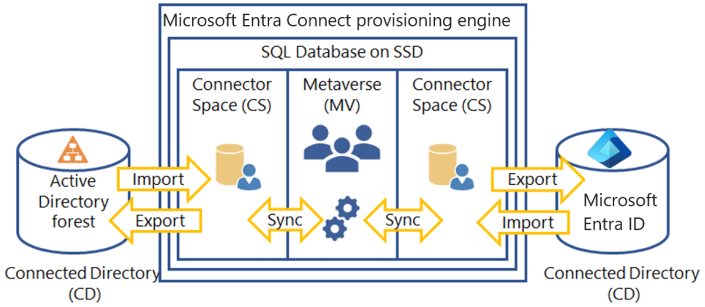

Azure AD Connect is a solution that bridges an organizations on-premises Active Directory with your cloud-based Azure Active Directory. This allows IT to identities from on-premises into Azure ensure a consistent identity across both platforms. This connection enables services like password hash synchronization, pass-through authentication, and seamless single sign-on.

Azure AD Connect is the Microsoft tool designed to meet and accomplish your hybrid identity goals. It provides the following capabilities:

- Synchronization - Responsible for creating users, groups, and other objects. As well as, making sure identity information for your on-premises users and groups is matching the cloud. This synchronization also includes password hashes.

- Password hash synchronization - A sign-in method that synchronizes a hash of a user's on-premises AD password with Azure AD.

- Pass-through authentication - A sign-in method that allows users to use the same password on-premises and in the cloud, but doesn't require the additional infrastructure of a federated environment.

- Federation integration - Federation is an optional part of Azure AD Connect and can be used to configure a hybrid environment using an on-premises AD FS infrastructure. It also provides AD FS management capabilities such as certificate renewal and additional AD FS server deployments.

- Health monitoring - Azure AD Connect Health provides robust monitoring.

    > [!div class="mx-imgBorder"]
    > 

## Why use Azure AD Connect?

Integrating your on-premises directories with Azure AD makes your users more productive by providing a common identity for accessing both cloud and on-premises resources. With Azure AD Connect, users can use a single identity to access on-premises applications and cloud services such as Microsoft 365. Additionally, organizations can provide an easy deployment experience for synchronization and sign-in using a single tool. Azure AD Connect replaces older versions of identity integration tools such as DirSync and Azure AD Sync; and is included in your Azure AD subscription.

## Select an authentication method

Identity is the new control plane of IT security, so authentication is an organization’s access guard to the new cloud world. Organizations need an identity control plane that strengthens their security and keeps their cloud apps safe from intruders. When the Azure AD hybrid identity solution is your new control plane, authentication is the foundation of cloud access. Choosing the correct authentication method is a crucial first decision in setting up an Azure AD hybrid identity solution. To choose an authentication method, you need to consider the time, existing infrastructure, complexity, and cost of implementing your choice. These factors are different for every organization and might change over time.

### Cloud authentication

When you choose this authentication method, Azure AD handles users' sign-in process. Coupled with seamless single sign-on (SSO), users can sign into cloud apps without having to reenter their credentials. With cloud authentication, you can choose from two options:

**Azure AD password hash synchronization (PHS)**. The simplest way to enable authentication for on-premises directory objects in Azure AD. Users can use the same username and password that they use on-premises without having to deploy any additional infrastructure.

- **Effort**. Password hash synchronization requires the least effort regarding deployment, maintenance, and infrastructure. This level of effort typically applies to organizations that only need their users to sign in to Microsoft 365, SaaS apps, and other Azure AD-based resources. When turned on, password hash synchronization is part of the Azure AD Connect sync process and runs every two minutes.

- **User experience**. To improve users' sign-in experience, deploy seamless SSO with password hash synchronization. Seamless SSO eliminates unnecessary prompts when users are signed in.

- **Advanced scenarios**. If organizations choose to, it's possible to use insights from identities with Azure AD Identity Protection reports with Azure AD Premium P2. An example is the leaked credentials report. Windows Hello for Business has specific requirements when you use password hash synchronization. Azure AD Domain Services requires password hash synchronization to provision users with their corporate credentials in the managed domain.

- **Business continuity**. Using password hash synchronization with cloud authentication is highly available as a cloud service that scales to all Microsoft datacenters. To make sure password hash synchronization does not go down for extended periods, deploy a second Azure AD Connect server in staging mode in a standby configuration.

- **Considerations**. Currently, password hash synchronization doesn't immediately enforce changes in on-premises account states. In this situation, a user has access to cloud apps until the user account state is synchronized to Azure AD. Organizations might want to overcome this limitation by running a new synchronization cycle after administrators do bulk updates to on-premises user account states. An example is disabling accounts.

**Azure AD pass-through authentication (PTA)**. Provides a simple password validation for Azure AD authentication services by using a software agent that runs on one or more on-premises servers. The servers validate the users directly with your on-premises Active Directory, which ensures that the password validation doesn't happen in the cloud. Companies with a security requirement to immediately enforce on-premises user account states, password policies, and sign-in hours might use this authentication method.

- **Effort**. For pass-through authentication, you need one or more (we recommend three) lightweight agents installed on existing servers. These agents must have access to your on-premises Active Directory Domain Services, including your on-premises AD domain controllers. They need outbound access to the Internet and access to your domain controllers. For this reason, it's not supported to deploy the agents in a perimeter network.

- **User experience**. To improve users' sign-in experience, deploy seamless SSO with pass-through authentication. Seamless SSO eliminates unnecessary prompts after users sign in.

- **Advanced scenarios**. Pass-through authentication enforces the on-premises account policy at the time of sign-in. For example, access is denied when an on-premises user’s account state is disabled, locked out, or their password expires or the logon attempt falls outside the hours when the user is allowed to sign in.

- **Business continuity**. We recommend that you deploy two extra pass-through authentication agents. These extras are in addition to the first agent on the Azure AD Connect server. This additional deployment ensures high availability of authentication requests. When you have three agents deployed, one agent can still fail when another agent is down for maintenance.

- **Considerations**. You can use password hash synchronization as a backup authentication method for pass-through authentication when the agents can't validate a user's credentials due to a significant on-premises failure. Fail over to password hash synchronization doesn't happen automatically and you must use Azure AD Connect to switch the sign-on method manually.

### Federated authentication

When you choose this authentication method, Azure AD hands off the authentication process to a separate trusted authentication system, such as on-premises Active Directory Federation Services (AD FS), to validate the user’s password. The authentication system can provide additional advanced authentication requirements. Examples are smartcard-based authentication or third-party multifactor authentication.

- **Effort**. A federated authentication system relies on an external trusted system to authenticate users. Some companies want to reuse their existing federated system investment with their Azure AD hybrid identity solution. The maintenance and management of the federated system falls outside the control of Azure AD. It's up to the organization by using the federated system to make sure it's deployed securely and can handle the authentication load.

- **User experience**. The user experience of federated authentication depends on the implementation of the features, topology, and configuration of the federation farm. Some organizations need this flexibility to adapt and configure the access to the federation farm to suit their security requirements. For example, it's possible to configure internally connected users and devices to sign in users automatically, without prompting them for credentials. This configuration works because they already signed into their devices. If necessary, some advanced security features make users' sign-in process more difficult.

- **Advanced scenarios**. A federated authentication solution is required when customers have an authentication requirement that Azure AD doesn't support natively.

  - Authentication that requires smartcards or certificates.

  - On-premises MFA servers or third-party multifactor providers requiring a federated identity provider.

  - Authentication by using third-party authentication solutions.

  - Sign in that requires a sAMAccountName, for example DOMAIN\username, instead of a User Principal Name (UPN), for example, user@domain.com.

- **Business continuity**. Federated systems typically require a load-balanced array of servers, known as a farm. This farm is configured in an internal network and perimeter network topology to ensure high availability for authentication requests.

- **Considerations**. Federated systems typically require a more significant investment in on-premises infrastructure. Most organizations choose this option if they already have an on-premises federation investment. And if it's a strong business requirement to use a single-identity provider. Federation is more complex to operate and troubleshoot compared to cloud authentication solutions.

## Architecture diagrams

The following diagrams outline the high-level architecture components required for each authentication method you can use with your Azure AD hybrid identity solution. They provide an overview to help you compare the differences between the solutions.

- Simplicity of a password hash synchronization solution:

   > [!div class="mx-imgBorder"]
   > 

- Agent requirements of pass-through authentication, using two agents for redundancy:

   > [!div class="mx-imgBorder"]
   > 

- Components required for federation in your perimeter and internal network of your organization:

   > [!div class="mx-imgBorder"]
   > 

## Recommendations

Your identity system ensures your users' access to cloud apps and the line-of-business apps that you migrate and make available in the cloud. To keep authorized users productive and bad actors out of your organization’s sensitive data, authentication controls access to apps.

Use or enable password hash synchronization for whichever authentication method you choose, for the following reasons:

1. **High availability and disaster recovery**. Pass-through authentication and federation rely on on-premises infrastructure. For pass-through authentication, the on-premises footprint includes the server hardware and networking the pass-through authentication agents require. For federation, the on-premises footprint is even larger. It requires servers in your perimeter network to proxy authentication requests and the internal federation servers.

   To avoid single points of failure, deploy redundant servers. Then authentication requests will always be serviced if any component fails. Both pass-through authentication and federation also rely on domain controllers to respond to authentication requests, which can also fail. Many of these components need maintenance to stay healthy. Outages are more likely when maintenance isn't planned and implemented correctly. Avoid outages by using password hash synchronization because the Microsoft Azure AD cloud authentication service scales globally and is always available.

1. **On-premises outage survival**. The consequences of an on-premises outage due to a cyber-attack or disaster can be substantial, ranging from reputational brand damage to a paralyzed organization unable to deal with the attack. Recently, many organizations were victims of malware attacks, including targeted ransomware, which caused their on-premises servers to go down. When Microsoft helps customers deal with these kinds of attacks, it sees two categories of organizations:

   - Organizations that previously also turned on password hash synchronization on top of federated or pass-through authentication changed their primary authentication method to then use password hash synchronization. They were back online in a matter of hours. By using access to email via Microsoft 365, they worked to resolve issues and access other cloud-based workloads.

   - Organizations that didn’t previously enable password hash synchronization had to resort to untrusted external consumer email systems for communications to resolve issues. In those cases, it took them weeks to restore their on-premises identity infrastructure before users were able to sign in to cloud-based apps again.

1. **Identity protection**. One of the best ways to protect users in the cloud is Azure AD Identity Protection with Azure AD Premium P2. Microsoft continually scans the Internet for user and password lists that bad actors sell and make available on the dark web. Azure AD can use this information to verify if any of the usernames and passwords in your organization are compromised. Therefore, it's critical to enable password hash synchronization no matter which authentication method you use, whether it's federated or pass-through authentication. Leaked credentials are presented as a report. Use this information to block or force users to change their passwords when they try to sign in with leaked passwords.

## Azure AD Connect design concepts

This section describes areas that must be thought through during the implementation design of Azure AD Connect. It is a deep dive on certain areas and these concepts are briefly described in other documents as well.

## sourceAnchor

The sourceAnchor attribute is defined as *an attribute immutable during the lifetime of an object*. It uniquely identifies an object as being the same object on-premises and in Azure AD. The attribute is also called **immutableId** and the two names are used interchangeable. The attribute is used for the following scenarios:

- When a new sync engine server is built, or rebuilt after a disaster recovery scenario, this attribute links existing objects in Azure AD with objects on-premises.

- If you move from a cloud-only identity to a synchronized identity model, then this attribute allows objects to "hard match" existing objects in Azure AD with on-premises objects.

- If you use federation, then this attribute together with the **userPrincipalName** is used in the claim to uniquely identify a user.

The attribute value must follow the following rules:

- Fewer than 60 characters in length

  - Characters not being a-z, A-Z, or 0-9 are encoded and counted as 3 characters

- Not contain a special character: \ ! # $ % & * + / = ? ^ ` { } | ~ < > ( ) ' ; : , [ ] " @ _

- Must be globally unique

- Must be either a string, integer, or binary

- Should not be based on user's name because these can change

- Should not be case-sensitive and avoid values that may vary by case

- Should be assigned when the object is created

If you have a single forest on-premises, the attribute you should use is **objectGUID**. This is also the attribute used when you use express settings in Azure AD Connect and also the attribute used by DirSync. If you have multiple forests and do not move users between forests and domains, then **objectGUID** is a good attribute to use even in this case. Another solution is to pick an existing attribute you know does not change. Commonly used attributes include **employeeID**. If you consider an attribute that contains letters, make sure there is no chance the case (upper case vs. lower case) can change for the attribute's value. Bad attributes that should not be used include those attributes with the name of the user. Once the sourceAnchor attribute is decided, the wizard stores the information in your Azure AD tenant. The information will be used by future installation of Azure AD Connect.

## Azure AD sign-in

While integrating your on-premises directory with Azure AD, synchronization settings can affect the way user authenticates. Azure AD uses userPrincipalName (UPN) to authenticate the user. However, when you synchronize your users, you must choose the attribute to be used for value of userPrincipalName carefully. When you are selecting the attribute for providing the value of UPN to be used in Azure one should ensure

- The attribute values conform to the UPN syntax (RFC 822), that is it should be of the format username@domain

- The suffix in the values matches to one of the verified custom domains in Azure AD

In express settings, the assumed choice for the attribute is userPrincipalName. If the userPrincipalName attribute does not contain the value you want your users to sign in to Azure, then you must choose **Custom Installation**.

### Custom domain state and User Principal Name

Ensure that there is a verified domain for the User Principal Name (UPN) suffix. John is a user in contoso.com. You want John to use the on-premises UPN john@contoso.com to sign in to Azure after you have synced users to your Azure AD directory contoso.onmicrosoft.com. To do so, you need to add and verify contoso.com as a custom domain in Azure AD before you can start syncing the users. If the UPN suffix of John, for example contoso.com, does not match a verified domain in Azure AD, then Azure AD replaces the UPN suffix with contoso.onmicrosoft.com.

Some organizations have non-routable domains, like contoso.local, or simple single label domains like contoso. You are not able to verify a non-routable domain in Azure AD. Azure AD Connect can sync to only a verified domain in Azure AD. When you create an Azure AD directory, it creates a routable domain that becomes default domain for your Azure AD for example, contoso.onmicrosoft.com. Therefore, it becomes necessary to verify any other routable domain in such a scenario in case you don't want to sync to the default onmicrosoft.com domain.

Azure AD Connect detects if you are running in a non-routable domain environment and would appropriately warn you from going ahead with express settings. If you are operating in a non-routable domain, then it is likely that the UPN, of the users, have non-routable suffixes too. For example, if you are running under contoso.local, Azure AD Connect suggests you use custom settings rather than using express settings. Using custom settings, you are able to specify the attribute that should be used as UPN to sign in to Azure after the users are synced to Azure AD.

## Topologies for Azure AD Connect

This section describes various on-premises and Azure Active Directory (Azure AD) topologies that use Azure AD Connect sync as the key integration solution; it includes both supported and unsupported configurations.

| **Common topology**| **Description**|
| :--- | :--- |
| Single forest, single Azure AD tenant| The most common topology is a single on-premises forest, with one or multiple domains, and a single Azure AD tenant. For Azure AD authentication, password hash synchronization is used. The express installation of Azure AD Connect supports only this topology.|
| Multiple forests, single Azure AD tenant| Many organizations have environments with multiple on-premises Active Directory forests. There are various reasons for having more than one on-premises Active Directory forest. Typical examples are designs with account-resource forests and the result of a merger or acquisition. When you have multiple forests, all forests must be reachable by a single Azure AD Connect sync server. The server must be joined to a domain. If necessary to reach all forests, you can place the server in a perimeter network (also known as DMZ, demilitarized zone, and screened subnet).|
| Multiple forests, single sync server, users are represented in only one directory| In this environment, all on-premises forests are treated as separate entities. No user is present in any other forest. Each forest has its own Exchange organization, and there's no GALSync between the forests. This topology might be the situation after a merger/acquisition or in an organization where each business unit operates independently. These forests are in the same organization in Azure AD and appear with a unified GAL. In the preceding picture, each object in every forest is represented once in the metaverse and aggregated in the target Azure AD tenant.|
| Multiple forests: full mesh with optional GALSync| A full mesh topology allows users and resources to be located in any forest. Commonly, there are two-way trusts between the forests. If Exchange is present in more than one forest, there might be (optionally) an on-premises GALSync solution. Every user is then represented as a contact in all other forests. GALSync is commonly implemented through FIM 2010 or MIM 2016. Azure AD Connect cannot be used for on-premises GALSync.|
| Multiple forests: account-resource forest| In this scenario, one (or more) resource forest trusts all account forests. The resource forest typically has an extended Active Directory schema with Exchange and Lync. All Exchange and Lync services, along with other shared services, are located in this forest. Users have a disabled user account in this forest, and the mailbox is linked to the account forest.|
| Staging server| Azure AD Connect supports installing a second server in *staging mode*. A server in this mode reads data from all connected directories but does not write anything to connected directories. It uses the normal synchronization cycle and therefore has an updated copy of the identity data.|
| Multiple Azure AD tenants| There's a 1:1 relationship between an Azure AD Connect sync server and an Azure AD tenant. For each Azure AD tenant, you need one Azure AD Connect sync server installation. The Azure AD tenant instances are isolated by design. That is, users in one tenant can't see users in the other tenant. If you want this separation, this is a supported configuration. Otherwise, you should use the single Azure AD tenant model.|
| Each object only once in an Azure AD tenant| In this topology, one Azure AD Connect sync server is connected to each Azure AD tenant. The Azure AD Connect sync servers must be configured for filtering so that each has a mutually exclusive set of objects to operate on. You can, for example, scope each server to a particular domain or organizational unit.|

## Azure AD Connect component factors

The following diagram shows a high-level architecture of provisioning engine connecting to a single forest, although multiple forests are supported. This architecture shows how the various components interact with each other.

> [!div class="mx-imgBorder"]
> 

The provisioning engine connects to each Active Directory forest and to Azure AD. The process of reading information from each directory is called Import. Export refers to updating the directories from the provisioning engine. Sync evaluates the rules of how the objects will flow inside the provisioning engine.

Azure AD Connect uses the following staging areas, rules, and processes to allow the sync from Active Directory to Azure AD:

- **Connector Space (CS)** - Objects from each connected directory (CD), the actual directories, are staged here first before they can be processed by the provisioning engine. Azure AD has its own CS and each forest you connect to has its own CS.

- **Metaverse (MV)** - Objects that need to be synced are create here based on the sync rules. Objects must exist in the MV before they can populate objects and attributes to the other connected directories. There's only one MV.

- **Sync rules** - They decide which objects will be created (projected) or connected (joined) to objects in the MV. The sync rules also decide which attribute values will be copied or transformed to and from the directories.

- **Run profiles** - Bundles the process steps of copying objects and their attribute values according to the sync rules between the staging areas and connected directories.

