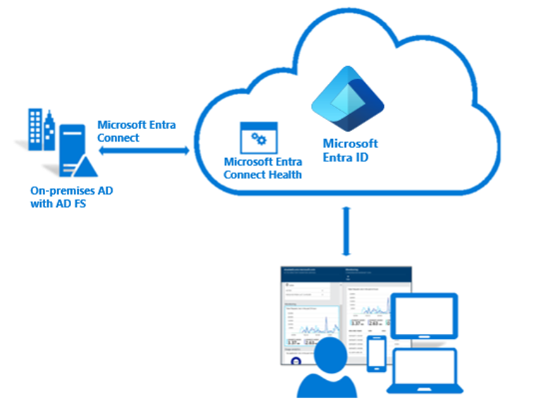
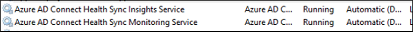

Azure Active Directory (Azure AD) Connect Health provides robust monitoring of your on-premises identity infrastructure. It enables you to maintain a reliable connection to Microsoft 365 and Microsoft Online Services. This reliability is achieved by providing monitoring capabilities for your key identity components. Also, it makes the key data points about these components easily accessible.

The information is presented in the [Azure AD Connect Health portal](https://aka.ms/aadconnecthealth). Use the Azure AD Connect Health portal to view alerts, performance monitoring, usage analytics, and other information. Azure AD Connect Health enables the single lens of health for your key identity components in one place.

> [!div class="mx-imgBorder"]
> 

Using the Azure AD Connect Health feature requires an Azure AD Premium P1 license. 

## Azure AD Connect Health agent installation

This section provides instructions for installing and configuring the Azure Active Directory (Azure AD) Connect Health agents.

## Requirements

- Azure AD Premium is installed.

- You're a global administrator in Azure AD.

- The Azure AD Connect Health agent is installed on each targeted server.

- The Azure service endpoints have outbound connectivity.

- Outbound connectivity is based on IP addresses.

- TLS inspection for outbound traffic is filtered or disabled.

- Firewall ports on the server are running the agent.

  - The agent requires the following firewall ports to be open so that it can communicate with the Azure AD Connect Health service endpoints:

    - TCP port 443

    - TCP port 5671

  - The latest version of the agent doesn't require port 5671. Upgrade to the latest version so that only port 443 is required.

- PowerShell version 4.0 or newer is installed.

- FIPS (Federal Information Processing Standard) is disabled.

## Install the agent

Download and install the Azure AD Connect Health agent from the Download Center.

## Install the agent for AD FS

> [!NOTE]
> Your AD FS server should be different from your Sync server. Don't install the AD FS agent on your Sync server.

Before you install the agent, make sure your AD FS server host name is unique and isn't present in the AD FS service. To start the agent installation, double-click the *.exe* file that you downloaded. In the first window, select **Install**.

> [!div class="mx-imgBorder"]
> 

After the installation finishes, select **Configure Now**.

> [!div class="mx-imgBorder"]
> 

A PowerShell window opens to start the agent registration process. When you're prompted, sign in by using an Azure AD account that has permissions to register the agent. By default, the global admin account has permissions.

> [!div class="mx-imgBorder"]
> 

After you sign in, PowerShell continues. When it finishes, you can close PowerShell. The configuration is complete.

At this point, the agent services should start automatically to allow the agent to securely upload the required data to the cloud service.

If you haven't met all of the prerequisites, warnings appear in the PowerShell window. Be sure to complete the requirements before you install the agent. The following screenshot shows an example of these warnings.

> [!div class="mx-imgBorder"]
> 

To verify that the agent was installed, look for the following services on the server. If you completed the configuration, they should already be running. Otherwise, they're stopped until the configuration is complete.

- Azure AD Connect Health AD FS Diagnostics Service

- Azure AD Connect Health AD FS Insights Service

- Azure AD Connect Health AD FS Monitoring Service

> [!div class="mx-imgBorder"]
> 

## Install the agent for Sync

The Azure AD Connect Health agent for Sync is installed automatically in the latest version of Azure AD Connect. To use Azure AD Connect for Sync, download the latest version of Azure AD Connect and install it.

To verify the agent has been installed, look for the following services on the server. If you completed the configuration, the services should already be running. Otherwise, the services are stopped until the configuration is complete.

- Azure AD Connect Health Sync Insights Service

- Azure AD Connect Health Sync Monitoring Service

> [!div class="mx-imgBorder"]
> 

> [!NOTE]
> Remember that you must have Azure AD Premium to use Azure AD Connect Health. If you don't have Azure AD Premium, you can't complete the configuration in the Azure portal. 

