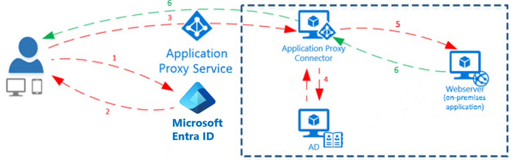

## What is Application Proxy?

Application Proxy is a feature of Azure AD that enables users to access on-premises web applications from a remote client. Application Proxy includes both the Application Proxy service that runs in the cloud, and the Application Proxy connector that runs on an on-premises server. Azure AD, the Application Proxy service, and the Application Proxy connector work together to securely pass the user sign-on token from Azure AD to the web application.

The Application Proxy for Azure AD provides secure remote access to on-premises web applications. After a single sign-on to Azure AD, users can access both cloud and on-premises applications through an external URL or an internal application portal. For example, Application Proxy can provide remote access and single sign-on to Remote Desktop, SharePoint, Teams, Tableau, Qlik, and line of business (LOB) applications.

Application Proxy works with:

- Web applications that use [Integrated Windows Authentication](https://docs.microsoft.com/azure/active-directory/manage-apps/application-proxy-configure-single-sign-on-with-kcd) for authentication.

- Web applications that use form-based or [header-based](https://docs.microsoft.com/azure/active-directory/manage-apps/application-proxy-configure-single-sign-on-with-headers) access.

- Web APIs that you want to expose to rich applications on different devices.

- Applications hosted behind a [Remote Desktop Gateway](https://docs.microsoft.com/azure/active-directory/manage-apps/application-proxy-integrate-with-remote-desktop-services).

- Rich client apps that are integrated with the Microsoft Authentication Library (MSAL).

Application Proxy is recommended for giving remote users access to internal resources. Application Proxy replaces the need for a virtual private network (VPN) or reverse proxy. It is not intended for internal users on the corporate network. These users who unnecessarily use Application Proxy can introduce unexpected and undesirable performance issues.

## How Application Proxy works

The following diagram shows how Azure AD and Application Proxy work together to provide single sign-on to on-premises applications.

1. After the user has accessed the application through an endpoint, the user is directed to the Azure AD sign-in page.

1. After a successful sign-in, Azure AD sends a token to the user's client device.

1. The client sends the token to the Application Proxy service, which retrieves the user principal name (UPN) and security principal name (SPN) from the token. Application Proxy then sends the request to the Application Proxy connector.

1. If you have configured single sign-on, the connector performs any additional authentication required on behalf of the user.

1. The connector sends the request to the on-premises application.

1. The response is sent through the connector and Application Proxy service to the user.

## Add an on-premises application for remote access through Application Proxy in Azure Active Directory

|||
| :--- | :--- |
| | Watch this video to learn more about enabling integrated windows authentication to on-premises applications with Azure AD Application Proxy|

>[!VIDEO https://aka.ms/AAD.AppProxy.Interactive.Guide]

